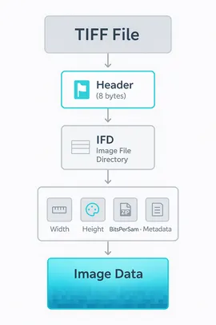
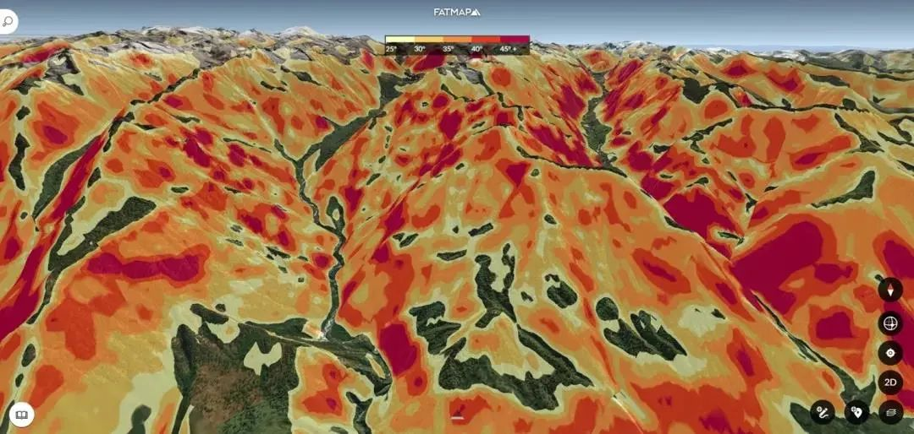
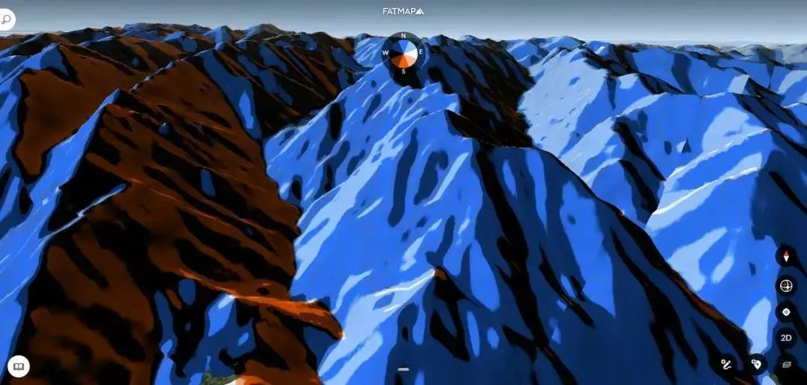
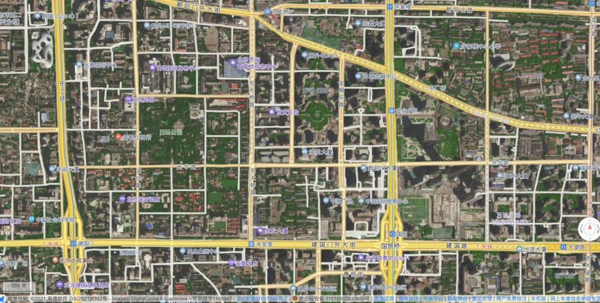
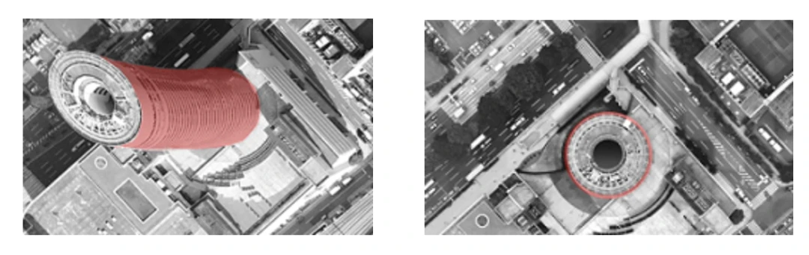
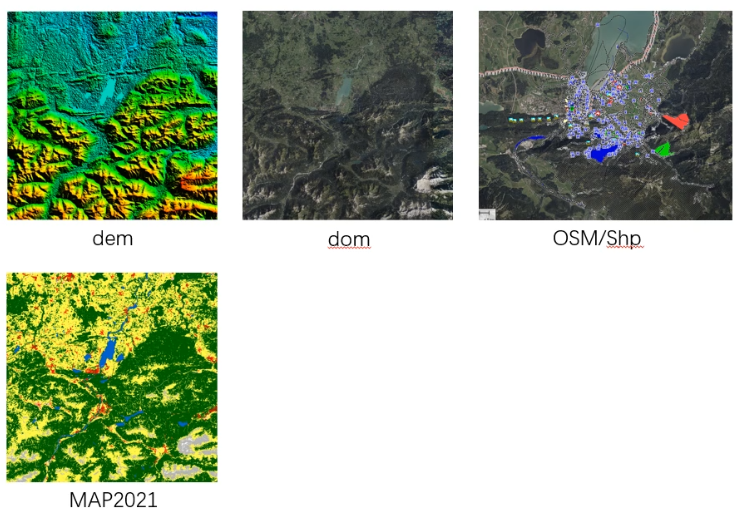

# GIS
Geographic Information System

## 各种数据
1. 常见数据
卫片：人造卫星拍摄的影像
航片:飞机拍摄的影像 无人机 有人机

DEM:数字高程模型 可以通过航空摄影 激光雷达 卫星遥感 干涉合成孔径雷达等获得数据
DOM:数字正射影像图 卫片经过校正 以及DEM等获得数据,可以贴在DEM上当做纹理 .tif文件 tiff GeoTiff
DSM:数字表面模型 地物高程模型 地表+地面物体
DTM:数字地形模型 地表高程模型

dem可以生成等高线

拍摄影像 三维点云 构建tin网 构建白模 纹理映射

白模:纯几何结构与拓扑 白模​​（White Model）是指​​仅包含几何结构而不包含任何材质、纹理、贴图或照明的3D模型​​。它通常以单一的白色或灰色显示，专注于模型的​​几何形状​​和​​拓扑结构​​。
def validate_white_model(model):
    checks = {
        'manifold': check_manifold_geometry(model),      # 流形几何
        'non_degenerate': check_non_degenerate_faces(model), # 无退化面
        'normal_consistency': check_normals(model),     # 法线一致性
        'uv_ready': check_uv_readiness(model),          # UV展开就绪
        'polycount_optimal': check_polycount(model)      # 多边形数量优化
    }
    return all(checks.values())

Oblique Photography
倾斜摄影:一正四斜(前后左右) 垂直摄影(卫星遥感 航空正射摄影)

空三:空中三角测量 Aerotriangulation AT 是由摄影测量发展而来的一种测量方法，它通过分析多张影像之间的几何关系，计算出地面点的三维坐标。空中三角测量是三维重建的基础，它可以帮助我们得到稀疏点云，进而得到稠密点云，最后得到三维模型。
地三:地面控制点 Ground Control Point GCP？


多视几何 三维重建
多视角成像 利用视差 计算三维坐标
视差匹配得到深度
深度得到点云

倾斜摄影获取的原始数据是啥?应该就是一系列的png图片，通过空三求解(包括特征提取、特征匹配、光束法平差)得到稀疏点云，再得到稠密点云 泊松重建得到mesh 纹理映射
后处理得到的数据格式可以是osgb obj fbx 3dtiles
点云分割得到DEM DSM DTM

**倾斜摄影得到的原始数据**
1. 多视角影像数据 一个垂直镜头四个倾斜镜头采集的jpg格式的 提供地物多角度的视觉信息，是三维重建的基础
2. 定位定姿数据 由GNSS(全球导航卫星系统global navigation satelite system)和IMU(惯性测量单元)系统记录的每张影像的外方位元素（如X, Y, Z, Omega, Phi, Kappa），通常存储在CSV或XML文件中（如Image.csv），提供影像的空间位置和姿态，用于空中三角测量和精确三维重建
3. 相机参数文件 记录相机的内方位元素（如焦距、像主点）和镜头畸变参数等，通常存储在CSV文件（如Camera.csv）中 用于校正影像畸变，保证几何精度
4. 元数据文件 ​如metadata.xml文件，记录整个数据集的坐标系、插入点坐标、生产信息等 描述数据的空间参考和基本属性，便于后续处理软件正确读取和定位数据
5. 数据组织文件 如OSGB格式数据对应的配置文件（.s3c）、层级目录结构等 管理海量的、分块多层级(LOD)存储的模型文件，确保数据能被正确加载和浏览。

常见gis数据及其格式 https://docs.fileformat.com/ 可以查看各种文件格式的基本信息
1. .ter
2. .tif geotiff 
   TIFF (Tagged Image File Format) is not just an image format, but a kind of universal "container". Imagine that this is not an ordinary photograph, but a digital folder capable of storing a lot of information. TIFF can contain an image of the highest quality, as well as all the accompanying information about it: where and when it was taken, what parameters it has, what colors were used, and so on. Thanks to its flexible structure, TIFF is widely used where the quality and integrity of data are more important than the file size.
   1. Header. A small "business card" at the very beginning of the file. It tells the program that this is a TIFF and where to find basic information about the image.
   2. Directory (IFD). This is the "index" or "contents" of the file. It contains a list of all the characteristics of the image, described as "tags".类似dcm的tag，可以保存宽 高 颜色空间 压缩格式 相机参数 拍摄位置时间等等信息
   3. Pixel data. The actual image itself.
3. DEM 可用于绘制等高线、坡度图、坡向图、立体透视图、立体景观图，并应用于制作正射影像（DOM）、立体地形模型与地图修测。所以，广义的DEM还包括等高线、三角网等所有表达地面高程的数字表示。
      ``` cpp 
      // DEM 数学表示就是一组离散的x y z，具体的
      struct DEMPoint {
         double x;        // 经度或东坐标
         double y;        // 纬度或北坐标  
         double z;        // 高程值
      };

      // 常见 DEM 格式
      enum DEMFormat {
         USGS_DEM,        // USGS DEM 格式
         SRTM,            // 航天飞机雷达地形任务SRTM（Shuttle Radar Topography Mission），由美国太空总署（NASA）和国防部国家测绘局（NIMA）联合测量。原始数据为geotif或ESRI GRID格式，每景数据覆盖经纬度各5°，水平和垂直精度分别为20和16m，水平分辨率约90m。
         ASTER_GDEM,      // ASTER 全球数字高程模型 从ASTER （advance spaceborne thermal emission and reflection radiometer）GDEM(global digital elevation model) 全球数据网站下载。原始数据为tif格式，每景数据覆盖经纬度各1°，数据的水平和垂直精度均为7~50m，水平分辨率约30m。参考大地水准面为WGS84/EGM96，特殊DN值：无效像素值为-9999，海平面数据为0
         TIN,             // 不规则三角网
         GRID             // 规则网格 高程矩阵
      };
      ```
     主要的表示模型有:规则栅格 等高线 TIN，还可以进行不同的渲染，如通过颜色等表达高低
      主要的文件格式有:
      GeoTIFF：一种常用的地理信息系统格式，支持地理参考的栅格图像。
      ASCII：一种文本格式，便于数据的读取和编辑。
      GRID：用于存储栅格数据的格式，适用于多种GIS软件。
      DTED（数字地形高程数据）：由美国国防部开发的标准格式，用于描述数字地形。 
      .ter：Terragen™ Terrain File

      . DEM Data : {"

         *.Flt : Floating Point Raster File,

         *.Ter : Terragen File,

         *.Tif (16-32bit) + Tilled Tiff : GeoTiff Files,

         *.Asc : Arc ASCII Grid format,

         *.Raw : Unity Heightmap data,

         *.Png Grayscale : Grayscale Pixel File ,

         *.Las : Lidar Point Cloud Format ,

         *.Hgt : Shuttle Radar Topography Mission (SRTM) Data,

         *.Bil : Band Interleaved by Line (BIL) Image File,

         *. Bin : Binary Float point "} .

         . Raster Data : { " *.jpg, *.Png " } .

         . Vector Data : { " *.Osm : OpenStreetMap Informations , *.Shp : ESRI Geometry data " } .

4. DTM 数字地面模型（Digital Terrain Model）x、y表示该点的平面坐标，z值可以表示高程、坡度、温度等信息，当z表示高程时，就是数字高程模型，即DEM。地形表面形态的属性信息一般包括高程、坡度、坡向等  
5. DSM DEM+地物 高程矩阵
   ```cpp
   std::vector<std::vector<double>> elevation_data;  // DSM 数据
   std::vector<std::vector<double>> dem_data;        // DEM 数据（如有）
   ```
6. DOM 卫片 tif png等带有地理信息的图像 是经过DEM高程模型几何校正、消除了地形误差的遥感影像地图，与人们感官的现实世界无异，我们现在看到的互联网卫星地图大多是正射影像产品 
7. TDOM 
8. 地类图map2021_aster，泥土 草 树，是mask文件，png或者tif
9. shape .shp
10. .osm openstreetmap

[DEM-DTM-DSM-DOM解释及示例图](./DEM-DTM-DSM-DOM解释及示例图.pdf)

GDAL库支持的数据格式
光栅格式:https://gdal.org/en/stable/drivers/raster/
矢量格式:https://gdal.org/en/stable/drivers/vector/index.html

arcgis列出的光栅数据格式
https://pro.arcgis.com/en/pro-app/latest/help/data/imagery/supported-raster-dataset-file-formats.htm

常用软件工具
​​自动化处理软件​​：
​​ContextCapture (Bentley)​​：行业标杆，生成的模型和点云质量极高。以前叫smart3d
​​Pix4D​​：非常流行，尤其在测绘和农业领域。
​​大疆智图 (DJI Terra)​​：对大疆无人机优化好，性价比高。
​​PhotoScan (现为Metashape, Agisoft)​​：功能强大，用户群体广。
​​点云分类与DEM编辑软件​​：
​​Global Mapper​​：功能全面，点云分类和DEM编辑功能非常强大且易用。
​​ArcGIS (3D Analyst模块)​​：GIS平台，适合后续的分析和展示。
​​CloudCompare​​：开源免费的强大点云处理软件，可以进行分类和导出，但自动化程度不如商业软件。

sketchup
cesium基于webgl 3dtiles(基于glTF)
osgEarth

earthmaker里面的文件格式 通用 专有

3S:GIS GPS RS


GIS中的距离和角度
geodisc测地距离

## GIS数据获取途径
搜 地理信息数据云
1. 地图服务
   1. google地图
   2. bing地图
   3. OpenStreetMap
   4. 高德地图
   5. 天地图
   6. 腾讯地图
2. 卫星影像
   1. 商业卫星影像
   2. 开源卫星影像
      1. Sentinel-2
      2. Landsat
      3. MODIS
      4. ASTER
      5. Planet
      6. DigitalGlobe
3. 国内
   1. 地理空间数据云http://www.gscloud.cn
   2. 天地图http://www.tianditu.gov.cn
   3. 国家卫星气象中心 http://www.nsmc.org.cn
   4. 中国科学院数据云 www.csdb.cn
   5. 国家地球系统科学数据共享平台 http://www.geodata.cn
   6. 国家基础地理信息中心 http://www.ngcc.cn
   7. 资源环境数据云平台 http://www.resdc.cn
   8. 水经注地图 http://www.rivermap.cn
4. 国外
   1. NASA Earthdata https://earthdata.nasa.gov
   2. Natural Earth http://www.naturalearthdata.com
   3. OpenStreetMap https://www.openstreetmap.org
   4. USGS Earth Explorer https://earthexplorer.usgs.gov
   5. FAO GeoNetwork https://foo.org

## 坐标系
北京:东经115° 北纬40°

1. 常见坐标系
   1. 大地坐标系:定位地球上的点 用经度 纬度 高程表示 lambda phi h
	由于地球不是完美的椭球体 需要定义一个基准椭球体来表示地球
	事实上的标准是WGS84 World Geodetic System 1984,
		本初子午线(英国格林尼治天文台)以东或以西
		赤道(非洲赤道)以北或以南
		高程相对于 ​​WGS 84 椭球面​​的高度（单位：米）。请注意，这不同于我们常说的“海拔高”（相对于大地水准面）
   2. 地心地固直角坐标系:计算机内部计算
		原点在地球质心
		z轴指向北极
		x轴指向本初子午线与赤道的交点,即经度0 纬度0的点
		y轴指向东经90度 大概是印度洋位置
		xyz轴构成右手系
		xyz轴的单位是米
   3. 投影坐标系:在平面上展开地球
      1. Mercator投影:google地图 bing地图 OpenStreetMap等web地图服务底层都是墨卡托投影 保持形状不变，等角投影, 但面积变形严重
      2. UTM投影:美国通用，将地球划分为60个区域，每个区域投影到平面，区域内的坐标是UTM坐标，区域外的坐标是经纬度坐标
      3. 

### 第一部分：GIS中常见的坐标系

GIS坐标系主要分为两大类型：**地理坐标系** 和 **投影坐标系**。

#### 1. 地理坐标系

*   **核心思想**：用经纬度来描述地球上任意一个点的位置。它是一个**三维球面**模型。
*   **基准面**：由于地球不是一个完美的球体，而是一个近似椭球体（梨形），为了精确测量，我们需要一个参考椭球体来拟合地球。**基准面就是定义了特定参考椭球体及其与地球相对位置的数学模型**。
    *   **地心基准面**：以地球质心为原点，最适合全球测量（如GPS）。
    *   **区域基准面**：最优化拟合某个特定区域（如北美），该区域测量更准，但其他区域偏差可能较大。
*   **单位**：十进制度度（Decimal Degrees, DD）。
*   **特点**：
    *   是**未投影**的坐标系。
    *   直接基于椭球体表面测量。
    *   在不同地区，**一度经纬度所代表的实际距离是不同的**（越靠近两极，经线越密集）。

**常见的地理坐标系：**

1.  **WGS84**
    *   **全称**：World Geodetic System 1984
    *   **基准面**：地心基准面。
    *   **应用**：**GPS全球卫星定位系统**的统一标准，也是目前网络地图（如Google Earth）的默认坐标系。是全球应用最广泛的坐标系。

2.  **CGCS2000**
    *   **全称**：中国国家大地坐标系 2000
    *   **基准面**：地心基准面。
    *   **应用**：**中国法定的国家坐标系**，用于一切测绘活动。它与WGS84在厘米级精度上非常接近，通常可以视为等同。

3.  **Beijing 1954 / Beijing 54**
    *   **基准面**：区域基准面（参考苏联的克拉索夫斯基椭球体）。
    *   **应用**：中国在2008年前广泛使用的地形图坐标系。现在正逐步被CGCS2000取代。与WGS84/CGCS2000之间存在较大偏差（可达100-200米）。

4.  **Xian 1980 / Xian 80**
    *   **基准面**：区域基准面（参考IAG 1975椭球体）。
    *   **应用**：在Beijing 54之后，CGCS2000之前使用，主要用于中国 mainland 的测绘。

---

#### 2. 投影坐标系

*   **核心思想**：将不可展平的**地球椭球面**通过某种数学法则**展开**到**二维平面**上。这个过程必然会产生**变形**（形状、面积、距离或方向的变形）。
*   **构成**：投影坐标系 = 地理坐标系 + 投影方法。
*   **单位**：米、英尺等长度单位。
*   **特点**：
    *   是**投影后**的坐标系。
    *   在二维平面上，坐标是 Cartesian 的（X, Y）。
    *   适用于面积量算、距离测量、规划绘图等。

**常见的投影方法与坐标系：**

1.  **Web Mercator (EPSG:3857)**
    *   **投影类型**：墨卡托投影的变种。
    *   **特点**：**等角**投影，保持方向不变形，但**面积变形严重**（高纬度地区被极度放大）。
    *   **应用**：**几乎所有在线地图服务的标准**，如Google Maps, Bing Maps, OpenStreetMap, 百度地图，高德地图。

2.  **UTM (Universal Transverse Mercator)**
    *   **投影类型**：横轴墨卡托投影。
    *   **特点**：将全球分为60个经度带（每个带6度经度），每个带单独投影，变形较小。是**等角**投影。
    *   **应用**：全球范围的大中比例尺地图（如1:100万至1:1万），军事、工程、科研领域广泛应用。中国范围内的带号一般为43-53。

3.  **Gauss-Krüger / 高斯-克吕格投影**
    *   **投影类型**：横轴墨卡托投影的一种。
    *   **特点**：与UTM类似，但采用3度分带或6度分带，中央经线比例系数为1（UTM为0.9996）。
    *   **应用**：**中国基本比例尺地形图（1:50万及更大比例尺）** 的官方投影。常与Beijing 54或CGCS2000基准面结合使用，形成如 `CGCS2000_3_Degree_GK_Zone_39` 这样的投影坐标系。

4.  **Albers Equal Area Conic (阿尔伯斯等积圆锥投影)**
    *   **投影类型**：圆锥投影。
    *   **特点**：**保持面积相等**，适合进行国家或大洲级别的面积统计分析。
    *   **应用**：中国全国范围的专题地图，特别是需要精确比较面积的场景（如人口密度、农作物分布）。

---

### 第二部分：坐标变换

坐标变换是将空间数据从一种坐标系转换到另一种坐标系的过程。根据情况不同，它可能包含以下一个或多个步骤。

#### 1. 坐标转换的主要类型

1.  **地理变换**
    *   **定义**：在不同**基准面**（即不同地理坐标系）之间进行转换。这是最复杂的一步，因为涉及到椭球体的改变。
    *   **方法**：
        *   **三参数/七参数法**：通过平移、旋转、缩放来建立两个椭球体之间的关系。七参数法精度更高。需要已知至少3个公共控制点来求解参数。
        *   **格网变换法**：使用一个偏移量查询表（如NADCON、NTv2）来修正不同基准面之间的差异，精度非常高。

2.  **投影变换**
    *   **定义**：在同一基准面下，将数据从**一种投影方法**转换为**另一种投影方法**。
    *   **例子**：将UTM投影的数据转换为阿尔伯斯等积投影。这个过程是纯数学的，不改变基准面。

3.  **基准面+投影变换**
    *   **定义**：最常见的完整坐标变换过程。既改变了基准面，也改变了投影方法。
    *   **例子**：将 `Beijing 1954 GK Zone 20` 的数据转换为 `WGS84 UTM Zone 50N`。

#### 2. 坐标变换的实践流程

在GIS软件（如ArcGIS, QGIS）中进行坐标变换时，通常遵循以下原则和步骤：

1.  **定义投影**：
    *   如果数据没有坐标系信息（即“未知坐标系”），你需要**告诉软件它当前是什么坐标系**。这一步只是添加元数据，并不改变数据本身的坐标值。

2.  **投影/变换**：
    *   将数据从当前的坐标系**转换**到你需要的目标坐标系。这一步会**重新计算并改变数据的坐标值**。

**黄金法则**：
*   **当两个坐标系的基准面不同时，必须使用地理变换（即需要指定转换参数）。**
*   如果只进行投影变换（基准面相同），则不需要地理变换参数。

#### 3. 常见问题与注意事项

*   **“火星坐标”问题**：在中国，从GPS设备（WGS84）获取的坐标，在用于百度地图或高德地图前，需要经过一个特殊的加密算法（GCJ-02）进行偏移。这是一个非标准的坐标变换，需要专门的库来处理。
*   **参数选择**：从Beijing 54或Xian 80转换到WGS84/CGCS2000时，务必选择正确的转换参数。使用错误的参数会导致几十到上百米的误差。
*   **动态地心基准**：像WGS84和CGCS2000这样的地心基准面本身也会随着测量技术的进步而微调（通过参考框架实现，如ITRF），在处理高精度应用时需要注意版本。

### 总结

| 操作 | 输入 | 输出 | 是否改变坐标值 |
| :--- | :--- | :--- | :--- |
| **定义投影** | 无坐标系信息的数据 + 正确的坐标系定义 | 具有正确坐标系信息的数据 | **否** |
| **投影** | A投影坐标系的数据 | B投影坐标系的数据（**基准面相同**） | **是** |
| **变换** | A地理坐标系的数据 | B地理坐标系的数据（**基准面不同**） | **是** |
| **投影与变换** | A投影坐标系的数据 | B投影坐标系的数据（**基准面不同**） | **是** |

理解坐标系和坐标变换是确保GIS数据空间位置准确性的关键。在处理任何空间数据时，第一步永远是**确认其当前的坐标系定义**。

## gis 引擎
高德地图是一个基于GIS和瓦片图技术的在线地图服务提供商，提供地图显示、导航、地理编码、路径规划等服务。

Leaflet和Mapbox是两个常用的开源JavaScript库，用于创建交互式地图应用程序。它们可以与不同的地图提供商和数据源集成，包括高德地图和Mapbox本身。

Cesium是一个基于WebGL的虚拟地球和地图开发平台，可以用于创建高度可视化的三维地图应用程序。与其他工具不同，Cesium的重点是3D地图可视化，因此它可以用于创建高度交互式的虚拟地球、卫星图像、城市和地形等应用程序。

osgearth

OpenLayer,LeafLet,arcgis api等都属于企业级地图应用开发库

arrgis qgis

unigine 太像了...

# ZORRO engine
1. global mapper地理信息浏览及处理,包括DOM卫片 MAP2021地面分类 DEM高程，都是tif格式
2. photoshop
3. cityengine参数化城市建模
4. maya 3d建模
5. notepad++
6. speedtree 树参数化建模

## 地形数据获取及处理
1. 所需数据分类  **是什么**
   1. 高精度dem(高程)
   2. 不同精度dom(影像)
   3. shp矢量数据(河流 道路)
   4. osm建筑轮廓
   5. 地类分类数据
2. 数据获取途径
   1. 水经注 watermap中国版global mapper，地图下载 数据处理 制图，可以从谷歌地图 天地图 osm等多种在线地图源下载影像 地形等数据，一般用于快速获取区域地图背景、下载卫星图、在线地图转离线等
   2. global mapper在线数据下载，瑞士军刀，支持超过300种空间数据导入、导出、查看、编辑、分析，包括LiDAR点云处理
	地形分析、路径剖面、体积计算等，格式兼容性及数据处理效率著称，不如esri的arcgis企业级空间数据库，但日常gis处理足够了，用于格式转换、点云分类、生成DEM、基础空间分析、地图制作
   3. esri Landcover数据集 livingatlas.arcgis.com，基于哨兵-2的卫星影像，分割得到地表分类数据，将地球表面的每个像素分类为水体、树木、草地、农作物、建筑表面、裸地等，每年更新免费获取，是了解地表覆盖变化的重要数据源，一般用于城市规划、环境监测、气候变化研究、农业调查
   4. osm建筑轮廓数据 www.openstreetmap.org 开源、可自由编辑的全球地图数据库，包含道路、建筑、河流、兴趣点、土地利用等丰富的地理要素的矢量地图数据，一般作为底图、路径规划、gis分析的数据源，制作专题图
   5. aster全球30m精度DEM数据集 gdemdl.aster.jspacesystems.or.jp，主要提供全球数字高程模型GDEM，免费覆盖全球，一般用于生成地形图、地貌分析、水文分析、作为遥感影像用于地物分类等
3. 数据处理
   1. 坐标系投影转换geo graphics或者Mercator投影，基准WGS84
   2. 数据裁剪
   3. 数据导出
4. 佐罗引擎编辑器使用流程
   1. dem导入
   2. dom导入
   3. mask导入
   4. 植被导入
   5. 城市建筑物生成及导入
   6. 地表建筑物制作及导入
   7. 数据库迭代处理
5. 地形 植被的brush画刷，不如ps好用 学习ps
6. lightmap没有地理信息，需要在global mapper里校正一下
   
## 模型得归零，tga贴图不支持

# 作战仿真平台
四大作战仿真平台：CIMPro、AFSim、VR-Forces与EADSIM
CIMPro采用"空天地一体化"设计理念，内置全球地理信息系统，支持19级影像瓦片和15级高程数据 国产
AFSIM:美国空军研发
VR-Forces：沉浸式训练先锋
EADSIM：防空反导专业平台

Open Source GeoSpatial Foundation
gdal:支持很多种数据及格式的读写，可以看看doc GDALGeoTransform GDALDataset
proj
grass
osgeo

