# GIS
Geographic Information System

## 各种数据
1. 常见数据
卫片：人造卫星拍摄的影像
航片:飞机拍摄的影像 无人机 有人机

DEM:数字高程模型 可以通过航空摄影 激光雷达 卫星遥感 干涉合成孔径雷达等获得数据
DOM:数字正射影像图 卫片经过校正 以及DEM等获得数据,可以贴在DEM上当做纹理 .tif文件 tiff GeoTiff
DSM:数字表面模型 地物高程模型 地表+地面物体
DTM:数字地形模型 地表高程模型

dem可以生成等高线

拍摄影像 三维点云 构建tin网 构建白模 纹理映射

白模:纯几何结构与拓扑 白模​​（White Model）是指​​仅包含几何结构而不包含任何材质、纹理、贴图或照明的3D模型​​。它通常以单一的白色或灰色显示，专注于模型的​​几何形状​​和​​拓扑结构​​。
def validate_white_model(model):
    checks = {
        'manifold': check_manifold_geometry(model),      # 流形几何
        'non_degenerate': check_non_degenerate_faces(model), # 无退化面
        'normal_consistency': check_normals(model),     # 法线一致性
        'uv_ready': check_uv_readiness(model),          # UV展开就绪
        'polycount_optimal': check_polycount(model)      # 多边形数量优化
    }
    return all(checks.values())

Oblique Photography
倾斜摄影:一正四斜(前后左右) 垂直摄影(卫星遥感 航空正射摄影)

空三:空中三角测量 Aerotriangulation AT 是由摄影测量发展而来的一种测量方法，它通过分析多张影像之间的几何关系，计算出地面点的三维坐标。空中三角测量是三维重建的基础，它可以帮助我们得到稀疏点云，进而得到稠密点云，最后得到三维模型。
地三:地面控制点 Ground Control Point GCP？


多视几何 三维重建
多视角成像 利用视差 计算三维坐标
视差匹配得到深度
深度得到点云

倾斜摄影获取的原始数据是啥?应该就是一系列的png图片，通过空三求解(包括特征提取、特征匹配、光束法平差)得到稀疏点云，再得到稠密点云 泊松重建得到mesh 纹理映射
后处理得到的数据格式可以是osgb obj fbx 3dtiles
点云分割得到DEM DSM DTM

**倾斜摄影得到的原始数据**
1. 多视角影像数据 一个垂直镜头四个倾斜镜头采集的jpg格式的 提供地物多角度的视觉信息，是三维重建的基础
2. 定位定姿数据 由GNSS(全球导航卫星系统global navigation satelite system)和IMU(惯性测量单元)系统记录的每张影像的外方位元素（如X, Y, Z, Omega, Phi, Kappa），通常存储在CSV或XML文件中（如Image.csv），提供影像的空间位置和姿态，用于空中三角测量和精确三维重建
3. 相机参数文件 记录相机的内方位元素（如焦距、像主点）和镜头畸变参数等，通常存储在CSV文件（如Camera.csv）中 用于校正影像畸变，保证几何精度
4. 元数据文件 ​如metadata.xml文件，记录整个数据集的坐标系、插入点坐标、生产信息等 描述数据的空间参考和基本属性，便于后续处理软件正确读取和定位数据
5. 数据组织文件 如OSGB格式数据对应的配置文件（.s3c）、层级目录结构等 管理海量的、分块多层级(LOD)存储的模型文件，确保数据能被正确加载和浏览。

常见gis数据及其格式 https://docs.fileformat.com/ 可以查看各种文件格式的基本信息
1. .ter
2. .tif geotiff 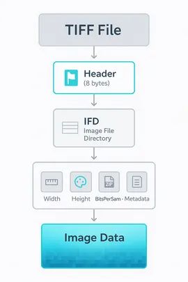
   TIFF (Tagged Image File Format) is not just an image format, but a kind of universal "container". Imagine that this is not an ordinary photograph, but a digital folder capable of storing a lot of information. TIFF can contain an image of the highest quality, as well as all the accompanying information about it: where and when it was taken, what parameters it has, what colors were used, and so on. Thanks to its flexible structure, TIFF is widely used where the quality and integrity of data are more important than the file size.
   1. Header. A small "business card" at the very beginning of the file. It tells the program that this is a TIFF and where to find basic information about the image.
   2. Directory (IFD). This is the "index" or "contents" of the file. It contains a list of all the characteristics of the image, described as "tags".类似dcm的tag，可以保存宽 高 颜色空间 压缩格式 相机参数 拍摄位置时间等等信息
   3. Pixel data. The actual image itself.
3. DEM 可用于绘制等高线、坡度图、坡向图、立体透视图、立体景观图，并应用于制作正射影像（DOM）、立体地形模型与地图修测。所以，广义的DEM还包括等高线、三角网等所有表达地面高程的数字表示。
      ``` cpp 
      // DEM 数学表示就是一组离散的x y z，具体的
      struct DEMPoint {
         double x;        // 经度或东坐标
         double y;        // 纬度或北坐标  
         double z;        // 高程值
      };

      // 常见 DEM 格式
      enum DEMFormat {
         USGS_DEM,        // USGS DEM 格式
         SRTM,            // 航天飞机雷达地形任务SRTM（Shuttle Radar Topography Mission），由美国太空总署（NASA）和国防部国家测绘局（NIMA）联合测量。原始数据为geotif或ESRI GRID格式，每景数据覆盖经纬度各5°，水平和垂直精度分别为20和16m，水平分辨率约90m。
         ASTER_GDEM,      // ASTER 全球数字高程模型 从ASTER （advance spaceborne thermal emission and reflection radiometer）GDEM(global digital elevation model) 全球数据网站下载。原始数据为tif格式，每景数据覆盖经纬度各1°，数据的水平和垂直精度均为7~50m，水平分辨率约30m。参考大地水准面为WGS84/EGM96，特殊DN值：无效像素值为-9999，海平面数据为0
         TIN,             // 不规则三角网
         GRID             // 规则网格 高程矩阵
      };
      ```
     主要的表示模型有:规则栅格 等高线 TIN，还可以进行不同的渲染，如通过颜色等表达高低
      主要的文件格式有:
      GeoTIFF：一种常用的地理信息系统格式，支持地理参考的栅格图像。
      ASCII：一种文本格式，便于数据的读取和编辑。
      GRID：用于存储栅格数据的格式，适用于多种GIS软件。
      DTED（数字地形高程数据）：由美国国防部开发的标准格式，用于描述数字地形。 
      .ter：Terragen™ Terrain File

      . DEM Data : {"

         *.Flt : Floating Point Raster File,

         *.Ter : Terragen File,

         *.Tif (16-32bit) + Tilled Tiff : GeoTiff Files,

         *.Asc : Arc ASCII Grid format,

         *.Raw : Unity Heightmap data,

         *.Png Grayscale : Grayscale Pixel File ,

         *.Las : Lidar Point Cloud Format ,

         *.Hgt : Shuttle Radar Topography Mission (SRTM) Data,

         *.Bil : Band Interleaved by Line (BIL) Image File,

         *. Bin : Binary Float point "} .

         . Raster Data : { " *.jpg, *.Png " } .

         . Vector Data : { " *.Osm : OpenStreetMap Informations , *.Shp : ESRI Geometry data " } .

4. DTM 数字地面模型（Digital Terrain Model）x、y表示该点的平面坐标，z值可以表示高程、坡度、温度等信息，当z表示高程时，就是数字高程模型，即DEM。地形表面形态的属性信息一般包括高程、坡度、坡向等 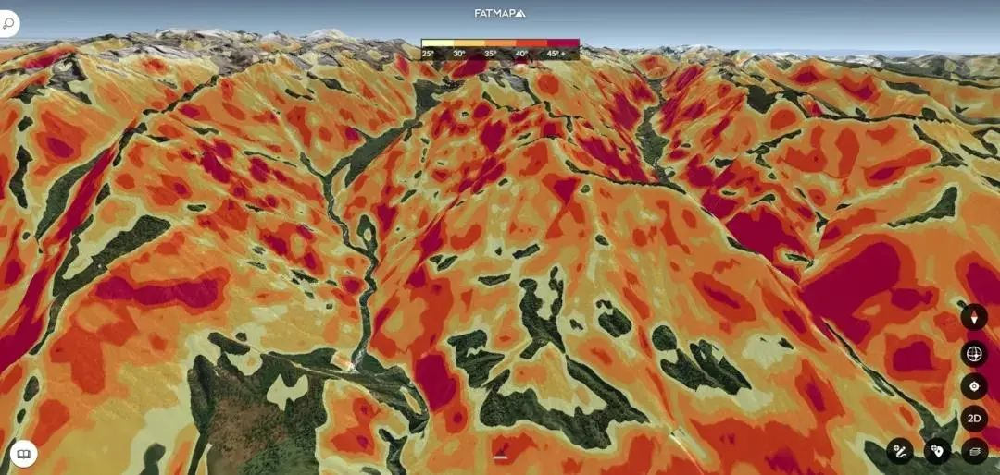 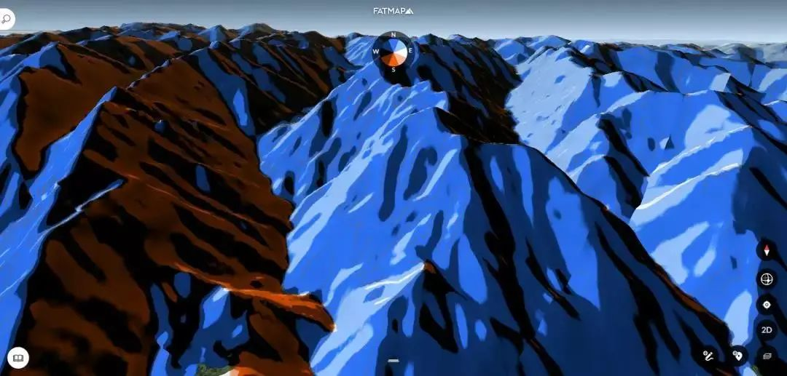
5. DSM DEM+地物 高程矩阵
   ```cpp
   std::vector<std::vector<double>> elevation_data;  // DSM 数据
   std::vector<std::vector<double>> dem_data;        // DEM 数据（如有）
   ```
6. DOM 卫片 tif png等带有地理信息的图像 是经过DEM高程模型几何校正、消除了地形误差的遥感影像地图，与人们感官的现实世界无异，我们现在看到的互联网卫星地图大多是正射影像产品 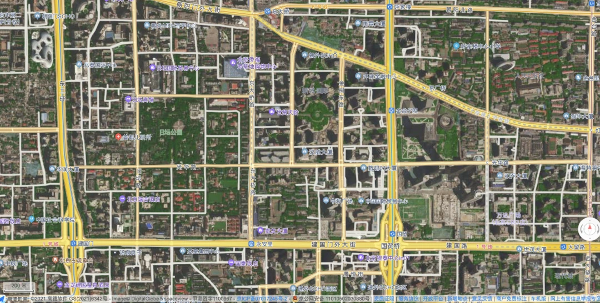
7. TDOM 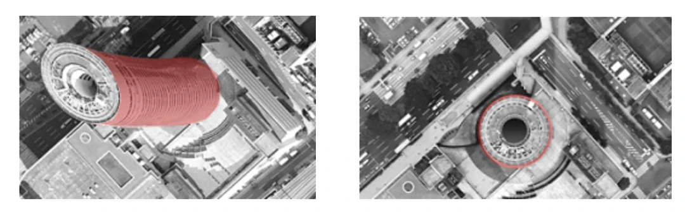
8. 地类图map2021_aster，泥土 草 树，是mask文件，png或者tif
9. shape .shp
10. .osm openstreetmap

[DEM-DTM-DSM-DOM解释及示例图](./DEM-DTM-DSM-DOM解释及示例图.pdf)

GDAL库支持的数据格式
光栅格式:https://gdal.org/en/stable/drivers/raster/
矢量格式:https://gdal.org/en/stable/drivers/vector/index.html

arcgis列出的光栅数据格式
https://pro.arcgis.com/en/pro-app/latest/help/data/imagery/supported-raster-dataset-file-formats.htm

常用软件工具
​​自动化处理软件​​：
​​ContextCapture (Bentley)​​：行业标杆，生成的模型和点云质量极高。以前叫smart3d
​​Pix4D​​：非常流行，尤其在测绘和农业领域。
​​大疆智图 (DJI Terra)​​：对大疆无人机优化好，性价比高。
​​PhotoScan (现为Metashape, Agisoft)​​：功能强大，用户群体广。
​​点云分类与DEM编辑软件​​：
​​Global Mapper​​：功能全面，点云分类和DEM编辑功能非常强大且易用。
​​ArcGIS (3D Analyst模块)​​：GIS平台，适合后续的分析和展示。
​​CloudCompare​​：开源免费的强大点云处理软件，可以进行分类和导出，但自动化程度不如商业软件。

sketchup
cesium基于webgl 3dtiles(基于glTF)
osgEarth

earthmaker里面的文件格式 通用 专有

3S:GIS GPS RS


GIS中的距离和角度
geodisc测地距离

**gis数据中的几个概念**:
1. 水平vs垂直:水平是指地球表面的经纬度,垂直指高程或深度值
2. 分辨率(Resolution) 数据的详细程度
   1. 空间分辨率 每个像素代表的地面实际尺寸范围
        高分辨率：＜5米（如卫星影像）
        中分辨率：5-30米（如Landsat）
        低分辨率：＞30米（如气象数据）
   2. 光谱分辨率 
    传感器捕捉的光谱波段宽度和数量
    决定区分不同地物的能力
3. 精度(Accuracy) 数据的精确程度(误差值)
   1. 平面位置精度：
        像素水平位置与实际位置的偏差
        通常以米为单位（如±10米
   2. 高程精度：
        高程值与实际高度的偏差
        如数字高程模型（DEM）的高程误差
   3. 分类精度：
        对于分类数据，正确分类的比例


## GIS数据获取途径
搜 地理信息数据云
gisdata123 mlwzsy@126.com
1. 地图服务
   1. google地图
   2. bing地图
   3. OpenStreetMap
   4. 高德地图
   5. 天地图
   6. 腾讯地图
2. 卫星影像
   1. 商业卫星影像
   2. 开源卫星影像
      1. Sentinel-2
      2. Landsat
      3. MODIS
      4. ASTER
      5. Planet
      6. DigitalGlobe
3. 国内
   1. 地理空间数据云http://www.gscloud.cn 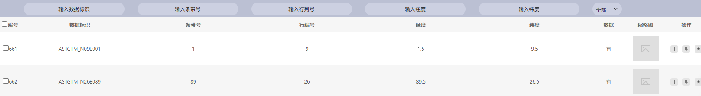 
      - 数据命名规则:数据来源_行号_条带号, 行号按照纬度划分 条带号按照经度划分，如 ASTGTM_N09E001 表示北纬9度，东经1度的区域；srtm_25_02表示西经57.5 北纬52.5
   2. 天地图http://www.tianditu.gov.cn
   3. 国家卫星气象中心 http://www.nsmc.org.cn
   4. 中国科学院数据云 www.csdb.cn
   5. 国家地球系统科学数据共享平台 http://www.geodata.cn
   6. 国家基础地理信息中心 http://www.ngcc.cn
   7. 资源环境数据云平台 http://www.resdc.cn
   8. 水经注地图 http://www.rivermap.cn
4. 国外
   1. NASA Earthdata https://earthdata.nasa.gov
   2. Natural Earth http://www.naturalearthdata.com
   3. OpenStreetMap https://www.openstreetmap.org
   4. USGS Earth Explorer https://earthexplorer.usgs.gov
   5. FAO GeoNetwork https://foo.org
5. 常见dem数据 常用的数字高程模型（DEM）数据：​
    1. ETOPO（1.8千米）
       ETOPO是一种地形高程数据，由NGDC美国地球物理中心发布，与大多数高程数据不同的是，它还包含海底地形数据。
    2. SRTM15（450米）
       SRTM15的空间分辨率为 15 弧秒，精度相当于 0.5km左右，包含了陆地高程和海洋深度数据。
    3. GMTED（250米）
       来自美国地质勘探局USGS和美国国家地理空间情报局NGA，它是对USGS的GTOPO30的进一步优化和发展，对应的最高精度在250米左右。
    4. SRTM3（90米）
       SRTM，全称为Shuttle Radar Topography Mission，该项目获取了北纬60度至南纬60度之间的雷达影像数据，SRTM3，即精度为3弧秒，即90m一个点，包括非洲、北美、南美、欧亚、澳大利亚以及部分岛屿。
    5. ASTER GDEM（30米）
       全称Advanced Spaceborne Thermal Emission and Reflection Radiometer Global Digital Elevation Model ，即先进星载热发射和反射辐射仪全球数字高程模型，其数据覆盖范围为北纬83°到南纬83°之间的所有陆地区域，达到了地球陆地表面的99%，所以应用十分的广泛。目前比较常用的是 ASTER GDEM V2，另外ASTER GDEM V3也比较常见，质量比V2版本要好的多。
    6. ALOS（12.5米）
       ALOS DEM是ALOS（Advanced Land Observing Satellite卫星相控阵型L波段合成孔径雷达（PALSAR）采集，该数据水平及垂直精度可达12.5米。
    7. 5米分辨率DEM&DSM(无控)
       5米分辨率DEM/DSM(无控)，以多颗高分辨率卫星数据为原始数据，基于智能立体模型构建与点云密集匹配，利用网络分布式与多核并行计算技术，三维点云融合与地形提取技术，辅以智能化的人机交互编辑等手段，处理和制作5m×5m空间分辨率的数字地表模型（DSM）和数字高程模型（DEM）。


## 坐标系

一般东经 北纬作为正数

极半径 6356752 米  
平均半径 6371008 米  
赤道半径6378137 米  
纬度每差一度，距离大概是111km  
经度每差一度，距离会随着纬度的变化而变化，纬度越高，经度每差一度，距离越小，纬度越低，经度每差一度，距离越大，经度每差一度的距离=111km*cos(纬度)

```c++
dvec3 world_ori_in_wgs =	e->toWGS(dvec3(0,0,0));//世界坐标系原点(地心)的经纬高(0,90,-6356752)应该等价于(0,0.-6378137)
dvec3 wgsv_xaxis_in_world =	e->toWorld(dvec3(0,0,0));//东经0°北纬0°的地球表面点(wgs坐标系的x轴,赤道平面上一点)的世界坐标系(6378137.0000000000,0,0)
dvec3 wgsv_yaxis_in_world =	e->toWorld(dvec3(90,0,0));//东经90°北纬0°的地球表面点(wgs坐标系的y轴,赤道平面上一点)的世界坐标系(0,6378137,0)
dvec3 wgsv_zaxis_in_world =	e->toWorld(dvec3(0,90,0));//东经0°北纬90°的地球北极点(wgs坐标系的z轴,北极点)的世界坐标系(0,0,6356752.3142451795)
dvec3 wgsv_south_pole_in_world = e->toWorld(dvec3(0,-90,0));//东经0°南纬90°的南极点(wgs坐标系的-z轴,南极点)的世界坐标系(0,0,-6356752.3142451795)
```

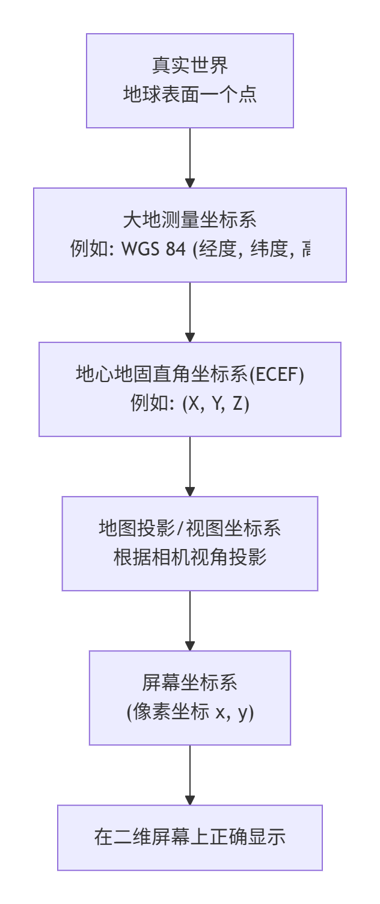

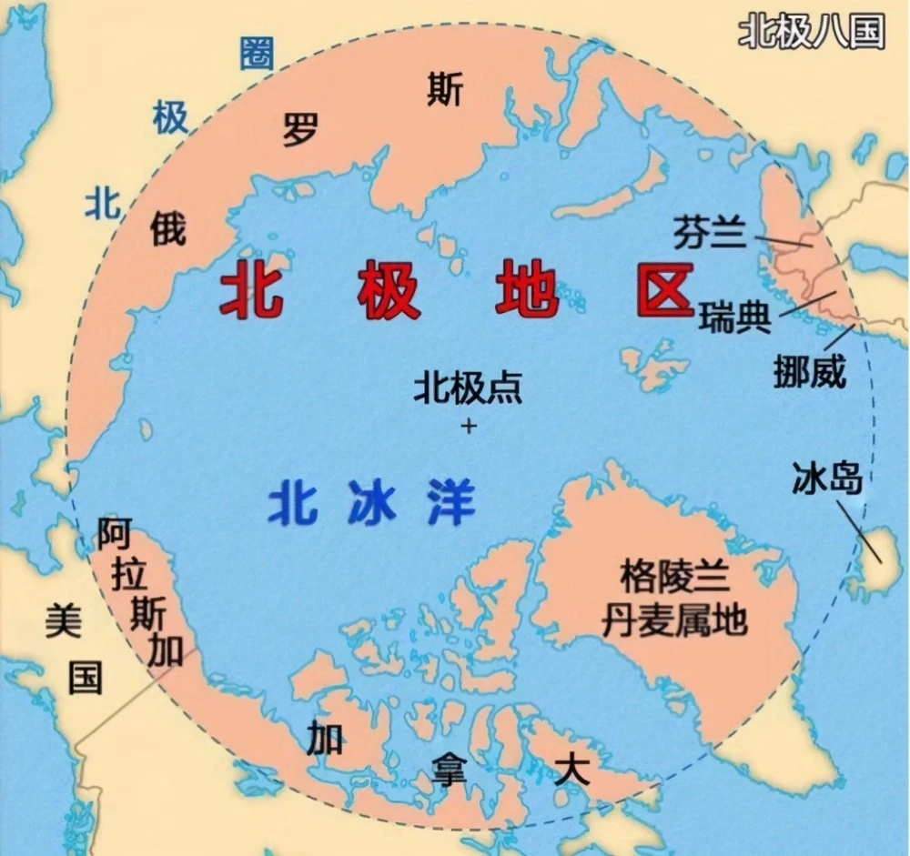
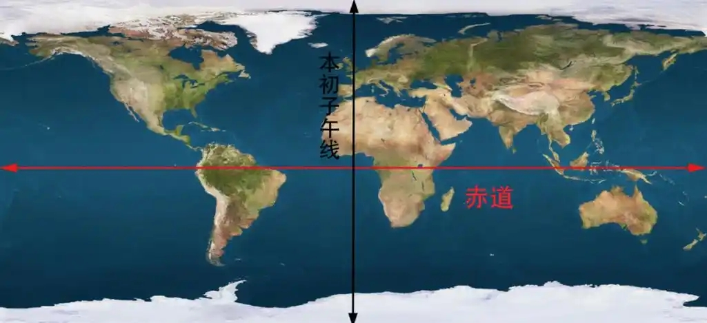
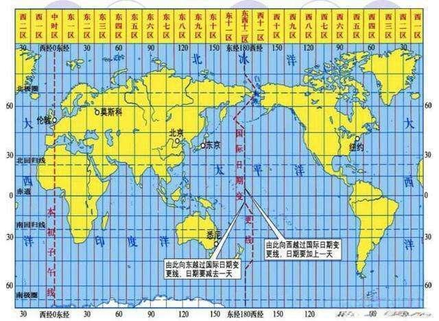
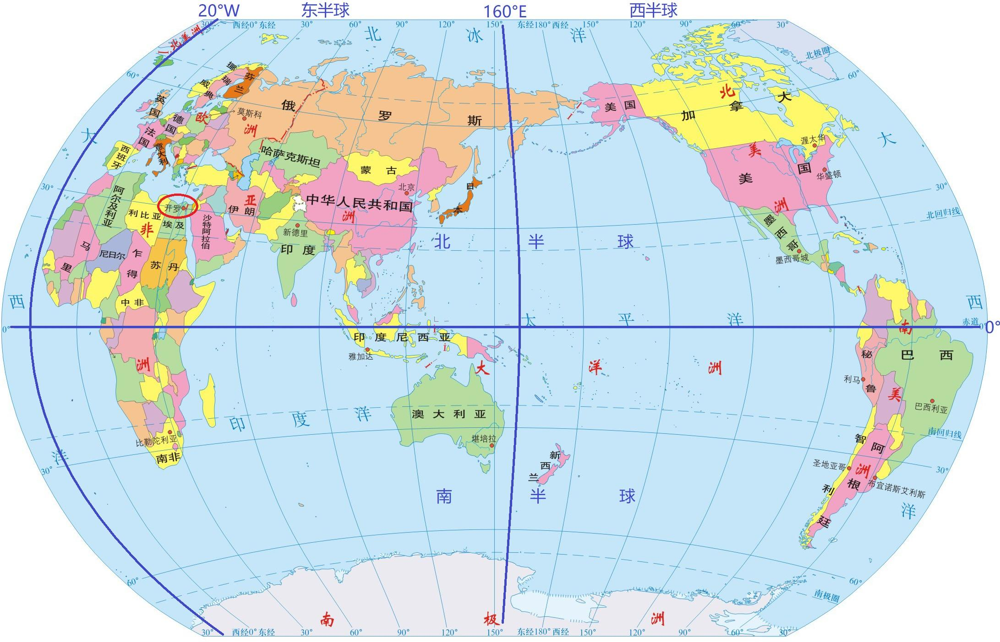

东西经0°:英国格林尼治天文台 非洲
东经90°:俄罗斯 中国新疆青海西藏 印度 印度洋
东经180°:太平洋 白令海峡 阿拉斯加 俄罗斯
南北纬0°:赤道 非洲 亚洲 南美洲 

东经90°、100°、110°、120°在我国分别穿过的省份和地形如下：

东经90°： 穿过的省份：新疆、青海、西藏。 穿过的地形：主要包括塔里木盆地、青藏高原。

东经100°： 穿过的省份：内蒙古、甘肃、青海、四川、云南。 穿过的地形：从北到南依次有内蒙古高原、河西走廊、青藏高原东部、横断山脉、云贵高原。

东经110°： 穿过的省份：内蒙古、陕西、湖北、重庆、湖南、广西、广东、海南。 穿过的地形：从北到南依次有内蒙古高原、黄土高原、秦巴山地、四川盆地东部、长江中下游平原、云贵高原东南部、两广丘陵、海南岛。

东经120°： 穿过的省份：内蒙古、辽宁、山东、江苏、浙江、福建、台湾。 穿过的地形：从北到南依次有大兴安岭、东北平原、华北平原东部、长江三角洲、杭嘉湖平原、东南丘陵、台湾岛。

北京:东经115° 北纬40°

1. 常见坐标系
   1. 大地坐标系:定位地球上的点 用经度 纬度 高程表示 lambda phi h
   A geodetic system uses the coordinates (lat,lon,h) to represent position relative to a reference ellipsoid.大地坐标系使用经纬高来表示相对于参考椭球面的位置  
	是最基础、最常用的坐标系 大地测量坐标系用来测量测绘的  
    由于地球不是完美的椭球体 需要定义一个基准椭球体来表示地球  
    根据参考椭球的不同，有很多种坐标系，比如 CGCS2000、Beijing 1954 等
	事实上的标准是WGS84 World Geodetic System 1984:  
    - 本初子午线(英国格林尼治天文台)以东或以西
    - 赤道(非洲 亚洲 南美洲)以北或以南
    - 高程相对于 ​​WGS 84 椭球面​​的高度（单位：米）。请注意，这不同于我们常说的“海拔高”（相对于大地水准面）
    
   2. 地心地固直角坐标系:计算机内部计算使用 ECEF
        原点在地球质心
        z轴指向北极点
        x轴指向本初子午线与赤道的交点,即经度0 纬度0的点
        y轴指向东经90度 北纬0° 大概是印度洋 新疆西藏云南南部位置
        xyz轴构成右手系
        xyz轴的单位是米  
        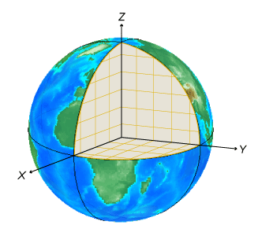
        又叫geocentric corrdinate system 地心直角坐标系，地球坐标系
        术语 geocentric​ 更侧重于描述坐标系的几何属性，即原点位于地心。而 ECEF​ 这个名称则进一步强调了该坐标系的物理特性——它不仅原点在地心，而且还与地球固联，并随着地球一起旋转。正因为地球的自转，ECEF 是一个非惯性参考系
        通过cartesian坐标(x,y,z)表示相对于地心的位置，而地心与参考椭球球心的距离取决于采用的reference ellipsoid.  
        An Earth-centered Earth-fixed (ECEF) system uses the Cartesian coordinates (X,Y,Z) to represent position relative to the center of the reference ellipsoid. The distance between the center of the ellipsoid and the center of the Earth depends on the reference ellipsoid. 因此可以转换到大地坐标系
   3. 投影坐标系:在平面上展开地球
      1. Mercator投影:google地图 bing地图 OpenStreetMap等web地图服务底层都是墨卡托投影 保持形状不变，等角投影, 但面积变形严重
      2. UTM投影:美国通用，将地球划分为60个区域，每个区域投影到平面，区域内的坐标是UTM坐标，区域外的坐标是经纬度坐标
      3. 信息
   4. 站心坐标系/局部坐标系  基于大地坐标系下某一点的坐标系
      1. East-North-Up Coordinates enu 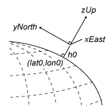
      2. North-East-Down Coordinates ned 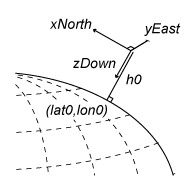
      3. Azimuth-Elevation-Range Coordinates aer 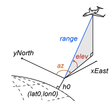

### 第一部分：GIS中常见的坐标系

GIS坐标系主要分为两大类型：**地理坐标系** 和 **投影坐标系**。

#### 1. 地理坐标系

*   **核心思想**：用经纬度来描述地球上任意一个点的位置。它是一个**三维球面**模型。
*   **基准面**：由于地球不是一个完美的球体，而是一个近似椭球体（梨形），为了精确测量，我们需要一个参考椭球体来拟合地球。**基准面就是定义了特定参考椭球体及其与地球相对位置的数学模型**。
    *   **地心基准面**：以地球质心为原点，最适合全球测量（如GPS）。
    *   **区域基准面**：最优化拟合某个特定区域（如北美），该区域测量更准，但其他区域偏差可能较大。
*   **单位**：十进制度度（Decimal Degrees, DD）。
*   **特点**：
    *   是**未投影**的坐标系。
    *   直接基于椭球体表面测量。
    *   在不同地区，**一度经纬度所代表的实际距离是不同的**（越靠近两极，经线越密集）。

**常见的地理坐标系：**

1.  **WGS84**
    *   **全称**：World Geodetic System 1984
    *   **基准面**：地心基准面。
    *   **应用**：**GPS全球卫星定位系统**的统一标准，也是目前网络地图（如Google Earth）的默认坐标系。是全球应用最广泛的坐标系。

2.  **CGCS2000**
    *   **全称**：中国国家大地坐标系 2000
    *   **基准面**：地心基准面。
    *   **应用**：**中国法定的国家坐标系**，用于一切测绘活动。它与WGS84在厘米级精度上非常接近，通常可以视为等同。

3.  **Beijing 1954 / Beijing 54**
    *   **基准面**：区域基准面（参考苏联的克拉索夫斯基椭球体）。
    *   **应用**：中国在2008年前广泛使用的地形图坐标系。现在正逐步被CGCS2000取代。与WGS84/CGCS2000之间存在较大偏差（可达100-200米）。

4.  **Xian 1980 / Xian 80**
    *   **基准面**：区域基准面（参考IAG 1975椭球体）。
    *   **应用**：在Beijing 54之后，CGCS2000之前使用，主要用于中国 mainland 的测绘。

---

#### 2. 投影坐标系

*   **核心思想**：将不可展平的**地球椭球面**通过某种数学法则**展开**到**二维平面**上。这个过程必然会产生**变形**（形状、面积、距离或方向的变形）。
*   **构成**：投影坐标系 = 地理坐标系 + 投影方法。
*   **单位**：米、英尺等长度单位。
*   **特点**：
    *   是**投影后**的坐标系。
    *   在二维平面上，坐标是 Cartesian 的（X, Y）。
    *   适用于面积量算、距离测量、规划绘图等。

**常见的投影方法与坐标系：**

1.  **Web Mercator (EPSG:3857)**
    *   **投影类型**：墨卡托投影的变种。
    *   **特点**：**等角**投影，保持方向不变形，但**面积变形严重**（高纬度地区被极度放大）。
    *   **应用**：**几乎所有在线地图服务的标准**，如Google Maps, Bing Maps, OpenStreetMap, 百度地图，高德地图。

2.  **UTM (Universal Transverse Mercator)**
    *   **投影类型**：横轴墨卡托投影。
    *   **特点**：将全球分为60个经度带（每个带6度经度），每个带单独投影，变形较小。是**等角**投影。
    *   **应用**：全球范围的大中比例尺地图（如1:100万至1:1万），军事、工程、科研领域广泛应用。中国范围内的带号一般为43-53。

3.  **Gauss-Krüger / 高斯-克吕格投影**
    *   **投影类型**：横轴墨卡托投影的一种。
    *   **特点**：与UTM类似，但采用3度分带或6度分带，中央经线比例系数为1（UTM为0.9996）。
    *   **应用**：**中国基本比例尺地形图（1:50万及更大比例尺）** 的官方投影。常与Beijing 54或CGCS2000基准面结合使用，形成如 `CGCS2000_3_Degree_GK_Zone_39` 这样的投影坐标系。

4.  **Albers Equal Area Conic (阿尔伯斯等积圆锥投影)**
    *   **投影类型**：圆锥投影。
    *   **特点**：**保持面积相等**，适合进行国家或大洲级别的面积统计分析。
    *   **应用**：中国全国范围的专题地图，特别是需要精确比较面积的场景（如人口密度、农作物分布）。

---

### 第二部分：坐标变换

坐标变换是将空间数据从一种坐标系转换到另一种坐标系的过程。根据情况不同，它可能包含以下一个或多个步骤。

#### 1. 坐标转换的主要类型

1.  **地理变换**
    *   **定义**：在不同**基准面**（即不同地理坐标系）之间进行转换。这是最复杂的一步，因为涉及到椭球体的改变。
    *   **方法**：
        *   **三参数/七参数法**：通过平移、旋转、缩放来建立两个椭球体之间的关系。七参数法精度更高。需要已知至少3个公共控制点来求解参数。
        *   **格网变换法**：使用一个偏移量查询表（如NADCON、NTv2）来修正不同基准面之间的差异，精度非常高。

2.  **投影变换**
    *   **定义**：在同一基准面下，将数据从**一种投影方法**转换为**另一种投影方法**。
    *   **例子**：将UTM投影的数据转换为阿尔伯斯等积投影。这个过程是纯数学的，不改变基准面。

3.  **基准面+投影变换**
    *   **定义**：最常见的完整坐标变换过程。既改变了基准面，也改变了投影方法。
    *   **例子**：将 `Beijing 1954 GK Zone 20` 的数据转换为 `WGS84 UTM Zone 50N`。

#### 2. 坐标变换的实践流程

在GIS软件（如ArcGIS, QGIS）中进行坐标变换时，通常遵循以下原则和步骤：

1.  **定义投影**：
    *   如果数据没有坐标系信息（即“未知坐标系”），你需要**告诉软件它当前是什么坐标系**。这一步只是添加元数据，并不改变数据本身的坐标值。

2.  **投影/变换**：
    *   将数据从当前的坐标系**转换**到你需要的目标坐标系。这一步会**重新计算并改变数据的坐标值**。

**黄金法则**：
*   **当两个坐标系的基准面不同时，必须使用地理变换（即需要指定转换参数）。**
*   如果只进行投影变换（基准面相同），则不需要地理变换参数。

#### 3. 常见问题与注意事项

*   **“火星坐标”问题**：在中国，从GPS设备（WGS84）获取的坐标，在用于百度地图或高德地图前，需要经过一个特殊的加密算法（GCJ-02）进行偏移。这是一个非标准的坐标变换，需要专门的库来处理。
*   **参数选择**：从Beijing 54或Xian 80转换到WGS84/CGCS2000时，务必选择正确的转换参数。使用错误的参数会导致几十到上百米的误差。
*   **动态地心基准**：像WGS84和CGCS2000这样的地心基准面本身也会随着测量技术的进步而微调（通过参考框架实现，如ITRF），在处理高精度应用时需要注意版本。

### 总结

| 操作 | 输入 | 输出 | 是否改变坐标值 |
| :--- | :--- | :--- | :--- |
| **定义投影** | 无坐标系信息的数据 + 正确的坐标系定义 | 具有正确坐标系信息的数据 | **否** |
| **投影** | A投影坐标系的数据 | B投影坐标系的数据（**基准面相同**） | **是** |
| **变换** | A地理坐标系的数据 | B地理坐标系的数据（**基准面不同**） | **是** |
| **投影与变换** | A投影坐标系的数据 | B投影坐标系的数据（**基准面不同**） | **是** |

理解坐标系和坐标变换是确保GIS数据空间位置准确性的关键。在处理任何空间数据时，第一步永远是**确认其当前的坐标系定义**。

## gis 引擎
高德地图是一个基于GIS和瓦片图技术的在线地图服务提供商，提供地图显示、导航、地理编码、路径规划等服务。

Leaflet和Mapbox是两个常用的开源JavaScript库，用于创建交互式地图应用程序。它们可以与不同的地图提供商和数据源集成，包括高德地图和Mapbox本身。

Cesium是一个基于WebGL的虚拟地球和地图开发平台，可以用于创建高度可视化的三维地图应用程序。与其他工具不同，Cesium的重点是3D地图可视化，因此它可以用于创建高度交互式的虚拟地球、卫星图像、城市和地形等应用程序。

osgearth

OpenLayer,LeafLet,arcgis api等都属于企业级地图应用开发库

arcgis qgis

unigine 太像了...


## 数据切片
切片是指将​​原始DEM数据​​（如整块GeoTIFF或HGT文件）切割成​​多层级瓦片金字塔​​（Tile Pyramid），每个瓦片（Tile）覆盖特定地理范围和分辨率，按需动态加载，提升性能  
原始的dem及影像数据就是最高的空间分辨率，不断下采样得到各层级的瓦片数据，最低分辨率的瓦片数据对应金字塔的最底部分，是0级瓦片

金字塔层级 0 2 4 6 8 14  
金字塔最底层是0级 层级对应的数值越大 精度越高 所以原始dem的精度就决定了金字塔的层数
LOD层级  
瓦片大小 图像分辨率 图像尺寸 瓦片尺寸 瓦片数量

理解DEM数据切片中的这些概念对构建高效的三维地形服务至关重要。下面这个表格汇总了它们的核心定义与区别，方便你快速把握要点。

| 概念 | 核心定义 | 关注点与说明 |
| :--- | :--- | :--- |
| **金字塔层级 (Pyramid Level)** | 瓦片金字塔的级别编号，通常从**0**开始。层级越高（数字越大），分辨率越高，展示细节越丰富。 | 定义了瓦片的**全局索引级别**，是瓦片坐标（Z、X、Y）中的Z值。 |
| **LOD层级 (Level of Detail)** | 根据观察点距离，动态切换不同金字塔层级的瓦片，以平衡渲染效果和性能。 | 一种**动态调度策略**，其基础是预先切好的金字塔层级。 |
| **瓦片数量 (Number of Tiles)** | 在特定金字塔层级下，覆盖整个DEM数据区域所需的瓦片总个数。 | 由数据地理范围、金字塔层级和瓦片**地理大小**共同决定。 |
| **瓦片大小 (Tile Size)** | 单个瓦片所代表的**实际地理范围**（如经度0.01度 × 纬度0.01度）。 | 一个**地理空间**概念，表示瓦片覆盖的实际地面面积。 |
| **瓦片图像尺寸 (Tile Image Dimensions)** | 瓦片作为图片文件时的**像素分辨率**，如经典的256×256或512×512。 | 一个**图像渲染**概念，尺寸越大，能描绘的地形细节越精细。 |
| **瓦片图像分辨率** | 每个像素所代表的地面实际大小（米/像素），由**瓦片大小**除以**瓦片图像尺寸**得出。 | 衡量地形模型精度的关键指标，值越小，精度越高。 |

### 💡 概念详解与关联

#### 1. 层级管理：金字塔层级 vs LOD层级

-   **金字塔层级 (Pyramid Level)**：这是数据的**静态组织结构**。就像真实的金字塔一样，第0层是覆盖全球但最粗糙的一张（或几张）瓦片；随着层级提高，每张瓦片覆盖的地理范围变小，但表示该区域的原始数据精度得以保留，从而展示更多细节。例如，第14级瓦片可能只覆盖一个城市街区。
-   **LOD层级 (Level of Detail)**：这是一种**动态渲染优化技术**。在实时渲染时，计算观察点（相机）到每个瓦片的距离。距离远的瓦片，即使存在更高金字塔层级的数据，也使用较低层级的瓦片来渲染，因为细节难以察觉。这能显著降低GPU负载，避免不必要的细节渲染。

**核心关系**：LOD机制依赖于已经构建好的金字塔层级。可以理解为，金字塔层级是“原材料”，而LOD是决定“在什么距离上使用哪种原材料”的智能调度策略。

#### 2. 瓦片度量：数量、大小与分辨率

-   **瓦片数量**：这个数量直接取决于你的数据面积和金字塔层级。有一个近似关系：在第 `Z` 级，全球范围大约会被划分为 `2^Z × 2^Z` 个瓦片。你的DEM数据覆盖其中多少，就决定了该层的瓦片数量。
-   **瓦片大小 vs 瓦片图像尺寸**：这是最容易混淆的一对概念。关键在于区分**地理空间**和**图像像素**。
    -   **瓦片大小**是地理概念，比如一个瓦片固定代表1平方公里。
    -   **瓦片图像尺寸**是像素概念，比如用256×256个像素点来描绘这1平方公里。
    -   两者共同决定了**分辨率**：如果1平方公里的地形用256像素宽的图片表示，那么分辨率大约是 `1000米 / 256像素 ≈ 3.9米/像素`。图像尺寸越大，每个像素代表的地面尺寸就越小，分辨率就越高。

### 🛠️ 实践中的选择与平衡

在实际项目中，这些概念转化为一系列需要权衡的决策：

-   **如何设定最大金字塔层级？** 这取决于你的**原始DEM数据精度**。例如，1米分辨率的DEM数据可以切到比30米分辨率SRTM数据高得多的层级，因为后者在高层级下并无可供显示的更多真实细节。
-   **如何选择瓦片图像尺寸？** 主流选择是256x256或512x512。更大的尺寸（如512px）意味着每个瓦片文件更大，加载次数少但每次传输数据量多。需要根据网络环境和性能要求进行测试选择。
-   **如何避免瓦片间的裂缝？** 在切片时，相邻瓦片边界处的高程值必须保持一致。一些先进的切片算法会对DEM数据的包围盒进行外延，确保切割后相邻瓦片在边界处有重叠像素或共用高程值，从而在渲染时无缝拼接。

### 瓦片金字塔模型
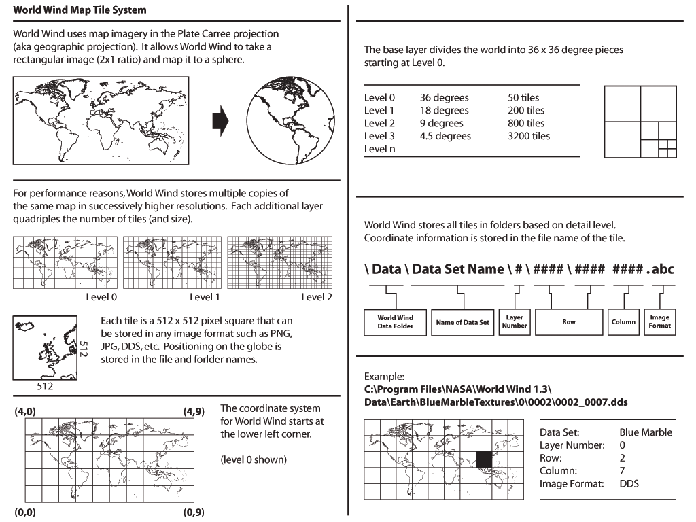  
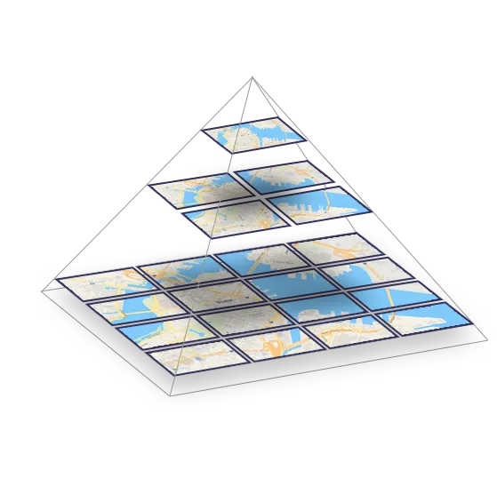  
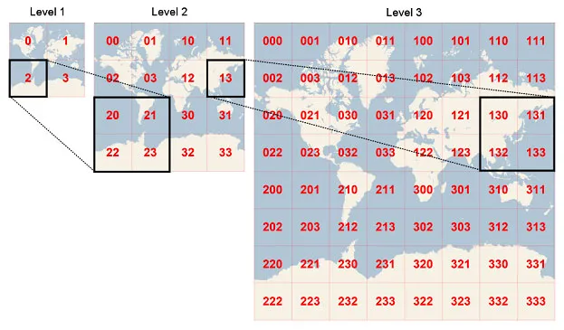  
WorldWind切片及文件组织示意说明:  
1. 经纬度切片数量比例2:1，经度方向瓦片数量是纬度方向的2倍，这是为了保持瓦片大小一致，避免经度方向的瓦片过宽，纬度方向的瓦片过窄
2. 0层瓦片大小(Level zero tile size)：lzts,36°，分了10*5格，所以每个像素代表36°经纬范围
3. 这个其实是按照度数均分的，但实际上经纬度对应的地理范围不一样，是不是导致瓦片对应的地理范围的长度南北跟东西方向不一致?
4. 切片金字塔从高到低 从上到下 金字塔层级从小到大 切片数量从少到多 分辨率从低到高 地球从缩小到放大 视角从高到低，都是一个概念、不同说法，是正金字塔


瓦片金字塔层级对应->地球缩放级别->对应视角高度,实际观察时，缩放地球或者调整视角高度，LOD调度策略会自动切换瓦片层级，以适应当前视角的细节需求，然后根据瓦片层级，从瓦片金字塔中加载对应层级(Z)的瓦片数据(X,Y)，再根据瓦片坐标，从瓦片文件中读取瓦片数据，最后将瓦片数据转换为三维模型(顶点、法线、纹理坐标等)进行渲染，从而实现动态的3D地形展示。

### 瓦片切割

地图切片主要是一个经纬度与瓦片坐标之间的坐标变换问题以及图片的降采样问题

瓦片切片制作过程[gdal瓦片构建过程api](gdal瓦片构建过程api.pdf)
1. 经纬度与瓦片坐标的转换，[地图切片-经纬度-瓦片坐标相互转换](地图切片-经纬度-瓦片坐标相互转换.pdf)
   1. 对于一张投影地图，坐标变换如下
      1. 经纬度->米
      2. 米->像素坐标
      3. 像素坐标->瓦片坐标
   2. 对于三维地图应该直接按照视角高度确定金字塔层级z，根据经纬度确定x y
2. 图片的降采样 生成图像金字塔 金字塔构建过程从最高精度(原始dem，金字塔底部)开始，不断下采样得到各层级的瓦片数据，最低分辨率的瓦片数据对应金字塔的最高(上)部分/顶部，是0级瓦片
3. 将每个瓦片对应的256*256的图片按照一定规则存储起来 便于可视化时读取响应瓦片
4. LOD调度策略
   - 金字塔结构与四叉树：这是LOD的基础。系统会预先为模型或地形生成多个细节层级的数据，像金字塔一样堆叠。
   - 在实时渲染时，常使用四叉树（用于地形）或八叉树（用于体数据）这类数据结构来高效管理这些层级，实现快速的空间查找和细节检索。
   - 瓦片化与分页调度：对于海量数据（如全球地形），数据会被切割成小块（瓦片）。系统不会一次性加载所有数据，而是根据视点动态地加载（Page In）所需瓦片，并卸载（Page Out）不可见或距离较远的瓦片，确保内存中只维持一个可控的数据集。开源引擎OSG中的 osgDB::DatabasePager组件就是实现分页调度的典型例子 

- [x] 具体的切片过程 gdal库  https://juejin.cn/post/7126890155273060382
- [x] 每层金字塔层级的瓦片数量: 由原始dem数据的地理范围、金字塔层级和瓦片地理大小共同决定，瓦片图像的大小默认都是256x256或512x512
- [x] 瓦片层级与地图比例尺关系 取决于以下几个核心因素：
        投影坐标系： 绝大多数在线瓦片地图（如Google Maps、OpenStreetMap、Bing Maps、高德、百度等）使用的是 Web墨卡托投影。
        初始分辨率： 在层级 z=0 时，整个世界通常被表示为一个256x256像素的瓦片。这个层级下地图覆盖整个地球的宽度（赤道周长）所对应的像素距离，就是初始分辨率的基础。
        瓦片金字塔结构： 每增加一个层级 (z+1)，地图的详细程度翻倍，每个瓦片覆盖的地理范围缩小为上一层级瓦片的四分之一（长宽各缩小一半）。同时，该层级下地图的像素分辨率（每像素代表的地理距离）也变为上一层级的一半。
        屏幕分辨率： 地图最终显示在屏幕上，屏幕的物理DPI会影响用户感知的“比例尺”。在线地图系统通常采用一个标准屏幕分辨率（如96 DPI）来计算和定义其标称比例尺。

### 瓦片金字塔与mipmap
地图瓦片的金字塔层级（LOD）和OpenGL的Mipmap层级，虽然都叫“层级”，也都用了“金字塔”结构，但它们在核心目标和技术实现上有着本质的区别。为了让你快速把握全貌，下面这个表格清晰地对比了它们的核心特性。

| 对比维度 | **地图瓦片金字塔层级 (LOD)** | **OpenGL Mipmap层级** |
| :--- | :--- | :--- |
| **核心目标** | **数据组织与网络调度**：将海量地理数据分层分块，实现按需加载，优化传输效率。 | **视觉质量与渲染性能**：解决纹理缩小渲染时的锯齿、闪烁问题，提升画面平滑度。 |
| **应用场景** | WebGIS、在线地图（如谷歌地图、百度地图）。 | 3D游戏、实时三维渲染、所有使用纹理贴图的图形应用。 |
| **数据结构** | **瓦片金字塔**：每个层级是无数张覆盖不同地理范围的独立图片（瓦片）。 | **纹理金字塔**：同一张纹理的一系列分辨率逐级减半的图像副本。 |
| **层级定义** | 层级（Level/Z）与地图的**比例尺/缩放级别**挂钩。层级越高，地图越详细，瓦片数量也呈指数级增长。 | 层级（Level）与纹理自身的**分辨率**挂钩。Level 0是原始分辨率，每增一级，宽高减半。 |
| **驱动因素** | 由用户的**地图操作**驱动（如缩放、平移）。系统根据当前视口的缩放级别和范围计算需要加载哪些瓦片。 | 由**像素与纹素的映射关系**驱动。GPU实时计算一个屏幕像素覆盖了多少纹理像素，自动选择合适的Mipmap层级。 |
| **切换策略** | **离散切换**：缩放时，在不同层级的瓦片之间进行“硬切换”。 | **平滑过渡**：可通过三线性过滤等技术，在两个相邻Mipmap层级之间进行混合，实现平滑过渡。 |
| **性能关注点** | **网络带宽和磁盘I/O**：重点在于减少不必要的瓦片请求和传输延迟。 | **GPU计算和显存访问**：重点在于提高纹理缓存命中率，减少渲染卡顿。 |

#### 💡 深入理解差异

##### 🗺️ 地图瓦片LOD：一种“宏观”的数据管理策略
地图瓦片技术本质上是一种应对海量地理数据的管理和传输方案。
*   **核心要解决的问题是“数据量太大”**。无法将整个地球的高清地图一次性加载到浏览器中。
*   其解决方案是“**化整为零，分层处理**”。通过预先生成不同缩放级别（对应不同详细程度）的地图图片，并将每个级别的地图切割成无数个标准大小的瓦片（如256x256像素）。当用户浏览地图时，客户端只会请求当前视野和缩放级别下所需的少量瓦片，然后像拼图一样在浏览器中拼接起来。这极大地减轻了服务器压力和网络传输负担。

##### 🎨 OpenGL Mipmap：一种“微观”的渲染优化技术
Mipmap技术则专注于解决实时图形渲染中一个具体的视觉问题：**纹理缩小**。
*   **核心要解决的问题是“视觉瑕疵”**。当一个高分辨率纹理被应用到远处一个在屏幕上只占几个像素的物体上时，GPU为了确定这个像素的颜色，需要从巨大的纹理中采样。由于采样不足，会导致严重的锯齿和闪烁现象。
*   其解决方案是“**预先过滤，按需取样**”。GPU会预计算并存储纹理的一系列缩小版本。当物体离得远时，就不再从原始大纹理中采样，而是从一个尺寸匹配的小纹理中采样，这样每个屏幕像素都能获得更具代表性的纹理颜色平均值，从而有效消除闪烁和锯齿，得到更平滑的视觉表现。

#### 🛠️ 实践中的协同与选择
尽管目标不同，但在复杂的三维地理信息系统（如Cesium、Mapbox GL JS等）中，这两种技术经常协同工作。
*   **地形渲染**：地形本身作为三维网格，会使用瓦片金字塔来管理不同区域的几何细节（几何LOD）。而贴在地形上的影像或地貌纹理，则会使用Mipmap技术来确保其在远处渲染时的平滑度。
*   **性能与质量平衡**：对于Mipmap，开发者可以通过选择不同的过滤模式来平衡性能和质量，例如，`GL_LINEAR_MIPMAP_NEAREST` 是性能和质量的良好折衷，而 `GL_LINEAR_MIPMAP_LINEAR`（三线性过滤）能提供最平滑的过渡效果。

#### 💎 总结
简单来说，**地图瓦片LOD决定了“加载哪张地图”，而OpenGL Mipmap决定了“如何画好一个表面”**。前者是面向数据和网络的地理空间概念，后者是面向渲染和视觉的计算机图形学概念。理解这一根本区别，有助于你在各自的领域内更好地应用这些强大的优化技术。

主要区别:
1. 数据结构：瓦片金字塔每一层级是无数张相同尺寸(256*256)的独立图片组成，而Mipmap每一层级是同一张图片的分辨率逐级减半的图像副本
2. 层级定义：瓦片金字塔层级与地图比例尺/缩放级别挂钩，层级越高，地图越详细，瓦片数量也呈指数级增长；Mipmap层级与纹理自身的分辨率挂钩，Level 0是原始分辨率，每增一级，宽高减半，层级数值正好相反


# ZORRO engine
1. global mapper地理信息浏览及处理,包括DOM卫片 MAP2021地面分类 DEM高程，都是tif格式
2. photoshop
3. cityengine参数化城市建模
4. maya 3d建模
5. notepad++
6. speedtree 树参数化建模

## 地形数据获取及处理
1. 所需数据分类 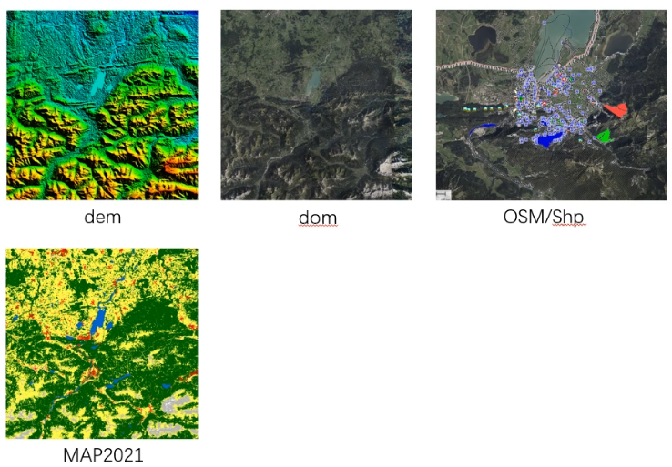 **是什么**
   1. 高精度dem(高程)
   2. 不同精度dom(影像)
   3. shp矢量数据(河流 道路)
   4. osm建筑轮廓
   5. 地类分类数据
2. 数据获取途径
   1. 水经注 watermap中国版global mapper，地图下载 数据处理 制图，可以从谷歌地图 天地图 osm等多种在线地图源下载影像 地形等数据，一般用于快速获取区域地图背景、下载卫星图、在线地图转离线等
   2. global mapper在线数据下载，瑞士军刀，支持超过300种空间数据导入、导出、查看、编辑、分析，包括LiDAR点云处理
	地形分析、路径剖面、体积计算等，格式兼容性及数据处理效率著称，不如esri的arcgis企业级空间数据库，但日常gis处理足够了，用于格式转换、点云分类、生成DEM、基础空间分析、地图制作
   3. esri Landcover数据集 livingatlas.arcgis.com，基于哨兵-2的卫星影像，分割得到地表分类数据，将地球表面的每个像素分类为水体、树木、草地、农作物、建筑表面、裸地等，每年更新免费获取，是了解地表覆盖变化的重要数据源，一般用于城市规划、环境监测、气候变化研究、农业调查
   4. osm建筑轮廓数据 www.openstreetmap.org 开源、可自由编辑的全球地图数据库，包含道路、建筑、河流、兴趣点、土地利用等丰富的地理要素的矢量地图数据，一般作为底图、路径规划、gis分析的数据源，制作专题图
   5. aster全球30m精度DEM数据集 gdemdl.aster.jspacesystems.or.jp，主要提供全球数字高程模型GDEM，免费覆盖全球，一般用于生成地形图、地貌分析、水文分析、作为遥感影像用于地物分类等
3. 数据处理
   1. 坐标系投影转换geo graphics或者Mercator投影，基准WGS84
   2. 数据裁剪
   3. 数据导出
4. 佐罗引擎编辑器使用流程
   1. dem导入
   2. dom导入
   3. mask导入
   4. 植被导入
   5. 城市建筑物生成及导入
   6. 地表建筑物制作及导入
   7. 数据库迭代处理
5. 地形 植被的brush画刷，不如ps好用 学习ps
6. lightmap没有地理信息，需要在global mapper里校正一下
   
## 模型得归零，tga贴图不支持

# 作战仿真平台
四大作战仿真平台：CIMPro、AFSim、VR-Forces与EADSIM
CIMPro采用"空天地一体化"设计理念，内置全球地理信息系统，支持19级影像瓦片和15级高程数据 国产
AFSIM:美国空军研发
VR-Forces：沉浸式训练先锋
EADSIM：防空反导专业平台

Open Source GeoSpatial Foundation:旗下有很多开源库  
gdal:Geospatial data abstraction library,支持很多种数据及格式的读写，可以看看doc GDALGeoTransform GDALDataset  
proj:a generic coordinate transformation software that transforms geospatial coordinates from one coordinate reference system (CRS) to another  
grass:Geographic resource analysis support system  
osgeo

