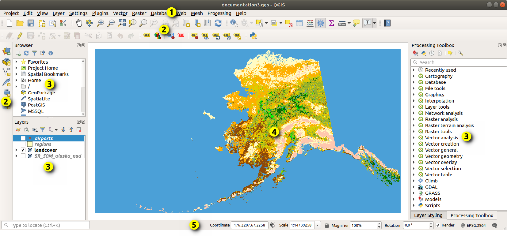

qgis data sample

  
1. Menu Bar

2. Toolbars

3. Panels

4. Map View

5. Status Bar

通过layer来管理数据
不同的layer及其意义

types of layers

1. Vector
2. Raster
3. Mesh
4. Point Cloud

数据库类型:  
1. GeoPackage
2. Spatialite
3. PostSQL
4. SAP HANA
5. STAC
6. MS SQL Server Spatial
7. Oracle

Tiles and web service
1. WMS/WMTS
2. XYZ Tiles
3. WCS
4. WFS
5. ArcGIS REST Services
6. vector tiles
7. Cloud
8. Scene

setting->option的配置可以被project->properties覆盖

# 6 working with projection
Coordinate Reference System, or CRS, is a method of associating numerical coordinates with a position on the surface of the Earth    

QGIS has support for approximately 7,000 known CRSs. These standard CRSs are based on those defined by the European Petroleum Search Group (EPSG) and the Institut Geographique National de France (IGNF), and are made available in QGIS through the underlying “Proj” projection library  

settings->options->CRS可以设置layer或者project的crs
1. layer coordinate reference system 为了能把数据project到特定坐标系，数据本身需要包含坐标信息或者手动指定CRS  
2. project coordinate reference system	

还可以通过project->properties->CRS来设置project的CRS