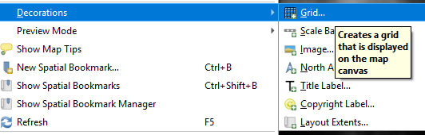
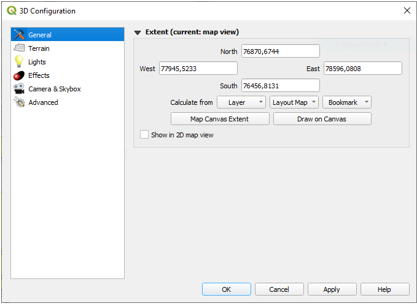
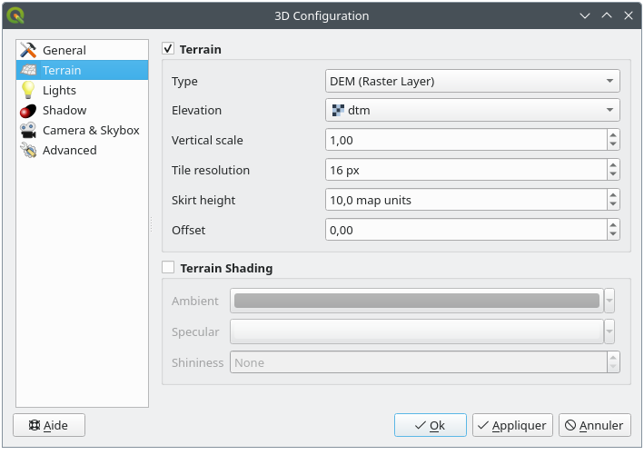

qgis data sample

  
1. Menu Bar

2. Toolbars

3. Panels

4. Map View

5. Status Bar

通过layer来管理数据
不同的layer及其意义

types of layers

1. Vector
2. Raster
3. Mesh
4. Point Cloud

数据库类型:  
1. GeoPackage
2. Spatialite
3. PostSQL
4. SAP HANA
5. STAC
6. MS SQL Server Spatial
7. Oracle

Tiles and web service
1. WMS/WMTS
2. XYZ Tiles
3. WCS
4. WFS
5. ArcGIS REST Services
6. vector tiles
7. Cloud
8. Scene

setting->option的配置可以被project->properties覆盖

# 6 working with projection
Coordinate Reference System, or CRS, is a method of associating numerical coordinates with a position on the surface of the Earth    

QGIS has support for approximately 7,000 known CRSs. These standard CRSs are based on those defined by the European Petroleum Search Group (EPSG) and the Institut Geographique National de France (IGNF), and are made available in QGIS through the underlying “Proj” projection library  

settings->options->CRS可以设置layer或者project的crs
1. layer coordinate reference system 为了能把数据project到特定坐标系，数据本身需要包含坐标信息或者手动指定CRS  
2. project coordinate reference system	

还可以通过project->properties->CRS来设置project的CRS

# 7 visualizing maps
基本通过view菜单进行控制
## 2D Map View
- 可以添加修饰，包括Grid, Title Label, Copyright Label, Image, North Arrow, Scale Bar and Layout Extents  

- 可以添加标注 
- 可以添加测量 长度 面积 角度等

## 3D Map View

### 场景配置
1. 地形范围设置  
	

2. 地形设置
    the terrain in a 3D view is represented by a hierarchy of terrain tiles and as the camera moves closer to the terrain, existing tiles that do not have sufficient details are replaced by smaller tiles with more details. Each tile has mesh geometry derived from the elevation raster layer and texture from 2D map layers.
	地形起伏平缓、垂直比例 = 1 → 保持默认值（10）即可；
	地形起伏大、垂直比例 > 1.5 → 增大至 50-200 地图单位；
	出现明显裂缝 → 逐步增大值，直到裂缝消失（避免一次性设为极大值，影响性能）   
	
	1. type: flat terrain/DEM/Online/Mesh/Quantized Mesh
	2. elevation:用于terrain generation的raster或mesh layer
	3. vertical scale: 垂直轴缩放，可以调整地形起伏
	4. Tile resolution: How many samples from the terrain raster layer to use for each tile. A value of 16px means that the geometry of each tile will consist of 16x16 elevation samples. Higher numbers create more detailed terrain tiles at the expense of increased rendering complexity.
	5. skirt height:裙边高度，用于消除瓦片之间的缝隙
	6. offset:
3. 光照 特效等效果

### 导航
- Tilt the terrain (rotating it around a horizontal axis that goes through the center of the window)

	Press the tiltUp Tilt up and tiltDown Tilt down tools

	Press Shift and use the up/down keys

	Drag the mouse forward/backward with the middle mouse button pressed

	Press Shift and drag the mouse forward/backward with the left mouse button pressed

- Rotate the terrain (around a vertical axis that goes through the center of the window)

	Turn the compass of the navigation widget to the watching direction

	Press Shift and use the left/right keys

	Drag the mouse right/left with the middle mouse button pressed

	Press Shift and drag the mouse right/left with the left mouse button pressed

- Change the camera position (and the view center), moving it around in a horizontal plan

	Drag the mouse with the left mouse button pressed, and the pan Camera control button enabled

	Press the directional arrows of the navigation widget

	Use the up/down/left/right keys to move the camera forward, backward, right and left, respectively

- Change the camera altitude: press the Page Up/Page Down keys

	Change the camera orientation (the camera is kept at its position but the view center point moves)

	Press Ctrl and use the arrow keys to turn the camera up, down, left and right

	Press Ctrl and drag the mouse with the left mouse button pressed

- Zoom in and out

	Press the corresponding zoomIn Zoom In and zoomOut Zoom Out tools of the navigation widget

	Scroll the mouse wheel (keep Ctrl pressed results in finer zooms)

	Drag the mouse with the right mouse button pressed to zoom in (drag down) and out (drag up)

中键拖动调整视角 或者ctrl+左键，调整的时候，好像与地形有关系，需要多次换个范围调整才有效果

