整个文档都应该看看，只不过重点是uv 渲染 材质 光照 动画以及基础的文件系统
blender manual: https://docs.blender.org/manual/en/latest/index.html 学习

4.0开始rendering有重大更新 新的Principled BSDF shader with coat and sheen layers  

图标是个比较好的提示

Photorealistic Materials and Textures in Blender Cycles - Fourth Edition
The Complete Guide to Blender Graphics
Blender script with python

dream-textures是stable diffusion的blender插件https://github.com/carson-katri/dream-textures

# User Interface
## window系统
  

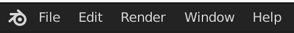  

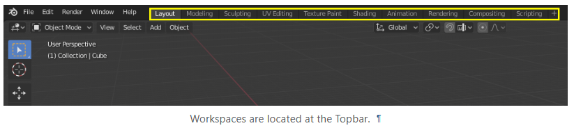  

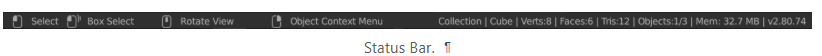 有一些资源 log 鼠标 键盘状态等的信息

### workspace
1. window系统中最主要的部分就是workspace部分:  
   Workspaces are essentially predefined window layouts. Each Workspace consists of a set of Areas containing Editors, and is geared towards a specific task such as modeling, animating, or scripting.  

2. 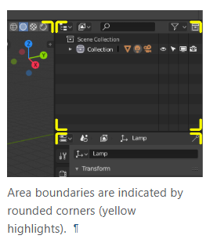可以认为是editor在窗口的占位符或容器  
   The Blender window is divided into a number of rectangles called Areas. Areas reserve screen space for Editors, such as the 3D Viewport or the Outliner. Each editor offers a specific piece of functionality.

3. 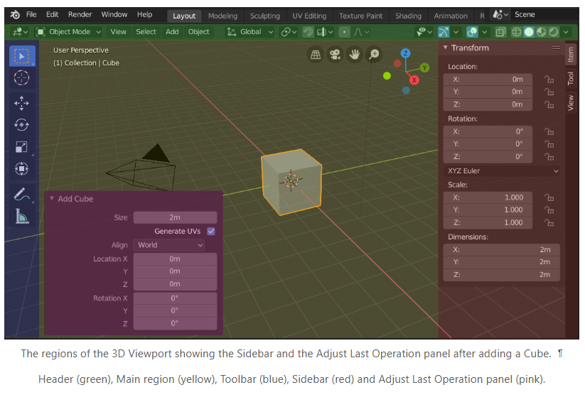

workspace下有多个areas，每个area下有多个editor可切换，每个editor下有多个region，每个region可以有tab/panel等完成特定功能    
每个editor的region主要包括:  
Toolbar Sidebar Headerbar 及 中央的main region

## keymap

## UI Elements
button widget menus input-field

## Tools & Operators
undo redo

## Nodes
blender有很多基于node的编辑器  
包括geometry nodes, shader nodes, texture nodes, composite nodes等

# Editors
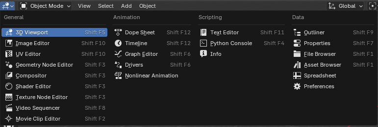
支持整个 3D 创作流程：建模、雕刻、骨骼装配、动画、模拟、实时渲染、合成和运动跟踪，甚至可用作视频编辑及游戏创建, 包括property editor   

每种editor都是针对特定资源的编辑器
workspace是针对某种工作流组合多种编辑器的预定义布局

每个editor的介绍至少都包括:  
1. Toolbar 
2. sidebar
3. headerbar
4. overlay
5. navigation

每个editor下有多种mode，如3d view的select edit等mode, tab可以切换前两种mode ctrl+tab弹出mode选择窗口

overlay:
	模型下的overlay有文字 注解 grid 骨骼 动画等等
	不同的editor有不同的overlay

**Gizmo**:  
Gizmos are graphical representations of tools that allow you to manipulate objects, lights, cameras, and other elements in the 3D Viewport. They are interactive and provide a visual representation of the tool's current state and allow you to manipulate it using the mouse or keyboard.  
嵌入3d场景中的可视化交互工具,主要功能包括变换(旋转 缩放 平移)、调试辅助(显示碰撞体、光源位置、相机位置、视景体等)  

在场景视图（Scene View）中显示为临时的、非游戏运行时的图形，帮助开发者在设计和调试阶段更好地理解对象的位置、方向和交互。这些Gizmos可以是线、点、框、球或其他几何形状，用于表示各种功能，如变换轴、碰撞体、关节、导航网格等。  

the Pivot Point determines the location of the Object Gizmo.

pivot types:

snapping target

## 3D Viewport

object mode模式下侧边栏item能够显示物体的长宽高尺寸

### navigation
导航有很多模式
1. 标准模式
2. 还有walk/fly navigation，是第一人称视角，这些模式是暂时的，点击鼠标确认后会退出选中的模式，可以使用键盘操作

小键盘快捷键:
- 2 4 6 8 旋转, ctrl+2 4 6 8平移
- 5切换投影方式
- 0切换相机/上帝视角
- 1 3 5 7切换三视图方向

**标准模式下有很多交互样式**:  
1. orbit:MMB,小键盘2468旋转预定角度
   alt键在orbit下
   - alt键+MMB点击一个点,此点成为pivot点，旋转时围绕此点旋转
   - 按住alt键,拖动MMB，画一条线，旋转时围绕此轴旋转
   - 先拖动MMB，再按住alt键，旋转时围绕此轴旋转并吸附到世界轴
2. pan:shift+MMB拖动，平移
3. zoom:滚轮缩放
4. dolly:shift+ctrl+MMB
5. 句点.:跳到选中物体的视角

### walk/fly navigation
view->navigation->walk/fly navigation:
移动鼠标，或者qwer等键盘移动视角,左键点击确认视角，右键/esc取消视角

### 3d cursor
是空间中一个点,具有位置和旋转,可以用来指定新添加的物体的位置或者手动指定gizmo的位置

shift+RMB点击3d cursor,可以设置3d cursor的位置,或者选中toolbar下的cursor，然后左键

## image editor

## UV editor
UV Editing比layout下的editor功能更丰富

navigation:  
Sync Selection:同步uv和3d view的选中状态  
vertex  
edge  
face  
uv island selection

与object有类似的selection功能

# Scenes & Objects

## Scenes
## Objects
一个或多个Object构成一个Scene，  
object type包括mesh, light, curve, camera, etc，由两部分组成
1. object:Holds information about the position, rotation and size of a particular element
2. objectData
   Holds everything else. For example:
	Meshes:
	Store geometry, material list, vertex groups, etc.

	Cameras:
	Store focal length, depth of field, sensor size, etc.

	Each object has a link to its associated object-data, and a single object-data may be shared by many objects.

object type包括mesh curve surface text volume armature camera lamp speaker

object的origin在平移旋转中很重要 选中物体时会显示原点 

选中对象(橙色) 激活对象(最近一次选中的对象，黄色) 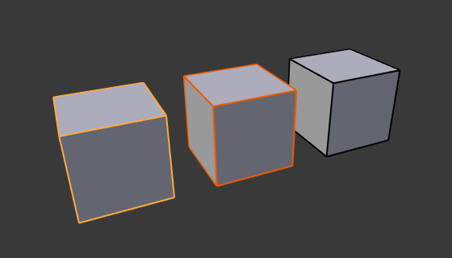  
Object的selection state包括:
1. active
2. selected but not active
3. not linked and not selected
4. linked
5. selected,linked, but not active

a:全选所有object  
alt-a:全不选  
ctrl-i:反选  
b:box selection  
还有从菜单栏打开的选择菜单功能  

### Editing
这是物体编辑的重点内容https://docs.blender.org/manual/en/latest/scene_layout/object/editing/index.html

## Collections
把objects组织起来，方便管理

## View Layers
方便渲染，可以设置哪些object被渲染，哪些被忽略

# Modeling
blender里有四种模型表示方式
1. mesh:explicit defined by vertices
2. curve:explicit defined by control points 1d u坐标，nurbs 或者bezier
3. surface:explicit defined by control points 2d u,v坐标，nurbs 或者bezier
4. metaball:implicit defined by formulas

## Meshes
### Tools
### Selecting
### Editing
### UVs
展uv的流程如下
1. Mark Seams if necessary. See more about marking seams.

2. Select mesh faces in the 3D Viewport.

3. Select a UV mapping method from the UV ‣ Unwrap menu or the UV menu in the 3D Viewport.

4. Adjust the unwrap settings in the Adjust Last Operation panel.

5. Add a test image to see if there will be any distortion. See Applying Images to UVs.

6. Adjust UVs in the UV editor. See Editing UVs.

uv editing:选择seam，进行unwrap(此时必须a或l，选中要展开的物体，才能看见mesh展开的情况) 
Texture Painting:
Shading: 在shader编辑器里添加texture，需要选中的object本身有material，material里添加texture
要在3d viewport里直接显示预览效果，需要选中header中的viewport shading为Material Preview

## Curves
## Surfaces
## Metaballs
## Texts
## Point Clouds
## Volume
## Empties
## Modifiers
## Geometry Nodes

# Sculpting & Painting

## Texture Painting
就是绘制纹理，可以绘制在模型上，也可以绘制在uv上，可以同步预览
分左右窗口，左边是image editor,右边是3d view
image editor有view paint mask等mode
3d view有texture paint sculpt edit等mode，默认是texture paint模式

具体绘制时，颜色得选好，有时有bug，没选择颜色(黑色，啥也看不见，颜色&second color)

# Grease Pencil
油画笔

# Animation & Rigging
动画是使物体随着时间移动或者改变形状
动画有多种形式
1. 物体作为一个整体进行移动(改变位置，旋转，缩放等)
2. 变形:顶点或控制点动画
3. 继承动画

骨骼编辑模式 E键进入骨骼挤出模式 移动鼠标后点击退出挤出模式
1. 创建骨架 armature,可以修改骨架的属性 形状 父子关系 挤出方向
2. 多个骨架可以连接起来

rigging插件有预设骨架 humuan basic animal

# Physics

# Rendering

纹理烘焙：离线提前制作好一些asset，在引擎里使用以提高效果效率，如高模法线烘焙贴到低模
blender里烘焙的流程如下:
选中需要进行烘焙的object，选中烘焙结果的导出目标(image texture node，不需要连接到任何节点，但需要有一张link的bitmap或生成的image,模型已经展uv到这张bitmap上)，选中烘焙类型(漫反射，法线，粗糙度，金属度等)点击bake
Property Editor里的render属性下有bake功能，需要选择引擎 烘焙类型 观察位置等
PBR贴图是实现真实感材质的关键，通常包括以下几种贴图：

1.** 反照率（Albedo）贴图 **：记录物体的基础颜色，不包含光照和阴影信息。在Blender中，可通过烘焙"漫反射"类型并去除光照影响得到。

2.** 法线（Normal）贴图 **：模拟物体表面的凹凸细节，使低模呈现高模的立体感。烘焙"法线"类型时，注意选择正确的空间（通常为" tangent "空间）。

3.** 粗糙度（Roughness）贴图 **：控制物体表面的光滑程度，影响高光的大小和模糊程度。可通过烘焙高模的细节或手动绘制得到。

4.** 金属度（Metallic）贴图 **：区分物体表面的金属和非金属区域，金属区域反射环境，非金属区域反射高光。

5.** 环境光遮蔽（AO）贴图 **：模拟物体表面因自身遮挡产生的阴影，增强细节的层次感。

这些贴图可以通过Blender的节点编辑器进行组合，创建PBR材质。例如，将法线贴图连接到Principled BSDF节点的"法线"输入，粗糙度和金属度贴图分别连接到对应的输入，即可实现基于物理的真实渲染效果。

Blender的PBR材质节点设置可参考 scripts/addons_core/io_scene_gltf2/blender/imp/pbrMetallicRoughness.py 中的PBR材质导入代码。

Open Shading Language

烘焙单个物体 多个物体 场景的具体操作都不太一样

## 3个引擎
3个引擎Cycles, Eevee, Workbench

EEVEE is a physically based realtime renderer. based on rasterization

Cycles is a physically based path tracer. based on path tracer

Workbench is designed for layout, modeling and previews.

每个引擎有自己的渲染设置，有时间了可以看看了解内部实现以及一些概念

## Cameras
## Light
## Material

## Shader Nodes
Materials, lights and backgrounds are all defined using a network of shading nodes. These nodes output values, vectors, colors and shaders

color model:
	RGB:红绿蓝
	HSV:色相饱和度明度
	HSL:色相亮度饱和度

### Input
### Output
AOV Output Node:any output variables
Material Output Node:材质表面输出
Light Output Node:光源
World Output Node:世界
### Shader
各种常见BSDF shader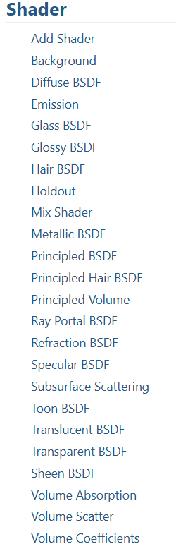
### Texture
各种常见纹理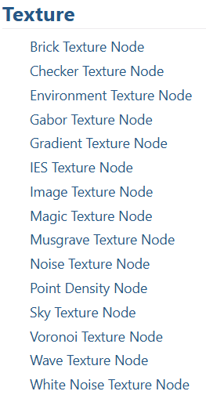
### Color
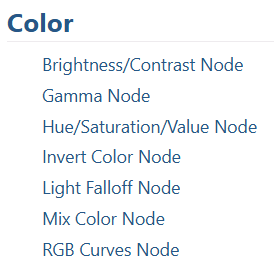
### Vector
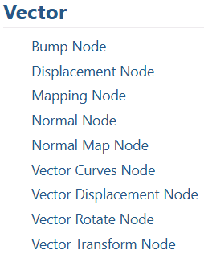
### Converter
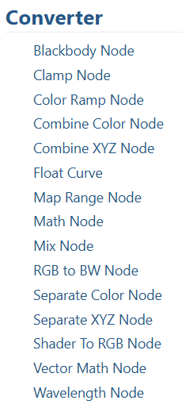 多通道非颜色属性的分离、合并的转换等channel package
### Scripte Node

## Color Management
OpenColorIO用于管理颜色，包括颜色空间转换，颜色校正等
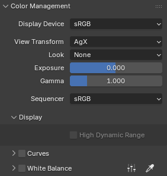

1. 显示设备
   1. sRGB: Used by most displays.
   2. Display P3: Used by most Apple devices.
   3. Rec. 1886: Used by many older TVs.
   4. Rec. 2020: Used for newer wide gamut HDR displays.
2. view transform
3. exposure 曝光，控制亮度 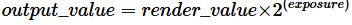
4. gamma校正
5. sequencer

## Freestyle
## Layers & Passes
## Render Output

~~# Compositing~~

# Motion Tracking & Masking
~~# Video Editing~~
# Assets, Filse & Data System
.blend文件包含一个database，这个database包含所有的scenes，objects，meshes，textures等等
一个.blend文件可以包含多个scenes，每个scene可以包含多个objects，每个object可以包含多个materials，每个material可以包含多个textures

## Data-Blocks
主要是在outline编辑器里使用
blend项目的基础单位是data-block,data-block可以是meshes, objects, materials, textures, node trees, scenes, texts, brushes, and even Workspaces.  
data-block是各种不同数据的通用抽象:  
1. 是.blender文件的主要内容
2. 可以相互引用，用于复用、实例化
3. 指定类型的数据，名字唯一
4. 可以增删改查
5. 不同文件之间可以链接
6. 可以有自己的动画数据
7. 可以有自定义属性

删除data-block: 
unlink:当前数据不再被某个用户使用，引用计数-1  
材质右侧的x进行unlink
shift+LMB+x:所有用户都不在使用此data-block,引用计数置零，删除data-block

## Linked Libraries (关联库)
链接库允许把一个 .blend 文件中的数据块引用到另一个 .blend 文件中，复用资产而不必复制。

### 是什么
- **链接库**是引用外部 .blend 文件中数据块的机制，在本地 .blend 文件中保存对外部文件的引用路径
- 通过 `File → Link` 或 `File → Append` 操作实现
- 在 Outliner 的 `Blender File` 显示模式下可以看到当前文件中所有链接的数据块及其来源路径
- 链接的数据块在 Outliner 中以**链状图标**标识

### 用途
- **多人协作**：把通用资产（角色、道具、场景）放在库文件中，多人共享同一份源
- **跨项目复用**：相同的资产可以被多个项目链接使用，避免重复制作
- **保持数据一致**：更新库文件后，所有链接它的项目都能获取最新内容
- **减小项目体积**：只存储引用，不复制数据本身
- **模块化制作**：把场景拆分成多个库文件（背景、角色、特效等），按需链接

### 内容
- **Link（链接）**：在本地文件中创建对外部数据块的引用，外部源文件修改后本地会自动同步；默认情况下链接的数据块**不可编辑**（包括物体的位置/旋转/缩放都被锁定）
- **Append（追加）**：把外部数据块**完整复制**到本地文件中，复制后与原文件完全独立；可在 `File Browser` 中浏览外部 .blend 文件并选择要追加的内容
- **Options 选项**：
  - `Relative Path`（链接）：用相对路径引用外部文件
  - `Select`（链接/追加）：自动选中新添加的物体
  - `Active Collection`（链接/追加）：添加到当前激活集合 vs 新建"Linked Data"/"Appended Data"集合
  - `Instance Collections`（链接/追加）：以集合实例（Empty 物体）方式添加
  - `Instance Object Data`（链接/追加）：为直接链接的物体数据创建物体
  - `Fake User`（追加）：标记为 Protected，保存时不删除
  - `Localize All`（追加）：连带复制所有间接链接的数据
- **Reload Library**：在 Outliner 的 `Blender File` 视图右键点击链接的库文件，可重新加载以更新数据
- **Relocate Library**：当外部文件移动或重命名后，可重新指定路径（解决 Broken Libraries 断链问题）
- **Relocate Linked ID**：用同库或不同库中的另一个 ID 替换当前链接的 ID
- **Make Local**：把链接的数据块转为本地（`Type` 选项决定是否连数据/材质一起本地化）
- **Known Limitations 已知局限**：
  - 不能有循环依赖
  - 链接物体时场景级别的设置（如 Rigid Body World）不会被复制，需把整个 Scene 链接作为 Background Scene
  - 引用压缩的 .blend 文件需完整加载，可能占用较多内存

### Library Overrides (库重写)
**是什么**：允许在保持与原始库数据同步的前提下，对链接数据块进行本地编辑的系统（Blender 3.0 引入，替代旧的 Proxy 代理系统）

**用途**：
- 对链接的角色/道具进行局部定制（位置、修改器、材质参数等），但保留与原始库文件的同步
- 同一链接数据的多个独立覆盖（同一角色在同一场景中多次出现，每个可独立编辑）
- 递归链接覆盖

**核心概念 - 重写层级（Override Hierarchies）**：
- 真实资产几乎不会由单个数据块组成，而是由多个相互依赖的数据块（物体+网格+骨架+材质+纹理）构成的树形结构
- 层级根通常是直接链接的集合
- 当同一链接数据有多个覆盖时，层级可清晰区分每个覆盖

**操作**：
- `Make an Override`（生成重写）：从选中数据块自动创建所需的所有重写
- `Reset an Override`（重置重写）：恢复为原始链接值
- `Clear an Override`（清空重写）：删除重写，回退到链接引用
- `Edit an Override`（编辑重写）：像普通数据块一样编辑；属性被重写时会显示**蓝绿色**高亮
- `Resyncing Overrides`（同步重写）：链接数据块之间的关系变化时需要重新同步；打开 .blend 时自动同步，也可手动

**限制**：
- Edit Mode 不允许对覆盖进行编辑
- 重写 Action 数据块的 F-Curve 只能静音，不能编辑/添加
- 库文件丢失时部分数据可能丢失（如 Pose 骨骼当 Armature obdata 本身未重写时）

## Asset Libraries (资产库)
**3.0 版本引入**，用于系统化管理可复用的 Blender 资产。

### 是什么
- **Asset（资产）**：带有元数据（含义、用途、目录、作者、标签、预览图）的数据块——`An asset is a data-block with meaning`
- **Asset Library（资产库）**：在 Preferences 中注册的、包含 .blend 文件的目录
- 数据块本身不一定是资产，只有通过 `Mark as Asset` 标记后才是；Asset 描述的是有"语义"的数据

### 用途
- **统一管理可复用资源**：把常用资产集中管理，避免散落各处
- **团队共享资源库**：让多个成员使用同一套资产
- **在线资产库**：Blender 支持在线资源库（按需下载并本地缓存），适合分发官方/工作室标准资产
- **当前文件资产库**：每个 .blend 文件内置一个"Current File"资产库，方便单文件内管理

### 内容
- **注册位置**：`Edit → Preferences → File Paths → Asset Libraries`
- **浏览方式**：通过 Asset Browser 编辑器选择已注册的资产库
- **索引机制**：首次加载时扫描库中所有 .blend 文件并生成索引（存放在 Local Cache Directory），后续加载显著加快
- **资产目录（Catalog）**：每个资产可分配目录标签，与文件物理位置无关
- **Asset Types 资产类型**，分两类：
  - **Primitive（原始）资产**：可被 Link 或 Append 到当前文件
    | 资产 | 描述 |
    |------|------|
    | Material | 可应用到物体的材质数据块，拖到物体上会替换材质槽 |
    | Collection | 物体集合，可被链接/追加到场景，保持内部层级，可被实例化 |
    | Object | 物体资产（可包含 mesh/curve/light 等） |
    | Node Group | 节点组资产，拖到兼容的节点编辑器（Geometry Nodes/Shader/Compositor） |
    | World | 世界环境资产，定义全局环境光照 |
    | Scene | 完整场景资产（含相机/灯光/链接物体） |
  - **Preset（预设）资产**：被加载并**应用**或**激活**到某物
    | 资产 | 描述 |
    |------|------|
    | Brush | 雕刻/绘制笔刷资产，激活后成为当前笔刷但不永久保存 |
    | Pose Action | 姿势资产（基于 Action），应用到选中/激活骨架 |

- **Bundled Assets 内置资产**：Blender 自带 "Essentials" 库，包括：
  - Hair node groups
  - Smooth By Angle Node Group
  - Brushes：Mesh Sculpt / Curve Sculpt / Texture Paint / Vertex Paint / Weight Paint
- **创建资产**：
  - Primitive 资产：在 data-block 选择器、Outliner、3D 视口物体菜单中使用 `Mark as Asset`
  - Preset 资产：使用专用的创建按钮（如 `Create Pose Asset`），或从已有笔刷资产 `Duplicate Asset`
- **编辑资产**：作为常规数据块编辑；编辑完后需保存 .blend 文件以更新到资产库
- **分享资产**：直接分享 .blend 文件；同时需带上 Asset Catalog Definition File
- **使用资产**：从 Asset Browser 拖入场景
- **删除资产**：用 `Clear Asset` 移除元数据（catalog/描述/作者/标签）
- **Asset System Files (.asset.blend)**：Blender 对部分资产类型（当前只有 Brush）使用 `.asset.blend` 扩展名特殊管理——只包含单一资产及其依赖；可打开但不能直接保存（防止数据丢失）
- **Online Asset Libraries 在线资产库**：
  - 用 URL 而非目录路径标识
  - 按需下载并缓存到本地
  - 不能直接 Link，必须 Append 或 Pack
  - 需要在 Preferences 中启用 Online Access
- **设计局限**：
  - Blender 不允许写入到当前打开文件之外的其他 .blend 文件——编辑资产必须打开其源文件
  - 资产推送（Asset Pushing）：Blender 不会自动把资产推送到库中（如何处理材质/纹理/依赖的决策需手动或借助扩展工具）

### 与 Linked Libraries 的关系
- **资产系统建立在数据块和链接库系统之上**
- Primitive 资产本质上就是"准备好被 Link/Append"的数据块
- Asset Library 提供更友好的浏览和组织方式，而 Linked Library 提供底层的引用机制
- Library Overrides 可应用于从资产库拖入的链接数据

## 与其他概念的关系
- **Data-Blocks** 是基础——所有内容都是数据块
- **Linked Libraries** 是文件间的引用机制
- **Library Overrides** 让链接数据可被本地编辑
- **Asset Libraries** 是更高层的组织方式，让资产可被浏览、搜索、复用

~~# Add-ons~~  
~~# Advanced~~  
~~# Troubleshooting~~  
# Glossary
https://docs.blender.org/manual/en/latest/glossary/index.html# blender及图形学术语

view layer

~~先把各种编辑器看完 走马灯看完了~~

shading nodes
geometry nodes

texture paint
材质/shading:所有三维软件的材质系统大致可以概括为两类，图层堆栈型和节点编辑型
animation
vfx特效
rendering

blender 3渲2 用3d模型渲染2d手绘般的效果 npr非真实感渲染的一种风格，又叫伪3d 2.5d

# shortcut
在 Edit->Preferences->Keymap里有各种快捷键
1. 视角控制：
   1. 鼠标中键按住旋转
   2. shift+M 平移
   3. 滚轮缩放
2. 视图切换
   1. 小键盘1正视图 3右视图 7俯视图，ctrl+是对面视图
   2. 9翻转当前视图
   3. 0切换摄像机视角
   4. 5切换正交 透视
   5. 2 4 6 8前后左右微调角度
   6. + - 缩放微调

3. 物体控制
先选中物体,小键盘的.切换物体
	G:按住G，移动物体，GXYZ分别代表x,y,z轴移动，G+中键坐标轴平移
	R:代表旋转，
	S:代表缩放 

新建物体 shift A:add model,在cursor当前所在位置添加模型
复制物体 shift D:复制+移动
删除物体 x 或delete

H:隐藏 alt+H shift+H

n:切换侧边栏显示

tab:切换模式 在最前面的两种模式间切换 编辑模式，物体模式，编辑模式，雕刻模式，顶点模式，权重模式，粒子模式，曲线模式，曲面模式，metaball模式，文本模式，点云模式，体积模式，空物体模式，修改器模式，几何节点模式

ctrl+tab:切换模式 调出模式列表进行选中切换

alt+某快捷键，撤销某种

select选择工具:框选 套索 a全选 c刷选，shift加选或减选

模型编辑模式下，可以添加法线显示的overlay

# blender的插件
各个小版本之间的插件安装方式都不一样  
4.5.3主要的安装方式有:  
1. edit->preferences->addons,可以选择内置插件,勾选激活
2. edit->preferences->addons->install from file,从硬盘选择插件安装,插件主要是压缩包或.py文件
3. 拖拽压缩包安装

安装失败的原因:  
1. 当您打算下载它时，插件 .py 文件会在浏览器中显示为代码。
2. 插件以 .zip 文件形式下载，但本应以 .py 文件形式安装
3. 一个压缩得很深的插件 .zip。
4. 一个压缩在 .zip 内的插件。

插件安装的位置:
第三方插件，打开插件能看见文件位置 内置的没有提示应该是在blender安装目录下4.5\scripts\addons_core
https://github.com/matyalatte/Blender-DDS-Addon

# uv展开
https://www.bilibili.com/video/BV114hgzYETE?vd_source=ffd47f490f976be9dd70c839d34b8fdc&spm_id_from=333.788.videopod.sections

# 材质的几个概念

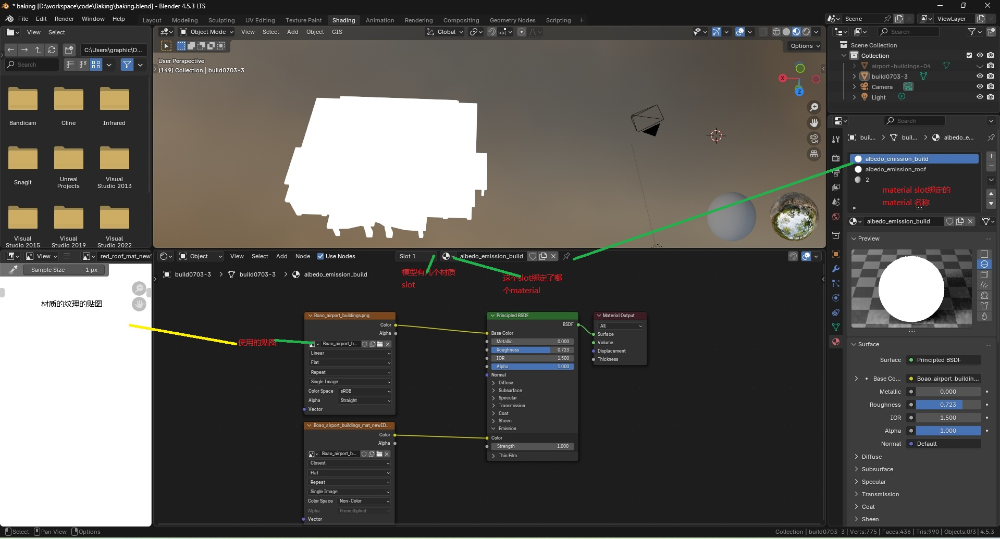

这套概念的核心是一条**层级链**：

> 物体 → 材质槽（Slot）→ 材质（Material）→ 着色器图（Shader Graph）→ 着色器节点（Shader Node）

每一层职责不同，**Shader Editor 是编辑这套链的"工作台"**，而 Material Editor 通常是大家对整个材质编辑系统的俗称（Blender 里并没有这个精确命名的编辑器，实际对应的是属性面板里的材质页）。

下面逐层拆开。

## 七个概念逐一解释

**1. Material Slot（材质槽）**
材质槽是**把材质链接到物体/网格上的接口**。默认情况下每个物体只有一个槽，挂一个材质给整个物体；如果网格不同部位需要不同材质，就加多个槽。槽本身不存储外观，它只是个"插口"。

**2. Material（材质）**
材质是**数据块（data-block）**，可以创建后被分配给一个或多个物体，控制网格/曲线/体积的外观、颜色、以及光如何与它交互。一个材质由三部分组成：
- **Surface Shader**：控制表面的纹理和光照交互
- **Volume Shader**：定义网格内部，烟雾、火焰等只用这个
- **Displacement**：通过纹理让表面产生位移细节

**3. Shader（着色器）**
着色器是材质内部**真正计算"光如何与表面交互"的组件**。Blender 提供了多种着色器节点：`Principled BSDF`（PBR 全能）、`Diffuse BSDF`、`Glossy BSDF`、`Glass BSDF`、`Emission`、`Mix Shader` 等。材质的外观由这些着色器的组合计算决定。

**4. Node（节点）**
节点是**着色器图里的最小积木**。除了 Shader 类节点，还有 Input（输入）、Texture（纹理）、Color（颜色）、Vector（矢量）、Converter（转换）、Output（输出）等类别。每个节点干一件具体的事，通过连线传递数据。

**5. Shader Graph / Node Graph（着色器图/节点图）**
这是**所有节点通过连线组成的网络**，数据从左向右、从上向下流动，最终必须连到 `Material Output` 节点的 `Surface` 输入，否则渲染出来是空材质。**任何没连到 Material Output 的节点对渲染零影响**——这是新手"材质看不见"的最常见原因。

**6. Shader Editor（着色器编辑器）**
这是 Blender 中的一个**编辑器类型（Editor Type）**，是你搭建和编辑节点图的工作台。官方手册明确：材质既可以在材质属性面板创建，也可以在 Shader Editor 创建，**两者提供的是同一套着色器节点和材质设置的不同视图**。Shader Editor 分为四个区域：Header（添加菜单）、Node Area（节点画布）、Sidebar（节点选项）、Properties（材质/槽管理）。

**7. Material Editor（材质编辑器）**
⚠️ Blender **没有这个 exact 名称的编辑器**。大家口头说的"材质编辑器"通常指两样东西：
- **属性面板里的材质页**（红色小球图标）——管理槽的增删、材质的分配/切换、Link 模式
- 或者泛指 **整个材质编辑系统**（材质页 + Shader Editor 协同工作）

## 概念对比表

| 概念 | 是什么 | 类比 | 在 UI 哪里 |
|---|---|---|---|
| Material Slot | 材质和物体之间的**接口** | 插座 | 属性面板 → 材质页 |
| Material | 材质**数据块** | 一个完整的"材质设定" | 属性面板材质页 + Shader Editor |
| Shader | 材质里的**着色计算组件** | 材质内部的"引擎" | Shader Editor 里的 Shader 类节点 |
| Node | 节点图里的**最小积木** | 乐高块 | Shader Editor 画布 |
| Shader Graph | 节点连成的**网络** | 流程图 | Shader Editor 画布 |
| Shader Editor | 编辑节点图的**工作台** | 车间 | 切换 Editor Type 选择 Shader Editor |
| Material Editor | （非正式）材质页 + Shader Editor 的统称 | 车间管理员 | 属性面板材质页 |

## 用一句话串起整条链

选中一个物体 → 它在材质页里有一个或多个 **Slot** → 每个 Slot 引用一个 **Material 数据块** → 这个 Material 内部是一张 **Shader Graph** → 图上摆着各种 **Node**，其中 **Shader 类节点**负责计算表面光照 → 你在 **Shader Editor** 里搭建这张图 → 而"Material Editor"是大家对"材质页 + Shader Editor 协同工作"这套系统的俗称。

## 一个容易混淆的点

很多人以为"切 Shader Editor 顶部的材质选择器"只是切换视图，**其实它会真的把当前 Slot 引用的材质换成另一个**——因为 Slot 和 Material 是"插口"和"插头"的关系，换选择器就是拔掉旧插头插上新插头。

反过来，如果你在两个物体间共享同一个 Material 数据块（Ctrl+L 链接材质），那么**在 Shader Editor 里改这个材质的节点图，两个物体会一起变**——因为底层是同一个数据块。这正是 Blender "数据块复用"哲学的体现：材质是独立资源，Slot 是引用资源的接口，物体是最终载体。

如果你是在调试某个具体场景——比如"为什么我改了节点图物体没变化"或"为什么两个物体材质同步变了"——把你的槽结构和节点截图发我，能直接定位是哪一层的关系没对上。

**Material 可以重命名，Slot 不行**——这是 Blender 材质系统里最容易被忽略的一点。

## 为什么 Slot 改不了名

Slot（材质槽）本质上是物体上的一个**接口/容器**，它本身不是一个独立的数据块，只是记录"第几个槽引用了哪个材质数据块"。所以你在属性面板材质页顶部的槽列表里双击槽名，**什么都不会发生**——因为它根本没有自己的名字可改。

槽在列表里显示的那个名字，其实是它当前引用的 Material 数据块的名字（只读映射）。正如 Blender 文档和社区资料指出的：**槽名称不能直接修改，必须通过槽获取真正的材质对象，再去重命名材质本身**。

## Material 重命名的三种方式

Material 是一个独立的**数据块（datablock）**，它的名字可以随便改，且改名后所有引用它的物体都会同步更新（因为它们链的是同一个数据块）。

**方法 1：属性面板材质页（最常用）**
1. 选中物体，进入材质属性面板（红色小球图标）
2. 顶部槽列表下方有一栏**带材质图标的长文本输入框**，显示着 `Material` 或 `Material.001` 这样的名字
3. 左键点进去，输入新名字，回车 

**方法 2：Ctrl + 双击槽列表**
在材质页顶部的槽列表里，**按住 Ctrl 再双击材质名**，会突然变成可编辑状态，输入新名字回车即可 

**方法 3：大纲视图（Outliner）**
1. 右上角大纲视图里，点开物体前的箭头展开
2. 会看到带红色小球图标的材质数据块
3. 双击材质名，输入新名字回车 

**Shader Editor 里也能改**
在 Shader Editor 中，**点击材质名输入框**（不是 Slot 下拉，是旁边那个显示材质名的长条），直接输入新名字即可 。

> 💡 在 Shader Editor 里要分清两个控件：
> - **Slot 下拉**：切换"当前编辑第几个槽"（不改名、不换材质）
> - **材质名输入框**：显示并允许修改当前槽所引用材质的名字（改的是 Material 数据块）

## 改名的影响范围

由于材质是数据块，改名时要注意 Link 模式：

| Link 模式 | 改名的影响 |
|---|---|
| **Data**（默认，链到网格） | 所有共享这份网格数据的物体，引用的材质会一起改名 |
| **Object**（链到物体） | 只影响当前物体，同网格的其他物体若引用同一材质数据块也会变（因为是同一个数据块） |

⚠️ 关键点：**只要多个物体引用的是同一个 Material 数据块，改其中一个的名字，所有的都会变**——因为底层是同一份数据。这也是为什么 Blender 建议给材质起有意义的名字（如 `Gold_Metal`、`Red_Paint`），方便在跨物体复用时识别。

## 一个实用技巧

如果你想要"看起来是多个材质，但实际独立不互相影响"：
1. 在材质输入框右侧有个**数字**（显示当前材质被几个用户引用）
2. 点击这个数字，会做 **Single User Copy**（单用户副本化）
3. 这时材质名会变成 `Material.001`，它是一个全新的独立数据块
4. 然后再重命名，就只影响这一个物体 

---

**总结一句话**：Slot 是插口，没名字可改；Material 是数据块，随处可改名，且改名联动所有引用者。如果你是想批量给场景里的材质规范化命名，可以用 Python 脚本遍历 `bpy.data.materials` 来批量处理。

# TODO
- [x] 导航时鼠标操作及小键盘快捷键
- [x] 3d视图快捷键
- [x] . gizmo center, pivot, origin, active object, select object
- [] asset datablock
- [] uv editor
- [] texture node
- [] shader node