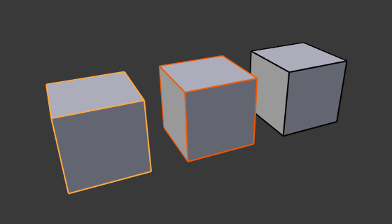
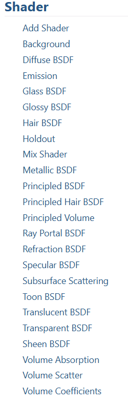
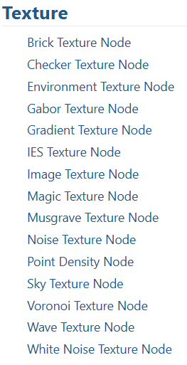
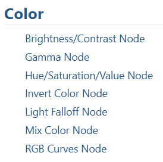
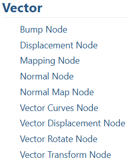
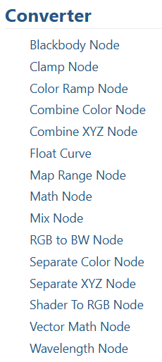
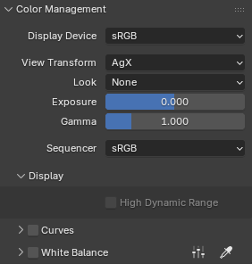
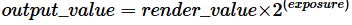

整个文档都应该看看，只不过重点是uv 渲染 材质 光照 动画以及基础的文件系统
blender manual: https://docs.blender.org/manual/en/latest/index.html 学习

图标是个比较好的提示

Photorealistic Materials and Textures in Blender Cycles - Fourth Edition
The Complete Guide to Blender Graphics
Blender script with python

dream-textures是stable diffusion的blender插件https://github.com/carson-katri/dream-textures

# User Interface
window系统
## Top Bar
## Status Bar
## workspace
Workspaces are essentially predefined window layouts. Each Workspace consists of a set of Areas containing Editors, and is geared towards a specific task such as modeling, animating, or scripting. 
## Areas
The Blender window is divided into a number of rectangles called Areas. Areas reserve screen space for Editors, such as the 3D Viewport or the Outliner. Each editor offers a specific piece of functionality.
## Regions

# Editors

支持整个 3D 创作流程：建模、雕刻、骨骼装配、动画、模拟、实时渲染、合成和运动跟踪，甚至可用作视频编辑及游戏创建 

每种editor都是针对特定资源的编辑器
workspace是针对某种工作流组合多种编辑器的预定义布局

Toolbar 
sidebar
headerbar

每个editor下有多种mode，如3d view的select edit等mode

overlay:
	模型下的overlay有文字 注解 grid 骨骼 动画等等
	不同的editor有不同的overlay

## 3D View
导航有很多模式
1. 鼠标中键进行shift平移 按住旋转 滚轮缩放
2. 还有walk mode，fly mode，是第一人称视角，这些模式是暂时的，确认后会退出，可以使用键盘操作

## image editor

## UV editor
UV Editing比layout下的editor功能更丰富

# Scenes & Objects
选中对象(橙色) 激活对象(最近一次选中的对象，黄色) 
## Scenes
## Objects
一个或多个Object构成一个Scene，
object type包括mesh, light, curve, camera, etc，由两部分组成
1. object:Holds information about the position, rotation and size of a particular element
2. objectData
   Holds everything else. For example:
	Meshes:
	Store geometry, material list, vertex groups, etc.

	Cameras:
	Store focal length, depth of field, sensor size, etc.

	Each object has a link to its associated object-data, and a single object-data may be shared by many objects.

object type包括mesh curve surface text volume armature camera lamp speaker

## Collections
把objects组织起来，方便管理
## View Layers
方便渲染，可以设置哪些object被渲染，哪些被忽略

# Modeling
blender里有四种模型表示方式
1. mesh:explicit defined by vertices
2. curve:explicit defined by control points 1d u坐标，nurbs 或者bezier
3. surface:explicit defined by control points 2d u,v坐标，nurbs 或者bezier
4. metaball:implicit defined by formulas

## Meshes
### Tools
### Selecting
### Editing
### UVs
展uv的流程如下
1. Mark Seams if necessary. See more about marking seams.

2. Select mesh faces in the 3D Viewport.

3. Select a UV mapping method from the UV ‣ Unwrap menu or the UV menu in the 3D Viewport.

4. Adjust the unwrap settings in the Adjust Last Operation panel.

5. Add a test image to see if there will be any distortion. See Applying Images to UVs.

6. Adjust UVs in the UV editor. See Editing UVs.

uv editing:选择seam，进行unwrap(此时必须a或l，选中要展开的物体，才能看见mesh展开的情况) 
Texture Painting:
Shading: 在shader编辑器里添加texture，需要选中的object本身有material，material里添加texture
要在3d viewport里直接显示预览效果，需要选中header中的viewport shading为Material Preview

## Curves
## Surfaces
## Metaballs
## Texts
## Point Clouds
## Volume
## Empties
## Modifiers
## Geometry Nodes

# Sculpting & Painting

## Texture Painting
就是绘制纹理，可以绘制在模型上，也可以绘制在uv上，可以同步预览
分左右窗口，左边是image editor,右边是3d view
image editor有view paint mask等mode
3d view有texture paint sculpt edit等mode，默认是texture paint模式

具体绘制时，颜色得选好，有时有bug，没选择颜色(黑色，啥也看不见，颜色&second color)

# Grease Pencil
油画笔

# Animation & Rigging

# Physics

# Rendering

纹理烘焙：离线提前制作好一些asset，在引擎里使用以提高效果效率，如高模法线烘焙贴到低模
blender里烘焙的流程如下:
选中需要进行烘焙的object，选中烘焙结果的导出目标(image texture node，不需要连接到任何节点，但需要有一张link的bitmap或生成的image,模型已经展uv到这张bitmap上)，选中烘焙类型(漫反射，法线，粗糙度，金属度等)点击bake
Property Editor里的render属性下有bake功能，需要选择引擎 烘焙类型 观察位置等
PBR贴图是实现真实感材质的关键，通常包括以下几种贴图：

1.** 反照率（Albedo）贴图 **：记录物体的基础颜色，不包含光照和阴影信息。在Blender中，可通过烘焙"漫反射"类型并去除光照影响得到。

2.** 法线（Normal）贴图 **：模拟物体表面的凹凸细节，使低模呈现高模的立体感。烘焙"法线"类型时，注意选择正确的空间（通常为" tangent "空间）。

3.** 粗糙度（Roughness）贴图 **：控制物体表面的光滑程度，影响高光的大小和模糊程度。可通过烘焙高模的细节或手动绘制得到。

4.** 金属度（Metallic）贴图 **：区分物体表面的金属和非金属区域，金属区域反射环境，非金属区域反射高光。

5.** 环境光遮蔽（AO）贴图 **：模拟物体表面因自身遮挡产生的阴影，增强细节的层次感。

这些贴图可以通过Blender的节点编辑器进行组合，创建PBR材质。例如，将法线贴图连接到Principled BSDF节点的"法线"输入，粗糙度和金属度贴图分别连接到对应的输入，即可实现基于物理的真实渲染效果。

Blender的PBR材质节点设置可参考 scripts/addons_core/io_scene_gltf2/blender/imp/pbrMetallicRoughness.py 中的PBR材质导入代码。

Open Shading Language

烘焙单个物体 多个物体 场景的具体操作都不太一样

## 3个引擎
3个引擎Cycles, Eevee, Workbench

EEVEE is a physically based realtime renderer. based on rasterization

Cycles is a physically based path tracer. based on path tracer

Workbench is designed for layout, modeling and previews.

每个引擎有自己的渲染设置，有时间了可以看看了解内部实现以及一些概念

## Cameras
## Light
## Material

## Shader Nodes
Materials, lights and backgrounds are all defined using a network of shading nodes. These nodes output values, vectors, colors and shaders

color model:
	RGB:红绿蓝
	HSV:色相饱和度明度
	HSL:色相亮度饱和度

### Input
### Output
AOV Output Node:any output variables
Material Output Node:材质表面输出
Light Output Node:光源
World Output Node:世界
### Shader
各种常见BSDF shader
### Texture
各种常见纹理
### Color

### Vector

### Converter
 多通道非颜色属性的分离、合并的转换等channel package
### Scripte Node

## Color Management
OpenColorIO用于管理颜色，包括颜色空间转换，颜色校正等

1. 显示设备
   1. sRGB: Used by most displays.
   2. Display P3: Used by most Apple devices.
   3. Rec. 1886: Used by many older TVs.
   4. Rec. 2020: Used for newer wide gamut HDR displays.
2. view transform
3. exposure 曝光，控制亮度 
4. gamma校正
5. sequencer

## Freestyle
## Layers & Passes
## Render Output

~~# Compositing~~
# Motion Tracking & Masking
~~# Video Editing~~
# Assets, Filse & Data System
.blend文件包含一个database，这个database包含所有的scenes，objects，meshes，textures等等
一个.blend文件可以包含多个scenes，每个scene可以包含多个objects，每个object可以包含多个materials，每个material可以包含多个textures

blend项目的基础单位是data-block,data-block可以是meshes, objects, materials, textures, node trees, scenes, texts, brushes, and even Workspaces.
~~# Add-ons~~
~~# Advanced~~
~~# Troubleshooting~~
# Glossary
https://docs.blender.org/manual/en/latest/glossary/index.html# blender及图形学术语

view layer

~~先把各种编辑器看完 走马灯看完了~~

shading nodes
geometry nodes

texture paint
材质/shading:所有三维软件的材质系统大致可以概括为两类，图层堆栈型和节点编辑型
animation
vfx特效
rendering

blender 3渲2 用3d模型渲染2d手绘般的效果 npr非真实感渲染的一种风格，又叫伪3d 2.5d

# shortcut
在 Edit->Preferences->Keymap里有各种快捷键
1. 视角控制：
   1. 鼠标中键按住旋转
   2. shift+M 平移
   3. 滚轮缩放
2. 视图切换
   1. 小键盘1正视图 3右视图 7俯视图，ctrl+是对面视图
   2. 9翻转当前视图
   3. 0切换摄像机视角
   4. 5切换正交 透视
   5. 2 4 6 8前后左右微调角度
   6. + - 缩放微调

3. 物体控制
先选中物体,
	G:按住G，移动物体，GXYZ分别代表x,y,z轴移动，G+中键坐标轴平移
	R:代表旋转，
	S:代表缩放 

新建物体 shift A:add model,在cursor当前所在位置添加模型
复制物体 shift D:复制+移动
删除物体 x 或delete

H:隐藏 alt+H shift+H

alt+某快捷键，撤销某种

select选择工具:框选 套索 a全选 c刷选，shift加选或减选

first princple