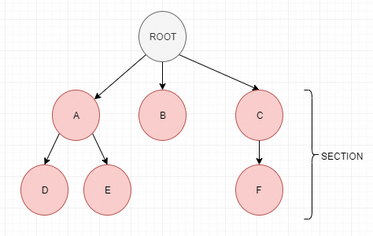

可以单头文件或库模式进行引用

两种单元测试编写模式:  
1. 传统模式
2. BDD模式 Behavior-driven development

具体实现方式是通过可变参数宏实现的  

在复杂的C++项目中，测试对象创建往往是最具挑战性的环节之一。传统的测试方法需要手动管理对象生命周期、处理依赖注入、确保测试隔离性，这些都会显著增加测试代码的复杂性。Catch2作为现代C++测试框架，通过其强大的测试工厂（Test Fixtures）机制，为对象创建模式提供了全面的支持

## 传统模式
1. TEST_CASE("global unique test name", "[tag][tag2]") 用于定义一个测试用例，其中标签用于标记同一类测试用例,可以通过命令行参数指定属于某个tag的测试用例执行,
2. SECTION( section name, [, section description ] ) 将一个测试用例内部划分为几个section,每个section都是一段独立的逻辑,与其他section无关
3. tag可以是任意字符串甚至是空字符串，但不能是[\]],catch2有一些预定义的tag
   1. [.]表示跳过测试用例
   2. [!throws]
   3. [!mayfail]
   4. [!shouldfail]
   5. [!nonportable]
   6. [#<filename>]
   7. [@<alias>]
   8. [!benchmark]

```c++
TEST_CASE( "vectors can be sized and resized", "[vector]" ) {

    std::vector<int> v( 5 );

    REQUIRE( v.size() == 5 );
    REQUIRE( v.capacity() >= 5 );

    // section1
    SECTION( "resizing bigger changes size and capacity" ) {
        v.resize( 10 );

        REQUIRE( v.size() == 10 );
        REQUIRE( v.capacity() >= 10 );
    }
    // section2
    SECTION( "resizing smaller changes size but not capacity" ) {
        v.resize( 0 );

        REQUIRE( v.size() == 0 );
        REQUIRE( v.capacity() >= 5 );
    }
    // section3
    SECTION( "reserving bigger changes capacity but not size" ) {
        v.reserve( 10 );

        REQUIRE( v.size() == 5 );
        REQUIRE( v.capacity() >= 10 );
    }
    // section4
    SECTION( "reserving smaller does not change size or capacity" ) {
        v.reserve( 0 );

        REQUIRE( v.size() == 5 );
        REQUIRE( v.capacity() >= 5 );
    }
}
```

```c++
//SECTION可以无限嵌套
SECTION( "reserving bigger changes capacity but not size" ) {
    v.reserve( 10 );

    REQUIRE( v.size() == 5 );
    REQUIRE( v.capacity() >= 10 );

    SECTION( "reserving smaller again does not change capacity" ) {
        v.reserve( 7 );

        REQUIRE( v.capacity() >= 10 );
    }
}
```
可将内嵌section的结构可以理解为一个树结构，树的根节点是单元测试的起始代码，每个含有内嵌section的section都是根的一个子树，没有内嵌section的section是树的叶子节点。Catch2会遍历执行树的所有路径（根到叶子节点），每个路径的执行均与其他路径的执行不相关。  


上面是针对函数的测试，针对类的测试，需要设计夹具类fixture，包含待测试类的成员，在执行夹具类时会自动创建一个测试类的新实例，从而得到一个全新的测试对象，可在夹具类的构造函数中初始化测试对象，在析构函数中销毁测试对象。
1. TEST_CASE_METHOD(UniqueTestsFixture, "test name", "[tag]") 用于定义一个测试用例，其中UniqueTestsFixture是夹具类，test name是测试用例名称，tag是标签
   ```c++
	#include <catch2/catch_test_macros.hpp>

	// 数据库连接模拟类
	class DBConnection {
	public:
	static DBConnection createConnection(const std::string& dbName) {
		return DBConnection();
	}

	bool executeSQL(const std::string& query, int id, const std::string& arg) {
		if (arg.empty()) {
			throw std::logic_error("空的SQL查询参数");
		}
		return true;
	}
	};

	// 测试工厂类
	class UniqueTestsFixture {
	protected:
	UniqueTestsFixture() 
		: conn(DBConnection::createConnection("myDB")) 
	{}

	int getID() {
		return ++uniqueID;
	}

	protected:
	DBConnection conn;

	private:
	static int uniqueID;
	};

	int UniqueTestsFixture::uniqueID = 0;

	// 使用测试工厂的测试用例
	TEST_CASE_METHOD(UniqueTestsFixture, "创建员工/无名称", "[create]") {
	REQUIRE_THROWS(conn.executeSQL(
		"INSERT INTO employee (id, name) VALUES (?, ?)", 
		getID(), 
		"")
	);
	}

	TEST_CASE_METHOD(UniqueTestsFixture, "创建员工/正常", "[create]") {
	REQUIRE(conn.executeSQL(
		"INSERT INTO employee (id, name) VALUES (?, ?)", 
		getID(), 
		"Joe Bloggs")
	);
	}
   ```
2. METHOD_AS_TEST_CASE:允许直接将类成员函数注册为测试用例，适用于简单的测试场景 
   ```c++
	#include <catch2/catch_test_macros.hpp>

	class StringTestClass {
	std::string testString;

	public:
	StringTestClass() : testString("hello") {}

	void testStringEquality() {
		REQUIRE(testString == "hello");
	}

	void testStringLength() {
		REQUIRE(testString.length() == 5);
	}
	};

	// 注册成员函数作为测试用例
	METHOD_AS_TEST_CASE(
	StringTestClass::testStringEquality, 
	"测试字符串相等性", 
	"[string][equality]"
	)

	METHOD_AS_TEST_CASE(
	StringTestClass::testStringLength, 
	"测试字符串长度", 
	"[string][length]"
	)
   ```

3. TEST_CASE_PERSISTENT_FIXTURE:用于昂贵初始化的情况，或者需要在测试期间保持状态的情况 catch2有吗?
   ```c++
	#include <catch2/catch_test_macros.hpp>
	#include <thread>

	// 模拟昂贵初始化类
	class ExpensiveResource {
	public:
	ExpensiveResource() {
		// 模拟昂贵初始化（如数据库连接、文件加载等）
		std::this_thread::sleep_for(std::chrono::milliseconds(100));
	}

	int getResourceValue() const { return 42; }
	};

	// 持久化测试工厂
	struct PersistentTestFixture {
	mutable int callCounter = 0;  // 可变成员，用于跟踪调用次数
	ExpensiveResource resource;   // 昂贵资源，只初始化一次
	};

	TEST_CASE_PERSISTENT_FIXTURE(PersistentTestFixture, "持久化工厂测试") {
	const int currentCount = callCounter++;

	SECTION("第一次部分运行") {
		const auto value = resource.getResourceValue();
		REQUIRE(currentCount == 0);
		REQUIRE(value == 42);
	}

	SECTION("第二次部分运行") { 
		REQUIRE(currentCount == 1); 
	}

	SECTION("第三次部分运行") { 
		REQUIRE(currentCount == 2); 
	}
	}
   ```
4. REGISTER_TEST_CASE

对于模板化测试:只写一次测试逻辑，就能自动对多种类型或数值进行测试  
1. TEMPLATE_TEST_CASE: 模板函数测试 TEMPLATE_TEST_CASE("test name", "[tag]", type1, type2, ..., typen),跟着待测试的模板参数
   ```c++
	#include <catch2/catch_test_macros.hpp>

	// 一个简单的模板函数
	template<typename T>
	T add(T a, T b) { return a + b; }

	TEMPLATE_TEST_CASE("add function", "[template]", int, float, double) {
	TestType a = 1;
	TestType b = 2;
	REQUIRE(add(a, b) == static_cast<TestType>(3));
	}
   ```
2. TEMPLATE_TEST_CASE_METHOD: 模板类测试
3. TEMPLATE_PRODUCT_TEST_CASE( test name , tags, (template-type1, template-type2, ..., template-typen), (template-arg1, template-arg2, ..., template-argm) )

Signature:  
	Signature has some strict rules for these tests cases to work properly:

	signature with multiple template parameters e.g. typename T, size_t S must have this format in test case declaration ((typename T, size_t S), T, S)
	signature with variadic template arguments e.g. typename T, size_t S, typename...Ts must have this format in test case declaration ((typename T, size_t S, typename...Ts), T, S, Ts...)
	signature with single non type template parameter e.g. int V must have this format in test case declaration ((int V), V)
	signature with single type template parameter e.g. typename T should not be used as it is in fact TEMPLATE_TEST_CASE
4. TEMPLATE_TEST_CASE_SIG ( test name , tags, signature, type1, type2, ..., typen )
   ```c++
	TEMPLATE_TEST_CASE_SIG("TemplateTestSig: arrays can be created from NTTP arguments", "[vector][template][nttp]",
	((typename T, int V), T, V), (int,5), (float,4), (std::string,15), ((std::tuple<int, float>), 6)) {

		std::array<T, V> v;
		REQUIRE(v.size() > 1);
	}
   ```
5. 

## BDD模式
提供了SCENARIO,GIVEN,WHEN,THEN等宏  
Feature: 简单的介绍这个功能
  对功能的更多介绍
  介绍....

  Scenario: 要测试的测试案例1
    Given 前提条件是....
    When 做了某件事....
    Then 结果应该得到...

  Scenario: 要测试的测试案例2
    Given 前提条件是....
    When 做了某件事....
    Then 结果应该得到...

1. SCENARIO实现上就是TEST_CASE,只是在测试用例名称前会自动添加**“Scenario: “**前缀
2. GIVEN、WHEN、THEN宏在实现上与DYNAMIC_SECTION宏相同 只是会在section名前增加**“given: “**、**“when: “**、**“then: “**前缀
3. AND_GIVEN( something ) AND_WHEN( something ) AND_THEN( something )

```c++
//bdd 示例
SCENARIO( "vectors can be sized and resized", "[vector]" ) {

    GIVEN( "A vector with some items" ) {
        std::vector<int> v( 5 );

        REQUIRE( v.size() == 5 );
        REQUIRE( v.capacity() >= 5 );

        WHEN( "the size is increased" ) {
            v.resize( 10 );

            THEN( "the size and capacity change" ) {
                REQUIRE( v.size() == 10 );
                REQUIRE( v.capacity() >= 10 );
            }
        }
        WHEN( "the size is reduced" ) {
            v.resize( 0 );

            THEN( "the size changes but not capacity" ) {
                REQUIRE( v.size() == 0 );
                REQUIRE( v.capacity() >= 5 );
            }
        }
        WHEN( "more capacity is reserved" ) {
            v.reserve( 10 );

            THEN( "the capacity changes but not the size" ) {
                REQUIRE( v.size() == 5 );
                REQUIRE( v.capacity() >= 10 );
            }
        }
        WHEN( "less capacity is reserved" ) {
            v.reserve( 0 );

            THEN( "neither size nor capacity are changed" ) {
                REQUIRE( v.size() == 5 );
                REQUIRE( v.capacity() >= 5 );
            }
        }
    }
}
```

## 断言宏
主要有两类断言宏:REQUIRE系列和CHECK系列  
大小、不等等条件可直接使用操作符>、<、!=。而在Google Test中，要验证相等、不等、大于等情况则要分别使用EXPECT_EQ、EXPECT_NE、EXPECT_GT等宏。  
1. REQUIRE( condition ) 断言条件为真，否则终止测试用例的执行
2. CHECK( condition ) 检测条件为真，继续执行测试用例
3. REQUIRE_FALSE( condition ) 断言条件为假，否则终止测试用例的执行
4. CHECK_FALSE( condition ) 断言条件为假，继续执行测试用例
5. REQUIRE_THROWS( expression ) 断言expression会抛出异常，否则终止测试用例的执行

## 自实现main函数
定义宏CATCH_CONFIG_MAIN可让Catch2自动实现main函数  
也可以手动实现main函数，分几种情况  
- 完全让catch2处理参数
	```c++
	/// 注意宏改为了 CATCH_CONFIG_RUNNER
	#define CATCH_CONFIG_RUNNER
	#include "catch.hpp"

	int main( int argc, char* argv[] ) {
	// global setup...

	int result = Catch::Session().run( argc, argv );

	// global clean-up...

	return result;
	}
	```
- 部分修改参数
  ```c++
	#define CATCH_CONFIG_RUNNER
	#include "catch.hpp"

	int main(int argc, char* argv[])
	{
		Catch::Session session;

		// 通过修改configData()对象来设置参数
		session.configData().reporterName = "compact";
		session.configData().showDurations = Catch::ShowDurations::OrNot::Always;

		// catch解析输入的命令行参数
		int returnCode = session.applyCommandLine(argc, argv);
		if (returnCode != 0) // Indicates a command line error
			return returnCode;

		// 在解析完输入参数后，这里可修改configData()以重写覆盖参数
		session.configData().reporterName = "xml";

		int numFailed = session.run();

		return numFailed;
	}
  ```
- 自定义参数
  ```c++
	#define CATCH_CONFIG_RUNNER
	#include "catch.hpp"

	int main(int argc, char* argv[])
	{
	using namespace Catch::clara;
	Catch::Session session;

	// 定义与选项关联的变量
	int height = 0;
	auto cli = session.cli()     // 获取Catch的命令行解析器
		| Opt(height, "height")  // 将变量绑定到带有提示字符串的新选项
		["-g"]["--height"]       // 指定与变量相关联的选项名
		("how high?");           // 指定选项的描述信息以在帮住信息中显示


	// 将新增的选项添加到Catch中
	session.cli(cli);

	// Let Catch (using Clara) parse the command line
	int returnCode = session.applyCommandLine(argc, argv);
	if (returnCode != 0) // Indicates a command line error
		return returnCode;

	// if set on the command line then 'height' is now set at this point
	if (height > 0)
		std::cout << "height: " << height << std::endl;

	return session.run();
	}
  ```


## 测试实践
1. 测试代码与生产代码分离，组织结构与生成代码一致
2. 测试命名清晰
3. 一致的标签策略