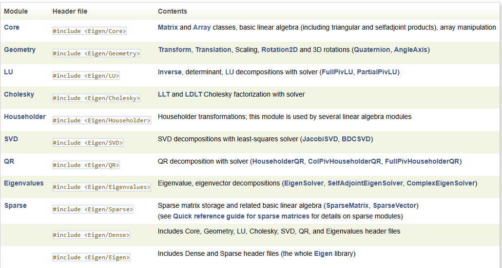
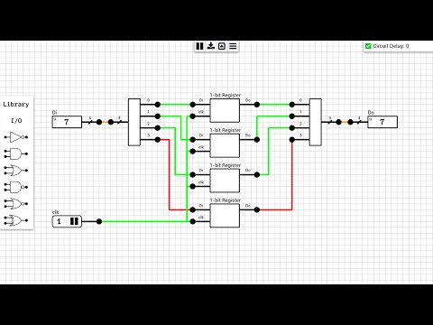

工作中遇到的各种知识 不限于图形学，当前主要是开源库的一些关键知识点记录

# 图形相关的各种库

1. xatlas库的.cpp里有很多宝藏代码 研究一下
2. [FastBVH](https://github.com/brandonpelfrey/Fast-BVH) 
3. [PBR-Viewer](https://github.com/comfyui-wiki/PBR-Viewer)

## 几何处理库
### igl
https://github.com/libigl/libigl 几何处理库 网格处理 参数化(纹理映射 uv展开) https://www.alecjacobson.com/weblog/4500.html 是一个uv编辑器

### assimp
```c++ 
//核心数据结构
struct ASSIMP_API aiScene {
    /** Any combination of the AI_SCENE_FLAGS_XXX flags. By default
    * this value is 0, no flags are set. Most applications will
    * want to reject all scenes with the AI_SCENE_FLAGS_INCOMPLETE
    * bit set.
    */
    unsigned int mFlags;

    /** The root node of the hierarchy.
    *
    * There will always be at least the root node if the import
    * was successful (and no special flags have been set).
    * Presence of further nodes depends on the format and content
    * of the imported file.
    */
    C_STRUCT aiNode* mRootNode;

    /** The number of meshes in the scene. */
    unsigned int mNumMeshes;

    /** The array of meshes.
    *
    * Use the indices given in the aiNode structure to access
    * this array. The array is mNumMeshes in size. If the
    * AI_SCENE_FLAGS_INCOMPLETE flag is not set there will always
    * be at least ONE material.
    */
    C_STRUCT aiMesh** mMeshes;

    /** The number of materials in the scene. */
    unsigned int mNumMaterials;

    /** The array of materials.
    *
    * Use the index given in each aiMesh structure to access this
    * array. The array is mNumMaterials in size. If the
    * AI_SCENE_FLAGS_INCOMPLETE flag is not set there will always
    * be at least ONE material.
    */
    C_STRUCT aiMaterial** mMaterials;

    /** The number of animations in the scene. */
    unsigned int mNumAnimations;

    /** The array of animations.
    *
    * All animations imported from the given file are listed here.
    * The array is mNumAnimations in size.
    */
    C_STRUCT aiAnimation** mAnimations;

    /** The number of textures embedded into the file */
    unsigned int mNumTextures;

    /** The array of embedded textures.
    *
    * Not many file formats embed their textures into the file.
    * An example is Quake's MDL format (which is also used by
    * some GameStudio versions)
    */
    C_STRUCT aiTexture** mTextures;

    /** The number of light sources in the scene. Light sources
    * are fully optional, in most cases this attribute will be 0
        */
    unsigned int mNumLights;

    /** The array of light sources.
    *
    * All light sources imported from the given file are
    * listed here. The array is mNumLights in size.
    */
    C_STRUCT aiLight** mLights;

    /** The number of cameras in the scene. Cameras
    * are fully optional, in most cases this attribute will be 0
        */
    unsigned int mNumCameras;

    /** The array of cameras.
    *
    * All cameras imported from the given file are listed here.
    * The array is mNumCameras in size. The first camera in the
    * array (if existing) is the default camera view into
    * the scene.
    */
    C_STRUCT aiCamera** mCameras;

    /**
     *  @brief  The global metadata assigned to the scene itself.
     *
     *  This data contains global metadata which belongs to the scene like
     *  unit-conversions, versions, vendors or other model-specific data. This
     *  can be used to store format-specific metadata as well.
     */
    C_STRUCT aiMetadata* mMetaData;

    /** The name of the scene itself.
     */
    C_STRUCT aiString mName;

    /**
     *
     */
    unsigned int mNumSkeletons;

    /**
     *
     */
    C_STRUCT aiSkeleton **mSkeletons;

#ifdef __cplusplus

    //! Default constructor - set everything to 0/nullptr
    aiScene();

    //! Destructor
    ~aiScene();

    //! Check whether the scene contains meshes
    //! Unless no special scene flags are set this will always be true.
    inline bool HasMeshes() const {
        return mMeshes != nullptr && mNumMeshes > 0;
    }

    //! Check whether the scene contains materials
    //! Unless no special scene flags are set this will always be true.
    inline bool HasMaterials() const {
        return mMaterials != nullptr && mNumMaterials > 0;
    }

    //! Check whether the scene contains lights
    inline bool HasLights() const {
        return mLights != nullptr && mNumLights > 0;
    }

    //! Check whether the scene contains textures
    inline bool HasTextures() const {
        return mTextures != nullptr && mNumTextures > 0;
    }

    //! Check whether the scene contains cameras
    inline bool HasCameras() const {
        return mCameras != nullptr && mNumCameras > 0;
    }

    //! Check whether the scene contains animations
    inline bool HasAnimations() const {
        return mAnimations != nullptr && mNumAnimations > 0;
    }

    //! Check whether the scene contains skeletons
    inline bool HasSkeletons() const {
        return mSkeletons != nullptr && mNumSkeletons > 0;
    }

    //! Returns a short filename from a full path
    static const char* GetShortFilename(const char* filename) {
        const char* lastSlash = strrchr(filename, '/');
        const char* lastBackSlash = strrchr(filename, '\\');
        if (lastSlash < lastBackSlash) {
            lastSlash = lastBackSlash;
        }
        const char* shortFilename = lastSlash != nullptr ? lastSlash + 1 : filename;
        return shortFilename;
    }

    //! Returns an embedded texture
    const aiTexture* GetEmbeddedTexture(const char* filename) const {
        return GetEmbeddedTextureAndIndex(filename).first;
    }

    //! Returns an embedded texture and its index
    std::pair<const aiTexture*, int> GetEmbeddedTextureAndIndex(const char* filename) const {
        if (nullptr==filename) {
            return std::make_pair(nullptr, -1);
        }
        // lookup using texture ID (if referenced like: "*1", "*2", etc.)
        if ('*' == *filename) {
            int index = std::atoi(filename + 1);
            if (0 > index || mNumTextures <= static_cast<unsigned>(index)) {
                return std::make_pair(nullptr, -1);
            }
            return std::make_pair(mTextures[index], index);
        }
        // lookup using filename
        const char* shortFilename = GetShortFilename(filename);
        if (nullptr == shortFilename) {
            return std::make_pair(nullptr, -1);
        }

        for (unsigned int i = 0; i < mNumTextures; i++) {
            const char* shortTextureFilename = GetShortFilename(mTextures[i]->mFilename.C_Str());
            if (strcmp(shortTextureFilename, shortFilename) == 0) {
                return std::make_pair(mTextures[i], static_cast<int>(i));
            }
        }
        return std::make_pair(nullptr, -1);
    }

    /**
     * @brief Will try to locate a bone described by its name.
     *
     * @param name  The name to look for.
     * @return The bone as a pointer.
     */
    inline aiBone *findBone(const aiString &name) const {
        for (size_t m = 0; m < mNumMeshes; m++) {
            aiMesh *mesh = mMeshes[m];
            if (mesh == nullptr) {
                continue;
            }

            for (size_t b = 0; b < mesh->mNumBones; b++) {
                aiBone *bone = mesh->mBones[b];
                if (bone == nullptr) {
                    continue;
                }
                if (name == bone->mName) {
                    return bone;
                }
            }
        }
        return nullptr;
    }

#endif // __cplusplus

    /**  Internal data, do not touch */
#ifdef __cplusplus
    void* mPrivate;
#else
    char* mPrivate;
#endif

};
```

1. aiScene 是整个导入场景的根结构，包含所有导入的数据。

- 主要成员变量:
  - mFlags: 场景标志位（如 AI_SCENE_FLAGS_INCOMPLETE 表示场景不完整）。
  - mRootNode: 场景图的根节点。
  - mMeshes: 网格数组（所有模型的几何数据）。
  - mMaterials: 材质数组（定义网格的渲染属性）。
  - mAnimations: 动画数组（骨骼动画、关键帧动画等）。
  - mTextures: 嵌入纹理数组（如 MDL 格式的内嵌纹理）。
  - mLights: 光源数组（可选）。
  - mCameras: 摄像机数组（可选）。
  - mMetaData: 场景的全局元数据（如单位、版本等）。
  - mName: 场景名称。
  - mSkeletons: 骨架数组（用于骨骼动画）。

2. aiNode是一个多叉树结构
```c++
//多叉树结构 父子层级
class aiNode {
    C_STRUCT aiString mName;

    /** The transformation relative to the node's parent. */
    C_STRUCT aiMatrix4x4 mTransformation;

    /** Parent node. nullptr if this node is the root node. */
    C_STRUCT aiNode* mParent;

    /** The number of child nodes of this node. */
    unsigned int mNumChildren;

    /** The child nodes of this node. nullptr if mNumChildren is 0. */
    C_STRUCT aiNode** mChildren;

    /** The number of meshes of this node. */
    unsigned int mNumMeshes;

    /** The meshes of this node. Each entry is an index into the
      * mesh list of the #aiScene.
      */
    unsigned int* mMeshes;

    /** Metadata associated with this node or nullptr if there is no metadata.
      *  Whether any metadata is generated depends on the source file format. See the
      * @link importer_notes @endlink page for more information on every source file
      * format. Importers that don't document any metadata don't write any.
      */
    C_STRUCT aiMetadata* mMetaData;
}
```

3. aiMesh 表示一个材质一样的网格，包含顶点、法线、纹理坐标、面等信息。
   - mVertices: aiVector3D* 顶点数组
   - mNormals: aiVector3D* 法线数组
   - mTangents: aiVector3D* 切线数组
   - mBitangents: aiVector3D* 副切线数组
   - mTextureCoords: aiVector3D* 纹理坐标数组
   - mColors: aiColor4D* 颜色数组
   - mFaces: aiFace* 面数组（由顶点索引组成）
   - mBones: aiBone** 骨骼数组（用于骨骼动画）
   - mAnimMeshes: aiAnimMesh** 动画网格数组
4. aiBone 骨头 一块骨头
   - mName: aiString
   - mNumberWeights: int
   - mArmature: aiNode*
   - mNode: aiNode*
   - mWeights: aiVertexWeight 包含该bone影响的顶点索引及对应的权重，一个顶点可能受多个aiBone影响，所有影响该顶点的aiBone的权重和应为1.0
   - mOffsetMatrix: aiMatrix4x4 偏移矩阵/逆绑定姿势矩阵(inverse bind pose matrix) 从模型空间转到骨骼空间 顶点最终位置 = CurrentBoneTransform * mOffsetMatrix * OriginalVertexPosition
5. aiSkeleton 骨骼系统/骨架 骨骼树 Skeleton是由多块 bone通过关节连接而成的完整系统 表示动画的骨骼层级A skeleton represents the bone hierarchy of an animation.
   - mName
   - mNumBones
   - mBones: aiSkeletonBone**
6. aiSkeletonBone
7. aiMaterial
   - C_STRUCT aiMaterialProperty **mProperties;
   - unsigned int mNumProperties;      // 属性数量
   - unsigned int mNumAllocated;       // 已分配的存储空间
8. aiMaterialProperty
   ```c++
	struct aiMaterialProperty {
		C_STRUCT aiString mKey;           // 属性名（键）
		unsigned int mSemantic;           // 语义（主要用于纹理）
		unsigned int mIndex;              // 索引（用于同类型多纹理）
		unsigned int mDataLength;         // 数据长度（字节）
		C_ENUM aiPropertyTypeInfo mType;  // 数据类型
		char *mData;                      // 数据缓冲区
	}
   ```
9.  aiAnimation
10. aiTexture
11. aiLight
12. aiCamera
13. aiMetadata
14. 

### tinyobjloader
```c++
struct tinyobj::attrib_t
{
	std::vector<real_t> vertices;  // 'v'(xyz)

  // For backward compatibility, we store vertex weight in separate array.
  std::vector<real_t> vertex_weights;  // 'v'(w)
  std::vector<real_t> normals;         // 'vn'
  std::vector<real_t> texcoords;       // 'vt'(uv)

  // For backward compatibility, we store texture coordinate 'w' in separate
  // array.
  std::vector<real_t> texcoord_ws;  // 'vt'(w)
  std::vector<real_t> colors; 
};

struct shape_t {
  std::string name;
  mesh_t mesh;
  lines_t lines;
  points_t points;
};

struct material_t {
  std::string name;

  real_t ambient[3];
  real_t diffuse[3];
  real_t specular[3];
  real_t transmittance[3];
  real_t emission[3];
  real_t shininess;
  real_t ior;       // index of refraction
  real_t dissolve;  // 1 == opaque; 0 == fully transparent
  // illumination model (see http://www.fileformat.info/format/material/)
  int illum;

  int dummy;  // Suppress padding warning.

  std::string ambient_texname;   // map_Ka. For ambient or ambient occlusion.
  std::string diffuse_texname;   // map_Kd
  std::string specular_texname;  // map_Ks
  std::string specular_highlight_texname;  // map_Ns
  std::string bump_texname;                // map_bump, map_Bump, bump
  std::string displacement_texname;        // disp
  std::string alpha_texname;               // map_d
  std::string reflection_texname;          // refl

  texture_option_t ambient_texopt;
  texture_option_t diffuse_texopt;
  texture_option_t specular_texopt;
  texture_option_t specular_highlight_texopt;
  texture_option_t bump_texopt;
  texture_option_t displacement_texopt;
  texture_option_t alpha_texopt;
  texture_option_t reflection_texopt;

  // PBR extension
  // http://exocortex.com/blog/extending_wavefront_mtl_to_support_pbr
  real_t roughness;            // [0, 1] default 0
  real_t metallic;             // [0, 1] default 0
  real_t sheen;                // [0, 1] default 0
  real_t clearcoat_thickness;  // [0, 1] default 0
  real_t clearcoat_roughness;  // [0, 1] default 0
  real_t anisotropy;           // aniso. [0, 1] default 0
  real_t anisotropy_rotation;  // anisor. [0, 1] default 0
  real_t pad0;
  std::string roughness_texname;  // map_Pr
  std::string metallic_texname;   // map_Pm
  std::string sheen_texname;      // map_Ps
  std::string emissive_texname;   // map_Ke
  std::string normal_texname;     // norm. For normal mapping.

  texture_option_t roughness_texopt;
  texture_option_t metallic_texopt;
  texture_option_t sheen_texopt;
  texture_option_t emissive_texopt;
  texture_option_t normal_texopt;

  int pad2;

  std::map<std::string, std::string> unknown_parameter;
  /**and on */
};
```


## 通用图像处理库
1. stb_image
stb_truetype

- https://ermig1979.github.io/Simd/ simd库

## 纹理图像处理
1. dds ktx io https://github.com/g-truc/gli
2. https://github.com/AcademySoftwareFoundation/OpenImageIO 读写多种图像格式的库
3. openexr
4. DirectXTex Texcov Texassemble https://github.com/Microsoft/DirectXTex/wiki/Texassemble
5. https://github.com/matyalatte/Texconv-Custom-DLL 微软的纹理转换工具的跨平台版本
6. https://github.com/jpcy/xatlas xatlas纹理映射库
7. [aobaker](https://github.com/prideout/aobaker) - Ambient occlusion baking. Uses [thekla_atlas](https://github.com/Thekla/thekla_atlas).
8. [Lightmapper](https://github.com/ands/lightmapper) - Hemicube based lightmap baking. The example model texture coordinates were generated by [thekla_atlas](https://github.com/Thekla/thekla_atlas).
9. [Microsoft's UVAtlas](https://github.com/Microsoft/UVAtlas) - isochart texture atlasing.
10. [Ministry of Flat](http://www.quelsolaar.com/ministry_of_flat/) - Commercial automated UV unwrapper.
11. [seamoptimizer](https://github.com/ands/seamoptimizer) - A C/C++ single-file library that minimizes the hard transition errors of disjoint edges in lightmaps.
12. [simpleuv](https://github.com/huxingyi/simpleuv/) - Automatic UV Unwrapping Library for Dust3D.

### tev
大量使用17 20

``` c++ 可视化面板
/*Represents a display surface (i.e. a full-screen or windowed GLFW window)
and forms the root element of a hierarchy of nanogui widgets.
*/
class NANOGUI_EXPORT Screen;

//top-level window
class ImageViewer:public nanogui::Screen: public Widget : public Object
{
	updateTitle();
};
//表示一个显示表面（即全屏或窗口化的GLFW窗口） ,所有的内容包括UI都是绘制出来的，UI使用了nanoVG库

```

```c++ imagecanvas
//imageviewer的绘制区
class ImageCanvas : public nanogui::Canvas
{
	void getValuesAtNanoPos();
};

class Image;//图像路径，图像数据，图像信息
class ImageData//图像数据
{
    size;
    displaySize;
    dataWindow;
    displayWindow;
};
rec709 color space:HDR UHDR
```

```c++
ImageInfoWindow:应该是鼠标放到ImageButton上时，显示图像信息的控件
9
ImageButton:图像列表
```

### ImageViewer
https://github.com/kopaka1822/ImageViewer.git 可以看hdr dds png等,可以参照实现一个查看器

### gli
1. texture:通过storage_linear实现线性存储,不同layer(数组纹理)、不同face(立方体贴图)、不同level的纹理数据是连续存储的
2. sampler模拟了gpu的纹理采样功能

```c++
class texture
	{
	public:
		typedef size_t size_type;
		typedef gli::target target_type;
		typedef gli::format format_type;
		typedef gli::swizzles swizzles_type;
		typedef storage_linear storage_type;
		typedef storage_type::data_type data_type;
		typedef storage_type::extent_type extent_type;

		/// Create an empty texture instance
		texture();

		/// Create a texture object and allocate a texture storage for it
		/// @param Target Type/Shape of the texture storage_linear
		/// @param Format Texel format
		/// @param Extent Size of the texture: width, height and depth.
		/// @param Layers Number of one-dimensional or two-dimensional images of identical size and format
		/// @param Faces 6 for cube map textures otherwise 1.
		/// @param Levels Number of images in the texture mipmap chain.
		/// @param Swizzles A mechanism to swizzle the components of a texture before they are applied according to the texture environment.
		texture(
			target_type Target,
			format_type Format,
			extent_type const& Extent,
			size_type Layers,
			size_type Faces,
			size_type Levels,
			swizzles_type const& Swizzles = swizzles_type(SWIZZLE_RED, SWIZZLE_GREEN, SWIZZLE_BLUE, SWIZZLE_ALPHA));

		/// Create a texture object by sharing an existing texture storage_type from another texture instance.
		/// This texture object is effectively a texture view where the layer, the face and the level allows identifying
		/// a specific subset of the texture storage_linear source. 
		/// This texture object is effectively a texture view where the target and format can be reinterpreted
		/// with a different compatible texture target and texture format.
		texture(
			texture const& Texture,
			target_type Target,
			format_type Format,
			size_type BaseLayer, size_type MaxLayer,
			size_type BaseFace, size_type MaxFace,
			size_type BaseLevel, size_type MaxLevel,
			swizzles_type const& Swizzles = swizzles_type(SWIZZLE_RED, SWIZZLE_GREEN, SWIZZLE_BLUE, SWIZZLE_ALPHA));

		/// Create a texture object by sharing an existing texture storage_type from another texture instance.
		/// This texture object is effectively a texture view where the target and format can be reinterpreted
		/// with a different compatible texture target and texture format.
		texture(
			texture const& Texture,
			target_type Target,
			format_type Format,
			swizzles_type const& Swizzles = swizzles_type(SWIZZLE_RED, SWIZZLE_GREEN, SWIZZLE_BLUE, SWIZZLE_ALPHA));

		virtual ~texture(){}

		/// Return whether the texture instance is empty, no storage_type or description have been assigned to the instance.
		bool empty() const;

		/// Return the target of a texture instance.
		target_type target() const{return this->Target;}

		/// Return the texture instance format
		format_type format() const;

		swizzles_type swizzles() const;

		/// Return the base layer of the texture instance, effectively a memory offset in the actual texture storage_type to identify where to start reading the layers. 
		size_type base_layer() const;

		/// Return the max layer of the texture instance, effectively a memory offset to the beginning of the last layer in the actual texture storage_type that the texture instance can access. 
		size_type max_layer() const;

		/// Return max_layer() - base_layer() + 1
		size_type layers() const;

		/// Return the base face of the texture instance, effectively a memory offset in the actual texture storage_type to identify where to start reading the faces. 
		size_type base_face() const;

		/// Return the max face of the texture instance, effectively a memory offset to the beginning of the last face in the actual texture storage_type that the texture instance can access. 
		size_type max_face() const;

		/// Return max_face() - base_face() + 1
		size_type faces() const;

		/// Return the base level of the texture instance, effectively a memory offset in the actual texture storage_type to identify where to start reading the levels. 
		size_type base_level() const;

		/// Return the max level of the texture instance, effectively a memory offset to the beginning of the last level in the actual texture storage_type that the texture instance can access. 
		size_type max_level() const;

		/// Return max_level() - base_level() + 1.
		size_type levels() const;

		/// Return the size of a texture instance: width, height and depth.
		extent_type extent(size_type Level = 0) const;

		/// Return the memory size of a texture instance storage_type in bytes.
		size_type size() const;

		/// Return the number of blocks contained in a texture instance storage_type.
		/// genType size must match the block size conresponding to the texture format.
		template <typename genType>
		size_type size() const;

		/// Return the memory size of a specific level identified by Level.
		size_type size(size_type Level) const;

		/// Return the memory size of a specific level identified by Level.
		/// genType size must match the block size conresponding to the texture format.
		template <typename gen_type>
		size_type size(size_type Level) const;

		/// Return a pointer to the beginning of the texture instance data.
		void* data();

		/// Return a pointer of type genType which size must match the texture format block size
		template <typename gen_type>
		gen_type* data();

		/// Return a pointer to the beginning of the texture instance data.
		void const* data() const;

		/// Return a pointer of type genType which size must match the texture format block size
		template <typename gen_type>
		gen_type const* data() const;

		/// Return a pointer to the beginning of the texture instance data.
		void* data(size_type Layer, size_type Face, size_type Level);

		/// Return a pointer to the beginning of the texture instance data.
		void const* const data(size_type Layer, size_type Face, size_type Level) const;

		/// Return a pointer of type genType which size must match the texture format block size
		template <typename gen_type>
		gen_type* data(size_type Layer, size_type Face, size_type Level);

		/// Return a pointer of type genType which size must match the texture format block size
		template <typename gen_type>
		gen_type const* const data(size_type Layer, size_type Face, size_type Level) const;

		/// Clear the entire texture storage_linear with zeros
		void clear();

		/// Clear the entire texture storage_linear with Texel which type must match the texture storage_linear format block size
		/// If the type of gen_type doesn't match the type of the texture format, no conversion is performed and the data will be reinterpreted as if is was of the texture format. 
		template <typename gen_type>
		void clear(gen_type const& Texel);

		/// Clear a specific image of a texture.
		template <typename gen_type>
		void clear(size_type Layer, size_type Face, size_type Level, gen_type const& BlockData);

		/// Clear a subset of a specific image of a texture.
		template <typename gen_type>
		void clear(size_type Layer, size_type Face, size_type Level, extent_type const& TexelOffset, extent_type const& TexelExtent, gen_type const& BlockData);

		/// Copy a specific image of a texture 
		void copy(
			texture const& TextureSrc,
			size_t LayerSrc, size_t FaceSrc, size_t LevelSrc,
			size_t LayerDst, size_t FaceDst, size_t LevelDst);

		/// Copy a subset of a specific image of a texture 
		void copy(
			texture const& TextureSrc,
			size_t LayerSrc, size_t FaceSrc, size_t LevelSrc, extent_type const& OffsetSrc,
			size_t LayerDst, size_t FaceDst, size_t LevelDst, extent_type const& OffsetDst,
			extent_type const& Extent);

		/// Reorder the component in texture memory.
		template <typename gen_type>
		void swizzle(gli::swizzles const& Swizzles);

		/// Fetch a texel from a texture. The texture format must be uncompressed.
		template <typename gen_type>
		gen_type load(extent_type const & TexelCoord, size_type Layer, size_type Face, size_type Level) const;

		/// Write a texel to a texture. The texture format must be uncompressed.
		template <typename gen_type>
		void store(extent_type const& TexelCoord, size_type Layer, size_type Face, size_type Level, gen_type const& Texel);

	protected:
		std::shared_ptr<storage_type> Storage;
		target_type Target;
		format_type Format;
		size_type BaseLayer;
		size_type MaxLayer;
		size_type BaseFace;
		size_type MaxFace;
		size_type BaseLevel;
		size_type MaxLevel;
		swizzles_type Swizzles;

		// Pre compute at texture instance creation some information for faster access to texels
		struct cache
		{
		public:
			enum ctor
			{
				DEFAULT
			};

			explicit cache(ctor)
			{}

			cache
			(
				storage_type& Storage,
				format_type Format,
				size_type BaseLayer, size_type Layers,
				size_type BaseFace, size_type MaxFace,
				size_type BaseLevel, size_type MaxLevel
			)
				: Faces(MaxFace - BaseFace + 1)
				, Levels(MaxLevel - BaseLevel + 1)
			{
				GLI_ASSERT(static_cast<size_t>(gli::levels(Storage.extent(0))) < this->ImageMemorySize.size());

				this->BaseAddresses.resize(Layers * this->Faces * this->Levels);

				for(size_type Layer = 0; Layer < Layers; ++Layer)
				for(size_type Face = 0; Face < this->Faces; ++Face)
				for(size_type Level = 0; Level < this->Levels; ++Level)
				{
					size_type const Index = index_cache(Layer, Face, Level);
					this->BaseAddresses[Index] = Storage.data() + Storage.base_offset(
						BaseLayer + Layer, BaseFace + Face, BaseLevel + Level);
				}

				for(size_type Level = 0; Level < this->Levels; ++Level)
				{
					extent_type const& SrcExtent = Storage.extent(BaseLevel + Level);
					extent_type const& DstExtent = SrcExtent * block_extent(Format) / Storage.block_extent();

					this->ImageExtent[Level] = glm::max(DstExtent, extent_type(1));
					this->ImageMemorySize[Level] = Storage.level_size(BaseLevel + Level);
				}
				
				this->GlobalMemorySize = Storage.layer_size(BaseFace, MaxFace, BaseLevel, MaxLevel) * Layers;
			}

			// Base addresses of each images of a texture.
			data_type* get_base_address(size_type Layer, size_type Face, size_type Level) const
			{
				return this->BaseAddresses[index_cache(Layer, Face, Level)];
			}

			// In texels
			extent_type get_extent(size_type Level) const
			{
				return this->ImageExtent[Level];
			};

			// In bytes
			size_type get_memory_size(size_type Level) const
			{
				return this->ImageMemorySize[Level];
			};

			// In bytes
			size_type get_memory_size() const
			{
				return this->GlobalMemorySize;
			};

		private:
			size_type index_cache(size_type Layer, size_type Face, size_type Level) const
			{
				return ((Layer * this->Faces) + Face) * this->Levels + Level;
			}

			size_type Faces;
			size_type Levels;
      /**
      原理：纹理中每一个具体的“切片”（即某一层的某一面的某一层级）在物理内存中的起始位置是不规则的（因为不同层级的 Mipmap 大小不同，数据块大小也不同）。如果每次访问都要通过复杂的数学公式计算偏移量，效率较低。
       */
			std::vector<data_type*> BaseAddresses; //是一个指针数组（或者偏移量数组）。预先计算好每一个 (Layer, Face, Level) 组合对应的内存地址，并将其存储在 BaseAddresses 数组中
			std::array<extent_type, 16> ImageExtent; //存储每个level的extent
			std::array<size_type, 16> ImageMemorySize;
			size_type GlobalMemorySize;
		} Cache;
	};
```

```c++
  //先遍历layer，再遍历face，最后遍历level
  for(size_type Layer = 0; Layer < Layers; ++Layer)//遍历纹理数组
  for(size_type Face = 0; Face < this->Faces; ++Face)//遍历立方体贴图的6个面
  for(size_type Level = 0; Level < this->Levels; ++Level)//遍历LOD层次
  {
    size_type const Index = index_cache(Layer, Face, Level);
    this->BaseAddresses[Index] = Storage.data() + Storage.base_offset(
      BaseLayer + Layer, BaseFace + Face, BaseLevel + Level);
  }
```

```c++
//底层数据存储结构
class storage_linear
	{
	public:
		typedef extent3d extent_type;
		typedef size_t size_type;
		typedef gli::format format_type;
		typedef gli::byte data_type;

	public:
		storage_linear();

		storage_linear(
			format_type Format,
			extent_type const & Extent,
			size_type Layers,
			size_type Faces,
			size_type Levels);

		bool empty() const;
		size_type size() const; // Express is bytes
		size_type layers() const;
		size_type levels() const;
		size_type faces() const;

		size_type block_size() const;
		extent_type block_extent() const;
		extent_type block_count(size_type Level) const;
		extent_type extent(size_type Level) const;

		data_type* data();
		data_type const* const data() const;

		/// Compute the relative memory offset to access the data for a specific layer, face and level
		size_type base_offset(
			size_type Layer,
			size_type Face,
			size_type Level) const;

		size_type image_offset(extent1d const& Coord, extent1d const& Extent) const;

		size_type image_offset(extent2d const& Coord, extent2d const& Extent) const;

		size_type image_offset(extent3d const& Coord, extent3d const& Extent) const;

		/// Copy a subset of a specific image of a texture 
		void copy(
			storage_linear const& StorageSrc,
			size_t LayerSrc, size_t FaceSrc, size_t LevelSrc, extent_type const& BlockIndexSrc,
			size_t LayerDst, size_t FaceDst, size_t LevelDst, extent_type const& BlockIndexDst,
			extent_type const& BlockCount);

		size_type level_size(
			size_type Level) const;
		size_type face_size(
			size_type BaseLevel, size_type MaxLevel) const;
		size_type layer_size(
			size_type BaseFace, size_type MaxFace,
			size_type BaseLevel, size_type MaxLevel) const;

	private:
		size_type const Layers;
		size_type const Faces;
		size_type const Levels;
		size_type const BlockSize;
		extent_type const BlockCount;
		extent_type const BlockExtent;
		extent_type const Extent;
		std::vector<data_type> Data;
	};
```


```c++
/// Image, representation for a single texture level
	class image
	{
	private:
		friend class texture1d;
		friend class texture2d;
		friend class texture3d;

	public:
		typedef size_t size_type;
		typedef gli::format format_type;
		typedef storage_linear::extent_type extent_type;
		typedef storage_linear::data_type data_type;

		/// Create an empty image instance
		image();

		/// Create an image object and allocate an image storoge for it.
		explicit image(format_type Format, extent_type const& Extent);

		/// Create an image object by sharing an existing image storage_linear from another image instance.
		/// This image object is effectively an image view where format can be reinterpreted
		/// with a different compatible image format.
		/// For formats to be compatible, the block size of source and destination must match.
		explicit image(image const& Image, format_type Format);

		/// Return whether the image instance is empty, no storage_linear or description have been assigned to the instance.
		bool empty() const;

		/// Return the image instance format.
		format_type format() const;

		/// Return the dimensions of an image instance: width, height and depth.
		extent_type extent() const;

		/// Return the memory size of an image instance storage_linear in bytes.
		size_type size() const;

		/// Return the number of blocks contained in an image instance storage_linear.
		/// genType size must match the block size conresponding to the image format. 
		template <typename genType>
		size_type size() const;

		/// Return a pointer to the beginning of the image instance data.
		void* data();

		/// Return a pointer to the beginning of the image instance data.
		void const* data() const;

		/// Return a pointer of type genType which size must match the image format block size.
		template <typename genType>
		genType* data();

		/// Return a pointer of type genType which size must match the image format block size.
		template <typename genType>
		genType const* data() const;

		/// Clear the entire image storage_linear with zeros
		void clear();

		/// Clear the entire image storage_linear with Texel which type must match the image storage_linear format block size
		/// If the type of genType doesn't match the type of the image format, no conversion is performed and the data will be reinterpreted as if is was of the image format. 
		template <typename genType>
		void clear(genType const& Texel);

		/// Load the texel located at TexelCoord coordinates.
		/// It's an error to call this function if the format is compressed.
		/// It's an error if TexelCoord values aren't between [0, dimensions].
		template <typename genType>
		genType load(extent_type const& TexelCoord);

		/// Store the texel located at TexelCoord coordinates.
		/// It's an error to call this function if the format is compressed.
		/// It's an error if TexelCoord values aren't between [0, dimensions].
		template <typename genType>
		void store(extent_type const& TexelCoord, genType const& Data);

	private:
		/// Create an image object by sharing an existing image storage_linear from another image instance.
		/// This image object is effectively an image view where the layer, the face and the level allows identifying
		/// a specific subset of the image storage_linear source. 
		/// This image object is effectively a image view where the format can be reinterpreted
		/// with a different compatible image format.
		explicit image(
			std::shared_ptr<storage_linear> Storage,
			format_type Format,
			size_type BaseLayer,
			size_type BaseFace,
			size_type BaseLevel);

		std::shared_ptr<storage_linear> Storage;
		format_type const Format;
		size_type const BaseLevel;
		data_type* Data;
		size_type const Size;

		data_type* compute_data(size_type BaseLayer, size_type BaseFace, size_type BaseLevel);
		size_type compute_size(size_type Level) const;
	};
```

## 数学库
glm

### imath
半精度浮点数 Industrail Light&Magic
``` c++
/// @file half.h
/// The half type is a 16-bit floating number, compatible with the
/// IEEE 754-2008 binary16 type.
///
/// **Representation of a 32-bit float:**
///
/// We assume that a float, f, is an IEEE 754 single-precision
/// floating point number, whose bits are arranged as follows:
///
///     31 (msb)
///     |
///     | 30     23
///     | |      |
///     | |      | 22                    0 (lsb)
///     | |      | |                     |
///     X XXXXXXXX XXXXXXXXXXXXXXXXXXXXXXX
///
///     s e        m
///
/// S is the sign-bit, e is the exponent and m is the significand.
///
/// If e is between 1 and 254, f is a normalized number:
///
///             s    e-127
///     f = (-1)  * 2      * 1.m
///
/// If e is 0, and m is not zero, f is a denormalized number:
///
///             s    -126
///     f = (-1)  * 2      * 0.m
///
/// If e and m are both zero, f is zero:
///
///     f = 0.0
///
/// If e is 255, f is an "infinity" or "not a number" (NAN),
/// depending on whether m is zero or not.
///
/// Examples:
///
///     0 00000000 00000000000000000000000 = 0.0
///     0 01111110 00000000000000000000000 = 0.5
///     0 01111111 00000000000000000000000 = 1.0
///     0 10000000 00000000000000000000000 = 2.0
///     0 10000000 10000000000000000000000 = 3.0
///     1 10000101 11110000010000000000000 = -124.0625
///     0 11111111 00000000000000000000000 = +infinity
///     1 11111111 00000000000000000000000 = -infinity
///     0 11111111 10000000000000000000000 = NAN
///     1 11111111 11111111111111111111111 = NAN
///
/// **Representation of a 16-bit half:**
///
/// Here is the bit-layout for a half number, h:
///
///     15 (msb)
///     |
///     | 14  10
///     | |   |
///     | |   | 9        0 (lsb)
///     | |   | |        |
///     X XXXXX XXXXXXXXXX
///
///     s e     m
///
/// S is the sign-bit, e is the exponent and m is the significand.
///
/// If e is between 1 and 30, h is a normalized number:
///
///             s    e-15
///     h = (-1)  * 2     * 1.m
///
/// If e is 0, and m is not zero, h is a denormalized number:
///
///             S    -14
///     h = (-1)  * 2     * 0.m
///
/// If e and m are both zero, h is zero:
///
///     h = 0.0
///
/// If e is 31, h is an "infinity" or "not a number" (NAN),
/// depending on whether m is zero or not.
///
/// Examples:
///
///     0 00000 0000000000 = 0.0
///     0 01110 0000000000 = 0.5
///     0 01111 0000000000 = 1.0
///     0 10000 0000000000 = 2.0
///     0 10000 1000000000 = 3.0
///     1 10101 1111000001 = -124.0625
///     0 11111 0000000000 = +infinity
///     1 11111 0000000000 = -infinity
///     0 11111 1000000000 = NAN
///     1 11111 1111111111 = NAN
///
/// **Conversion via Lookup Table:**
///
/// Converting from half to float is performed by default using a
/// lookup table. There are only 65,536 different half numbers; each
/// of these numbers has been converted and stored in a table pointed
/// to by the ``imath_half_to_float_table`` pointer.
///
/// Prior to Imath v3.1, conversion from float to half was
/// accomplished with the help of an exponent look table, but this is
/// now replaced with explicit bit shifting.
///
/// **Conversion via Hardware:**
///
/// For Imath v3.1, the conversion routines have been extended to use
/// F16C SSE instructions whenever present and enabled by compiler
/// flags.
///
/// **Conversion via Bit-Shifting**
///
/// If F16C SSE instructions are not available, conversion can be
/// accomplished by a bit-shifting algorithm. For half-to-float
/// conversion, this is generally slower than the lookup table, but it
/// may be preferable when memory limits preclude storing of the
/// 65,536-entry lookup table.
///
/// The lookup table symbol is included in the compilation even if
/// ``IMATH_HALF_USE_LOOKUP_TABLE`` is false, because application code
/// using the exported ``half.h`` may choose to enable the use of the table.
///
/// An implementation can eliminate the table from compilation by
/// defining the ``IMATH_HALF_NO_LOOKUP_TABLE`` preprocessor symbol.
/// Simply add:
///
///     #define IMATH_HALF_NO_LOOKUP_TABLE
///
/// before including ``half.h``, or define the symbol on the compile
/// command line.
///
/// Furthermore, an implementation wishing to receive ``FE_OVERFLOW``
/// and ``FE_UNDERFLOW`` floating point exceptions when converting
/// float to half by the bit-shift algorithm can define the
/// preprocessor symbol ``IMATH_HALF_ENABLE_FP_EXCEPTIONS`` prior to
/// including ``half.h``:
///
///     #define IMATH_HALF_ENABLE_FP_EXCEPTIONS
///
/// **Conversion Performance Comparison:**
///
/// Testing on a Core i9, the timings are approximately:
///
/// half to float
/// - table: 0.71 ns / call
/// - no table: 1.06 ns / call
/// - f16c: 0.45 ns / call
///
/// float-to-half:
/// - original: 5.2 ns / call
/// - no exp table + opt: 1.27 ns / call
/// - f16c: 0.45 ns / call
///
/// **Note:** the timing above depends on the distribution of the
/// floats in question.
///
```


### eigen
Eigen is a C++ template library for linear algebra: matrices, vectors, numerical solvers, and related algorithms.

OpenBLAS是c/fortran/手写汇编实现,整体性能较高，是numpy/sicpy的cpu计算后端 适合生产/部署阶段
Eigen是纯头文件库 c++ 方便使用，可以用openblas作为后端 适合原型/研究阶段
MKL是intel的高性能线代库

#### 主要数据结构
eigen库分成了core及几个附加module，每个module都有一个头文件  
  

主要记录了两种dense数据结构 未包括稀疏数据及矩阵分解等高级功能  
主要有两种密实数据:matrix和array  
```c++
/**
 * 1. 矩阵 向量 行向量都是Matrix对象
 * Eigen provides a number of typedefs covering the usual cases. Here are some examples:
 *
 * \li \c Matrix2d is a 2x2 square matrix of doubles (\c Matrix<double, 2, 2>)
 * \li \c Vector4f is a vector of 4 floats (\c Matrix<float, 4, 1>)
 * \li \c RowVector3i is a row-vector of 3 ints (\c Matrix<int, 1, 3>)
 *
 * \li \c MatrixXf is a dynamic-size matrix of floats (\c Matrix<float, Dynamic, Dynamic>)
 * \li \c VectorXf is a dynamic-size vector of floats (\c Matrix<float, Dynamic, 1>)
 *
 * \li \c Matrix2Xf is a partially fixed-size (dynamic-size) matrix of floats (\c Matrix<float, 2, Dynamic>)
 * \li \c MatrixX3d is a partially dynamic-size (fixed-size) matrix of double (\c Matrix<double, Dynamic, 3>)
 * 
 * 2. 向量用[]访问，矩阵用(i,j)访问
 * 
 * 3. Dynamic size的矩阵和向量在堆上分配内存,只是代表编译时不知道大小的矩阵和向量,并不是像std::map那样可以动态改变大小的, 4*4以内的一般在栈上分配
 * 
 * 4. 存储序 行主元 列主元
 * 
 */
template <typename Scalar_, int Rows_, int Cols_, int Options_, int MaxRows_, int MaxCols_>
class Matrix : public PlainObjectBase<Matrix<Scalar_, Rows_, Cols_, Options_, MaxRows_, MaxCols_>>
{

};


/** \class Array
 * \ingroup Core_Module
 *
 * \brief General-purpose arrays with easy API for coefficient-wise operations
 *
 * The %Array class is very similar to the Matrix class. It provides
 * general-purpose one- and two-dimensional arrays. The difference between the
 * %Array and the %Matrix class is primarily in the API: the API for the
 * %Array class provides easy access to coefficient-wise operations, while the
 * API for the %Matrix class provides easy access to linear-algebra
 * operations.
 *
 * See documentation of class Matrix for detailed information on the template parameters
 * storage layout.
 *
 * This class can be extended with the help of the plugin mechanism described on the page
 * \ref TopicCustomizing_Plugins by defining the preprocessor symbol \c EIGEN_ARRAY_PLUGIN.
 *
 * \sa \blank \ref TutorialArrayClass, \ref TopicClassHierarchy
 */
template <typename Scalar_, int Rows_, int Cols_, int Options_, int MaxRows_, int MaxCols_>
class Array : public PlainObjectBase<Array<Scalar_, Rows_, Cols_, Options_, MaxRows_, MaxCols_>>
{

};

class PlainObjectBase : public internal::dense_xpr_base<Derived>::type
{

}；


```
```c++
Matrix<double, 6, Dynamic>                  // Dynamic number of columns (heap allocation)
Matrix<double, Dynamic, 2>                  // Dynamic number of rows (heap allocation)
Matrix<double, Dynamic, Dynamic, RowMajor>  // Fully dynamic, row major (heap allocation)
Matrix<double, 13, 3>                       // Fully fixed (usually allocated on stack)

```

数据结构可以mapping外部的数据指针
```c++
template <typename PlainObjectType, int MapOptions, typename StrideType>
class Map : public MapBase<Map<PlainObjectType, MapOptions, StrideType> >;

//连续内存
float data[] = {1,2,3,4};
Map<Vector3f> v1(data);       // uses v1 as a Vector3f object
Map<ArrayXf>  v2(data,3);     // uses v2 as a ArrayXf object
Map<Array22f> m1(data);       // uses m1 as a Array22f object
Map<MatrixXf> m2(data,2,2);   // uses m2 as a MatrixXf object

//非连续内存
float data[] = {1,2,3,4,5,6,7,8,9};
Map<VectorXf,0,InnerStride<2> >  v1(data,3);                      // = [1,3,5]
Map<VectorXf,0,InnerStride<> >   v2(data,3,InnerStride<>(3));     // = [1,4,7]
Map<MatrixXf,0,OuterStride<3> >  m2(data,2,3);                    // both lines     |1,4,7|
Map<MatrixXf,0,OuterStride<> >   m1(data,2,3,OuterStride<>(3));   // are equal to:  |2,5,8|
```
The inheritance diagram for Matrix looks as follows:  
EigenBase<Matrix>
  <-- DenseCoeffsBase<Matrix>    (direct access case)
    <-- DenseBase<Matrix>
      <-- MatrixBase<Matrix> (线代里定义的矩阵运算接口大部分在这个类里 trace/lpNorm/inverse/transpos等)
        <-- PlainObjectBase<Matrix>    (matrix case)
          <-- Matrix

The inheritance diagram for Array looks as follows:  
EigenBase<Array>
  <-- DenseCoeffsBase<Array>    (direct access case)
    <-- DenseBase<Array>
      <-- ArrayBase<Array>
        <-- PlainObjectBase<Array>    (array case)
          <-- Array
        
#### 表达式模板
**表达式模板（Expression Templates）**是一种C++模板元编程技术，用于构建惰性求值系统，避免临时对象并优化性能。
在Eigen中，它用于将线性代数运算表示为模板表达式树，直到需要结果时才进行计算，从而优化运算  
Eigen为每种运算定义专门的表达式类型：
```c++
template<typename BinaryOp, typename Lhs, typename Rhs>
class CwiseBinaryOp;  // 二元运算表达式

template<typename UnaryOp, typename MatrixType>  
class CwiseUnaryOp;   // 一元运算表达式

template<typename Scalar, typename Derived>
class CwiseScalarOp;  // 标量运算表达式
```
Eigen的表达式类型系统是其高性能计算的核心架构，通过精细的模板元编程构建了一个完整的编译期表达式树体系。以下是Eigen表达式类型系统的详细分类和解析：

##### 一、基本存储类型（叶子节点）

这些是表达式树的终端节点，代表实际存储数据的矩阵或数组：

| 类型 | 模板类 | 说明 | 示例 |
|------|--------|------|------|
| **普通矩阵** | `Matrix<Scalar,Rows,Cols>` | 动态或静态尺寸矩阵 | `MatrixXd`, `Matrix3f` |
| **普通数组** | `Array<Scalar,Rows,Cols>` | 按元素操作的数组 | `ArrayXXd`, `Array4i` |
| **映射矩阵** | `Map<Matrix<...>>` | 外部数据映射 | `Map<VectorXd>(data, size)` |
| **常量映射** | `Map<const Matrix<...>>` | 只读外部数据映射 | `Map<const MatrixXd>` |
| **特殊矩阵** | `Identity`, `Zero`, `Ones` | 编译期常量矩阵 | `MatrixXd::Identity(3,3)` |

##### 二、一元运算表达式

对单个表达式进行逐元素操作：

| 类型 | 模板类 | 运算 | 示例 |
|------|--------|------|------|
| **相反数** | `CwiseUnaryOp<scalar_opposite_op>` | `-A` | `-matrix` |
| **共轭** | `CwiseUnaryOp<scalar_conjugate_op>` | `A.conjugate()` | `matrix.conjugate()` |
| **绝对值** | `CwiseUnaryOp<scalar_abs_op>` | `A.abs()` | `array.abs()` |
| **平方根** | `CwiseUnaryOp<scalar_sqrt_op>` | `A.sqrt()` | `array.sqrt()` |
| **指数** | `CwiseUnaryOp<scalar_exp_op>` | `A.exp()` | `array.exp()` |
| **对数** | `CwiseUnaryOp<scalar_log_op>` | `A.log()` | `array.log()` |
| **三角函数** | `CwiseUnaryOp<scalar_sin_op>`等 | `A.sin()` | `array.sin()` |

##### 三、二元运算表达式

对两个表达式进行逐元素操作：

| 类型 | 模板类 | 运算 | 示例 |
|------|--------|------|------|
| **加法** | `CwiseBinaryOp<scalar_sum_op>` | `A + B` | `matrix1 + matrix2` |
| **减法** | `CwiseBinaryOp<scalar_difference_op>` | `A - B` | `matrix1 - matrix2` |
| **乘法** | `CwiseBinaryOp<scalar_product_op>` | `A * B`（逐元素） | `array1 * array2` |
| **除法** | `CwiseBinaryOp<scalar_quotient_op>` | `A / B` | `array1 / array2` |
| **比较** | `CwiseBinaryOp<scalar_cmp_op>` | `A < B`, `A == B`等 | `(array1 < array2)` |
| **最小值** | `CwiseBinaryOp<scalar_min_op>` | `A.min(B)` | `array1.min(array2)` |
| **最大值** | `CwiseBinaryOp<scalar_max_op>` | `A.max(B)` | `array1.max(array2)` |

##### 四、矩阵乘积表达式

线性代数特有的矩阵运算：

| 类型 | 模板类 | 运算 | 特性 |
|------|--------|------|------|
| **矩阵乘积** | `Product<Lhs,Rhs>` | `A * B` | 支持各种优化策略 |
| **点积** | `Dot` | `v1.dot(v2)` | 向量内积特化 |
| **叉积** | `Cross` | `v1.cross(v2)` | 3D向量叉积 |
| **外积** | `Outer` | `v1 * v2.transpose()` | 向量外积 |

####### 五、视图和切片表达式

不复制数据，提供原数据的特定视图：

| 类型 | 模板类 | 功能 | 示例 |
|------|--------|------|------|
| **转置** | `Transpose<MatrixType>` | `A.transpose()` | `matrix.transpose()` |
| **共轭转置** | `Conjugate` + `Transpose` | `A.adjoint()` | `matrix.adjoint()` |
| **块操作** | `Block<MatrixType>` | `A.block(i,j,p,q)` | `matrix.block(2,3,4,5)` |
| **行/列** | `Row`/`Col` | `A.row(i)`, `A.col(j)` | `matrix.row(0)` |
| **对角线** | `Diagonal<MatrixType>` | `A.diagonal()` | `matrix.diagonal()` |
| **重塑** | `Reshape<MatrixType>` | `A.reshape(rows,cols)` | `matrix.reshape(2,8)` |
| **切片** | `Slice` | `A.slice(start,size)` | `vector.slice(2,5)` |

##### 六、归约表达式

将矩阵或数组归约为标量或向量：

| 类型 | 模板类 | 运算 | 示例 |
|------|--------|------|------|
| **求和** | `Sum` | `A.sum()` | `matrix.sum()` |
| **均值** | `Mean` | `A.mean()` | `array.mean()` |
| **乘积** | `Prod` | `A.prod()` | `matrix.prod()` |
| **最大值** | `MaxCoeff` | `A.maxCoeff()` | `array.maxCoeff()` |
| **最小值** | `MinCoeff` | `A.minCoeff()` | `array.minCoeff()` |
| **迹** | `Trace` | `A.trace()` | `matrix.trace()` |
| **范数** | `Norm` | `A.norm()` | `vector.norm()` |
| **平方范数** | `SquaredNorm` | `A.squaredNorm()` | `vector.squaredNorm()` |

##### 七、特殊运算表达式

| 类型 | 模板类 | 功能 | 示例 |
|------|--------|------|------|
| **逆矩阵** | `Inverse` | `A.inverse()` | `matrix.inverse()` |
| **行列式** | `Determinant` | `A.determinant()` | `matrix.determinant()` |
| **特征值** | `EigenSolver` | 特征值分解 | `EigenSolver<MatrixXd>` |
| **SVD分解** | `JacobiSVD` | 奇异值分解 | `JacobiSVD<MatrixXd>` |
| **QR分解** | `HouseholderQR` | QR分解 | `HouseholderQR<MatrixXd>` |
| **LU分解** | `PartialPivLU` | LU分解 | `PartialPivLU<MatrixXd>` |

##### 八、表达式类型推导机制

1. 运算符重载与类型推导
```cpp
// 加法运算符重载示例
template<typename Derived1, typename Derived2>
inline const CwiseBinaryOp<
    internal::scalar_sum_op<typename Derived1::Scalar, typename Derived2::Scalar>,
    Derived1, Derived2>
operator+(const MatrixBase<Derived1>& a, const MatrixBase<Derived2>& b) {
    return CwiseBinaryOp<
        internal::scalar_sum_op<typename Derived1::Scalar, typename Derived2::Scalar>,
        Derived1, Derived2>(a.derived(), b.derived());
}
```

2. 表达式树构建示例
```cpp
VectorXd v1, v2, v3;
auto expr = 2.0 * v1 + v2 * v3;
// 编译期类型推导为：
// CwiseBinaryOp<scalar_sum_op<double>,
//   CwiseUnaryOp<scalar_multiple_op<double>, VectorXd>,
//   CwiseBinaryOp<scalar_product_op<double>, VectorXd, VectorXd>>
```

##### 九、表达式求值策略

1. 惰性求值（默认）
```cpp
MatrixXd A, B, C, D;
MatrixXd result = A * B + C * D;  // 表达式模板，延迟求值
```

2. 强制求值
```cpp
// 方法1：赋值时自动求值
MatrixXd result = expr;  // 触发求值

// 方法2：显式调用eval()
MatrixXd temp = (A * B).eval();

// 方法3：使用finished()（已弃用，早期版本）
MatrixXd temp = (A * B).finished();
```

3. 别名感知求值
```cpp
MatrixXd A, B;
A = A * B;  // Eigen自动检测别名，创建临时对象
// 等价于：tmp = A * B; A = tmp;

A.noalias() = A * B;  // 错误！告诉Eigen无别名，但实际有
```

##### 十、高级特性与优化

1. 表达式嵌套与优化
```cpp
// 复杂表达式自动优化
auto expr = (A + B) * (C - D) + E * F;
// Eigen自动优化为最有效的计算顺序

// 编译期常量传播
auto expr = 2.0 * A + 3.0 * B;
// 常量在编译期处理，无运行时开销
```

2. SIMD向量化支持
```cpp
// 表达式模板自动生成SIMD指令
Vector4f a, b, c;
c = a + b;  // 编译为单条SIMD加法指令

// 混合精度优化
MatrixXd A;
MatrixXf B;
auto expr = A.cast<float>() + B;  // 自动处理类型转换
```

3. 编译期维度检查
```cpp
MatrixXd A(3, 4);
MatrixXd B(5, 6);
// auto expr = A * B;  // 编译错误：维度不匹配(3×4) * (5×6)

MatrixXd C(4, 5);
auto expr = A * C;  // 正确：(3×4) * (4×5) → (3×5)
```

Eigen的表达式类型系统通过精细的模板设计，在编译期构建完整的表达式树，实现零开销抽象。这种设计使得复杂的数学表达式能够直接映射为高效的机器代码，同时保持代码的数学直观性。理解这一类型系统对于编写高性能的Eigen代码和进行深度优化至关重要。

#### eigen使用技巧
1. 固定尺寸矩阵性能会好一些，与不同库混用时注意存储序(影响性能)
2. 不同数据类型的Matrix运算时，会有隐式类型转换及特殊类型处理技巧等，降低性能。可以先Matrix.cast<>()转换成同类型再运算
3. block块运算 .block<>(i,j,m,n) .block(i,j,m,n) .block<3,3>(i,j) .block(i,j,3,3)
4. 性能优化一个重要的技巧是尽量减少临时变量的生成，eigen使用懒惰求值机制
   ```c++
   //产生临时变量
   MatrxiXd result = A * B + C * D; // result = A*B + C * D

   //避免临时变量
   MatrixXd result ;
   result.noalias() = A*B;
   result.noalias() += C * D;
   ```
5. add_compile_options(-O3 -march=native -DNDEBUG) //编译选项,使用-O3优化，使用native指令集(intel处理器上使用sse/avx指令集)，关闭debug信息
6. 表达式模板能避免临时对象. 
   ```c++
    double energy = v.transpose() * A * v;
    double energy = v.transpose().lazyProduct(A).lazyProduct(v).eval()(0);
   ```
7. eval强制求值 释放中间结果;可以与simd指令混合编程
8. 内存对齐陷阱 
   ```c++
   Eigen::Vector4d * vec = new Eigen::Vector4d[10];//可能不对齐
   Eigen::aligned_allocator<Eigen::Vector4d> alloc;
   Eigen::Vector4d * vec = alloc.allocate(10);//保证对齐

   //stl容器需要使用Eigen::aligned_allocator
   std::vector<Eigen::Vector4d, Eigen::aligned_allocator<Eigen::Vector4d> > vec(10);
   ```
9.  表达式模板


# 引擎

## bgfx
https://github.com/bkaradzic/bgfx 跨平台的图形api封装库，支持Dx11 DX12 OpenGL3.1 GLES3.1 Vulkan webGPU

Bring Graphics For X
强调精简核心，只做图形API抽象这一件事
无论具体缩写如何，BGFX的核心含义是：一个专注于图形渲染底层抽象的基础框架，将最脏最累的平台适配工作封装起来

bx库:能够在没有C运行时（CRT）和C++标准库（STL）的情况下编译, 为bgfx提供底层基础数据结构
bimg:图像库
bnet:网络库

**使用bgfx的项目**:
1. https://github.com/dariomanesku/cmftStudio 立方体贴图滤波器
2. https://github.com/crownengine/crown 跨平台的快速游戏引擎
3. https://github.com/andr3wmac/Torque6 3d引擎
4. https://github.com/podgorskiy/KeplerOrbits 天体运动模拟
5. https://github.com/cyberegoorg/cetech - CETech is a data-driven game engine and toolbox inspired by Bitsquid/Stingray engine.
6. https://github.com/jpcy/ioq3-renderer-bgfx - A renderer for ioquake3 written in C++ and using bgfx to support multiple rendering APIs.
7. http://makingartstudios.itch.io/dls - DLS, the digital logic simulator game 
8. https://github.com/mamedev/mame - MAME - Multiple Arcade Machine Emulator.
9. https://blackshift.itch.io/blackshift - Blackshift is a grid-based, space-themed action puzzle game 
10. https://github.com/degenerated1123/REGoth - REGoth is an open-source reimplementation of the zEngine, used by the game "Gothic" and "Gothic II".
11. https://github.com/volcoma/EtherealEngine - EtherealEngine is a C++ game engine and WYSIWYG editor.游戏引擎及编辑器
12. https://github.com/jdryg/vg-renderer#vg-renderer - vg-renderer is a vector graphics renderer for bgfx, based on ideas from both NanoVG and ImDrawList (Dear ImGUI).矢量图形渲染器
13. http://www.footballmanager.com/ - Football Manager 2018 is a 2017 football management simulation video game足球经理
14. https://github.com/fredakilla/GPlayEngine#gplayengine - GPlayEngine is a C++ cross-platform game engine for creating 2D/3D games based on the GamePlay 3D engine v3.0.
15. https://github.com/jpcy/xatlas#xatlas - Mesh parameterization library.
16. https://github.com/openblack/openblack#openblack - An open-source reimplementation of the game Black & White (2001).
17. https://github.com/pezcode/Cluster#cluster - Implementation of Clustered Shading and Physically Based Rendering with the bgfx rendering library.

## Overload 3d游戏引擎 lua脚本
https://github.com/Overload-Technologies/Overload

# UI库 底层也是shader渲染
前端各种UI库
mfc c# wpf WinUi WinForms
eletron
qt
lvgl
nanovg:2d vector drawing based on opengl

ImGUI:轻量 无状态 高性能 跨平台，适合游戏编辑器、调试界面以及CAD软件界面

**nanogui vs imgui**
🔍 核心工作机制剖析
这个表格揭示了根本差异，下面我们深入看看这些差异是如何体现在具体工作机制上的。

NanoGUI的保留模式：其架构类似于许多传统的GUI框架（如Qt）。你需要在初始化时创建控件对象（例如按钮、滑块），这些对象会一直存在于内存中，形成一个持久的控件树。NanoGUI的布局引擎会帮你计算和管理这些控件的位置与大小。当有用户输入（如点击、拖拽）时，系统会通过事件回调机制（例如一个onClick函数）来通知你的程序。

ImGui的即时模式：它没有持久的控件对象。相反，在应用的每一帧，你的代码都需要通过直接调用函数（如ImGui::Button("Click Me")）来“描述”当前帧的UI应该长什么样。这个函数调用不仅完成了绘制，其返回值（一个布尔值）就直接告诉你在这一帧中按钮是否被按下。所有的UI状态（例如输入框的文字、窗口是否打开）都必须由你的应用程序在ImGui之外进行存储和管理，并在每一帧传递给ImGui。

🎨 渲染与实现细节
两者在渲染和底层实现上的考量也各有侧重。

NanoGUI的集成化渲染：它被设计为与OpenGL（包括OpenGL ES）紧密集成，直接利用这些底层API进行硬件加速渲染，以实现高性能的2D图形界面。其代码结构包含了从控件到渲染的完整实现。

ImGui的解耦设计：ImGui采用了核心库与渲染后端分离的架构。它的核心只负责生成绘制命令列表（包含顶点、索引、纹理等），而具体的渲染工作则交给独立的、可插拔的后端（如OpenGL、DirectX、Vulkan）来完成。这种设计使其能轻松嵌入到不同的图形项目中。在内存管理上，ImGui为应对每帧重建带来的压力，广泛采用了对象池（如窗口对象池）和帧内临时内存分配等策略来优化性能、避免内存碎片


NanoVG:借鉴HTML5 canvas的api，专注于2d矢量图形渲染,解决如何画的问题，不管画的是按钮还是啥，也不关心是否被点击，类似于Qt的渲染引擎
Nanogui:基于NanoVG，解决如何布局的问题，解决画什么的问题，解决如何点击的问题，也就是一套GUI框架，类似于Qt

```c++ NanoVG 渲染管线的重要组成部分，它负责收集和预处理所有的绘图命令，为后续的渲染做好准备
static void nvg__appendCommands(NVGcontext* ctx, float* vals, int nvals)
{
	NVGstate* state = nvg__getState(ctx);
	int i;

	if (ctx->ncommands+nvals > ctx->ccommands) {
		float* commands;
		int ccommands = ctx->ncommands+nvals + ctx->ccommands/2;
		commands = (float*)realloc(ctx->commands, sizeof(float)*ccommands);
		if (commands == NULL) return;
		ctx->commands = commands;
		ctx->ccommands = ccommands;
	}

	if ((int)vals[0] != NVG_CLOSE && (int)vals[0] != NVG_WINDING) {
		ctx->commandx = vals[nvals-2];
		ctx->commandy = vals[nvals-1];
	}

	// transform commands
  /**
  根据不同的命令类型对坐标进行变换
  使用当前状态的变换矩阵（state->xform）来变换坐标点
  支持的命令类型：
  NVG_MOVETO：移动到指定点（3个float：命令+X+Y）
  NVG_LINETO：画线到指定点（3个float：命令+X+Y）
  NVG_BEZIERTO：画贝塞尔曲线（7个float：命令+三个控制点的X和Y）
  NVG_CLOSE：闭合路径（1个float：命令）
  NVG_WINDING：设置绕行方向（2个float：命令+方向） */
	i = 0;
	while (i < nvals) {
		int cmd = (int)vals[i];
		switch (cmd) {
		case NVG_MOVETO:
			nvgTransformPoint(&vals[i+1],&vals[i+2], state->xform, vals[i+1],vals[i+2]);
			i += 3;
			break;
		case NVG_LINETO:
			nvgTransformPoint(&vals[i+1],&vals[i+2], state->xform, vals[i+1],vals[i+2]);
			i += 3;
			break;
		case NVG_BEZIERTO:
			nvgTransformPoint(&vals[i+1],&vals[i+2], state->xform, vals[i+1],vals[i+2]);
			nvgTransformPoint(&vals[i+3],&vals[i+4], state->xform, vals[i+3],vals[i+4]);
			nvgTransformPoint(&vals[i+5],&vals[i+6], state->xform, vals[i+5],vals[i+6]);
			i += 7;
			break;
		case NVG_CLOSE:
			i++;
			break;
		case NVG_WINDING:
			i += 2;
			break;
		default:
			i++;
		}
	}

	memcpy(&ctx->commands[ctx->ncommands], vals, nvals*sizeof(float));

	ctx->ncommands += nvals;
}

```
```c++ nanoVG具体的渲染工作由后端负责，包括填充(fill)、描边(stroke)、绘制三角形(triangles)等操作
  NVGparams params;
	NVGcontext* ctx = NULL;
	GLNVGcontext* gl = (GLNVGcontext*)malloc(sizeof(GLNVGcontext));
	if (gl == NULL) goto error;
	memset(gl, 0, sizeof(GLNVGcontext));

	memset(&params, 0, sizeof(params));
	params.renderCreate = glnvg__renderCreate;
	params.renderCreateTexture = glnvg__renderCreateTexture;
	params.renderDeleteTexture = glnvg__renderDeleteTexture;
	params.renderUpdateTexture = glnvg__renderUpdateTexture;
	params.renderGetTextureSize = glnvg__renderGetTextureSize;
	params.renderViewport = glnvg__renderViewport;
	params.renderCancel = glnvg__renderCancel;
	params.renderFlush = glnvg__renderFlush;
	params.renderFill = glnvg__renderFill;
	params.renderStroke = glnvg__renderStroke;
	params.renderTriangles = glnvg__renderTriangles;
	params.renderDelete = glnvg__renderDelete;
	params.userPtr = gl;
	params.edgeAntiAlias = flags & NVG_ANTIALIAS ? 1 : 0;
```


# 通用库
## 测试框架
1. gtest
2. Catch2
3. doctest

## 日志库


## 命令行参数库
clara:https://github.com/philsquared/Clara 单头文件命令行解析库

https://github.com/dougbinks/enkiTS 任务调度