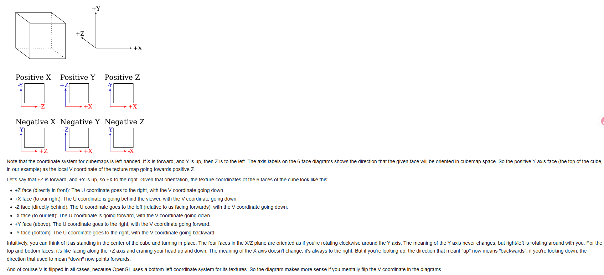
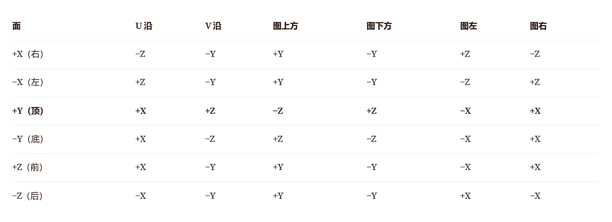

# Cubemap 实现细节与透视正确插值

> 本文档整合三部分内容：OpenGL Cubemap 实现、Cubemap 面坐标系详解（含 OpenGL/DirectX 对比）、透视正确插值。

---

## 第一部分：OpenGL Cubemap 实现

### 1. 加载 DDS Cubemap 纹理

```cpp
// DDS DX10 cubemap: 6 个面连续存储在像素数据区
// 每面 face_size × face_size × 16 字节 (RGBA32F)

GLuint load_cubemap_dds(const char* path) {
    FILE* f = fopen(path, "rb");
    fseek(f, 4 + 124 + 20, SEEK_SET);  // 跳过 magic + header + DX10
    int face_size = 128;
    size_t face_bytes = face_size * face_size * 16;
    std::vector<uint8_t> data(6 * face_bytes);
    fread(data.data(), 1, 6 * face_bytes, f);
    fclose(f);

    GLuint tex;
    glGenTextures(1, &tex);
    glBindTexture(GL_TEXTURE_CUBE_MAP, tex);

    GLenum targets[6] = {
        GL_TEXTURE_CUBE_MAP_POSITIVE_X, GL_TEXTURE_CUBE_MAP_NEGATIVE_X,
        GL_TEXTURE_CUBE_MAP_POSITIVE_Y, GL_TEXTURE_CUBE_MAP_NEGATIVE_Y,
        GL_TEXTURE_CUBE_MAP_POSITIVE_Z, GL_TEXTURE_CUBE_MAP_NEGATIVE_Z
    };
    for (int i = 0; i < 6; ++i) {
        glTexImage2D(targets[i], 0, GL_RGBA32F,
                     face_size, face_size, 0,
                     GL_RGBA, GL_FLOAT,
                     data.data() + i * face_bytes);
    }

    glTexParameteri(GL_TEXTURE_CUBE_MAP, GL_TEXTURE_MIN_FILTER, GL_LINEAR);
    glTexParameteri(GL_TEXTURE_CUBE_MAP, GL_TEXTURE_MAG_FILTER, GL_LINEAR);
    glTexParameteri(GL_TEXTURE_CUBE_MAP, GL_TEXTURE_WRAP_S, GL_CLAMP_TO_EDGE);
    glTexParameteri(GL_TEXTURE_CUBE_MAP, GL_TEXTURE_WRAP_T, GL_CLAMP_TO_EDGE);
    glTexParameteri(GL_TEXTURE_CUBE_MAP, GL_TEXTURE_WRAP_R, GL_CLAMP_TO_EDGE);
    return tex;
}
```

**关键点**：
- `GL_TEXTURE_CUBE_MAP` 绑定目标
- 6 个面用 `GL_TEXTURE_CUBE_MAP_POSITIVE_X` ~ `NEGATIVE_Z` 上传
- 顺序：+X, -X, +Y, -Y, +Z, -Z（与 DDS array slot 顺序一致）
- `GL_RGBA32F` 内部格式对应 `dxgiFormat=2`

### 2. Shader 采样

```glsl
// vertex shader
#version 330 core
layout(location = 0) in vec3 a_pos;
out vec3 v_dir;
uniform mat4 u_mvp;

void main() {
    v_dir = a_pos;  // 用顶点位置作为采样方向
    gl_Position = u_mvp * vec4(a_pos, 1.0);
}
```

```glsl
// fragment shader
#version 330 core
in vec3 v_dir;
out vec4 frag_color;
uniform samplerCube u_cubemap;

void main() {
    vec4 sky = texture(u_cubemap, normalize(v_dir));
    frag_color = sky;
}
```

### 3. 作为 Skybox 使用

```cpp
glDepthMask(GL_FALSE);
glm::mat4 view = glm::mat4(glm::mat3(cameraView));  // 去掉平移
glm::mat4 mvp = projection * view;
glUniformMatrix4fv(loc_mvp, 1, GL_FALSE, &mvp[0][0]);
glBindTexture(GL_TEXTURE_CUBE_MAP, cubemap_tex);
glDrawArrays(GL_TRIANGLES, 0, 36);
glDepthMask(GL_TRUE);
```

### 4. 核心 API 对照表

| 操作 | OpenGL API |
|---|---|
| 绑定 cubemap | `glBindTexture(GL_TEXTURE_CUBE_MAP, tex)` |
| 上传单面 | `glTexImage2D(GL_TEXTURE_CUBE_MAP_POSITIVE_X+i, ...)` |
| Shader 采样器类型 | `samplerCube` |
| 采样函数 | `texture(sampler, vec3 direction)` |
| 方向向量 | 从原点指向立方体表面点（建议归一化） |

---

## 第二部分：Cubemap 面坐标系详解

### 1. 6 个面的命名与顺序

OpenGL 和 DirectX 的 cubemap 面顺序**相同**：

| Slot | DX DXGI | OpenGL 枚举 | 方向 |
|------|---------|------------|------|
| 0 | +X | `GL_TEXTURE_CUBE_MAP_POSITIVE_X` | 右 |
| 1 | -X | `GL_TEXTURE_CUBE_MAP_NEGATIVE_X` | 左 |
| 2 | +Y | `GL_TEXTURE_CUBE_MAP_POSITIVE_Y` | 上 |
| 3 | -Y | `GL_TEXTURE_CUBE_MAP_NEGATIVE_Y` | 下 |
| 4 | +Z | `GL_TEXTURE_CUBE_MAP_POSITIVE_Z` | 前(DX) / 后(GL) |
| 5 | -Z | `GL_TEXTURE_CUBE_MAP_NEGATIVE_Z` | 后(DX) / 前(GL) |

> **注意**：DX 是左手系（+Z 朝远处），OpenGL 是右手系（+Z 朝观察者），所以 +Z 方向语义相反。

---

### 2. 每个面的像素原点与行列方向（核心难点）

> **重要前提澄清**（基于 OpenGL 规范 / Mesa3D 源码验证）：
> - OpenGL 和 DX 的 cubemap **都是从原点（立方体中心）向外看**的视角定义
> - OpenGL cubemap 的 **UV 原点在左上角**（V 向下），这与普通 2D 纹理（V 向上）**相反**
> - 因此 OpenGL 和 DX 的 cubemap **V 方向相同**（都是向下，第一行=顶部）
> - 区别仅在于坐标系手性（GL 右手系 vs DX 左手系），导致 +X/-X 面的 U 方向相反

#### 2.1 OpenGL Cubemap 面坐标系（基于 Mesa3D 源码 / OpenGL 规范）

  
 


 

- 以上spec为最终标准，mesa也是根据这个来的
- uv坐标(s,t,r)是根据位于单位立方体中心的直角坐标系下的顶点坐标(rx,ry,rz,rw)根据公式映射而来
- 映射公式的分母是带绝对值的
- spec图表格里各栏的含义是
  - 主轴方向(根据顶点坐标个分量绝对值最大的确定)代表6个面的槽位，也就是taget
  - $s_c$ $t_c$ 列代表了带入$s$ $t$纹理坐标计算公式的对应变量，$-r_z$意思就是顶点坐标的z分量乘以-1，也就是0.7的z坐标变成-0.7
  - $m_a$列代表主轴的位置分量，值本身有正负
- glwiki图里
  - 6个面没有flip，实际上cubemap的原点是左上角
  - 坐标轴本身代表uv的方向
  - 坐标轴上标出来的方向代表顶点坐标系对应的方向，同时也代表了带入$s$ $t$计算公式时使用的顶点坐标的变换，也就是gl spec里的$s_c$ $t_c$栏
- 各个face的上下左右是根据前面两个规格推导的面向该面时图像四边对应的位置坐标的坐标轴
- 看这6个面时，想象OpenGL的左手系，人站在立方体(位置坐标系)中心点，面向前方(+z),头朝上(+y),右是+x，绕朝上的顺时针转就切换4个侧面，仰头看天就是顶面/低头看地就是底面(初始朝前位姿)
- 

OpenGL 规范定义的 `sc`/`tc` 映射（来自 Mesa3D `choose_cube_face` 实现）：

```
major axis
direction     target                             sc     tc    ma
----------    -------------------------------    ---    ---   ---
 +rx          TEXTURE_CUBE_MAP_POSITIVE_X        -rz    -ry   rx
 -rx          TEXTURE_CUBE_MAP_NEGATIVE_X        +rz    -ry   rx
 +ry          TEXTURE_CUBE_MAP_POSITIVE_Y        +rx    +rz   ry
 -ry          TEXTURE_CUBE_MAP_NEGATIVE_Y        +rx    -rz   ry
 +rz          TEXTURE_CUBE_MAP_POSITIVE_Z        +rx    -ry   rz
 -rz          TEXTURE_CUBE_MAP_NEGATIVE_Z        -rx    -ry   rz
```

UV 计算公式：`u = (sc / |ma| + 1) / 2`，`v = (tc / |ma| + 1) / 2`

由 `sc`/`tc` 推导出每个面的 3D 方向：

| 面 | sc | tc | U(右)=sc↑ | V(下)=tc↑ | 像素(0,0) |
|----|----|----|----------|----------|----------|
| +X | -rz | -ry | -Z | -Y | 左上角 |
| -X | +rz | -ry | +Z | -Y | 左上角 |
| +Y | +rx | +rz | +X | +Z | 左上角 |
| -Y | +rx | -rz | +X | -Z | 左上角 |
| +Z | +rx | -ry | +X | -Y | 左上角 |
| -Z | -rx | -ry | -X | -Y | 左上角 |

> **关键**：OpenGL cubemap 的 **V 向下**（UV 原点在左上角），与普通 2D 纹理相反！这是 cubemap 的特殊性质。

#### 2.2 DirectX Cubemap 面坐标系（左手系，Y-up）

DX 的 cubemap UV 映射（基于 D3D11 规范）：

| 面 | U（右）方向 | V（下）方向 | 像素(0,0)位置 |
|----|-----------|-----------|--------------|
| +X | +Z | -Y | 左上角 |
| -X | -Z | -Y | 左上角 |
| +Y | +X | +Z | 左上角 |
| -Y | +X | -Z | 左上角 |
| +Z | +X | -Y | 左上角 |
| -Z | -X | -Y | 左上角 |

#### 2.3 OpenGL vs DirectX 完整对比

| 面 | GL U(右) | DX U(右) | U 相同? | GL V(下) | DX V(下) | V 相同? |
|----|---------|---------|---------|---------|---------|---------|
| +X | -Z | +Z | ✗ 相反 | -Y | -Y | ✓ 相同 |
| -X | +Z | -Z | ✗ 相反 | -Y | -Y | ✓ 相同 |
| +Y | +X | +X | ✓ 相同 | +Z | +Z | ✓ 相同 |
| -Y | +X | +X | ✓ 相同 | -Z | -Z | ✓ 相同 |
| +Z | +X | +X | ✓ 相同 | -Y | -Y | ✓ 相同 |
| -Z | -X | -X | ✓ 相同 | -Y | -Y | ✓ 相同 |

> **结论**（修正）：
> - **V 方向**：OpenGL 和 DX **完全相同**（都是向下，UV 原点在左上角）
> - **U 方向**：+X/-X 面相反（因坐标系手性），其余面相同
> - **像素原点**：两者都是左上角（第一行=顶部）

#### 2.4 与普通 2D 纹理的差异

| 纹理类型 | UV 原点 | V 方向 | 第一行 |
|---------|--------|-------|-------|
| OpenGL 2D 纹理 | 左下角 | 向上 | 底部 |
| OpenGL cubemap | **左上角** | **向下** | **顶部** |
| DirectX 2D 纹理 | 左上角 | 向下 | 顶部 |
| DirectX cubemap | 左上角 | 向下 | 顶部 |

> **关键**：OpenGL cubemap 与 OpenGL 2D 纹理的 V 方向**相反**！这是 cubemap 沿用 RenderMan 约定的结果。因此加载 cubemap 时**不要**做垂直翻转（与加载普通 2D 纹理不同）。

---

### 3. 十字交叉图（Cross Layout）的多种展开方式

十字交叉图是一种 2D 可视化方式，**没有统一标准**，常见变体：

#### 3.1 水平十字（最常见，Y-up）

```
         [+Y 上]
[-X 左] [+Z 前] [+X 右] [-Z 后]
         [-Y 下]
```

尺寸：4W × 3H（每个面 W×H）

#### 3.2 垂直十字

```
[+Y 上]
[-X 左][+Z 前][+X 右][-Z 后]
[-Y 下]
```

#### 3.3 T 形布局

```
   [+Y]
[+X][+Z][-X][-Z]
   [-Y]
```

#### 3.4 Z-up 十字（本项目使用）

```
[+Z 天顶]
[-X][+Y][+X]
[-Y]
[-Z 地底]
```

> **注意**：十字交叉图仅用于可视化，不是数据交换格式。实际写入 DDS 时按标准 slot 顺序（+X,-X,+Y,-Y,+Z,-Z）。

---

### 4. 6 张独立图像拼成 Cubemap 的所有细节

#### 4.1 数据布局

DDS cubemap 文件中，6 个面的像素数据**连续存储**：

```
[DDS Header 124B][DX10 20B]
[+X 面像素 W*H*bpp]
[-X 面像素 W*H*bpp]
[+Y 面像素 W*H*bpp]
[-Y 面像素 W*H*bpp]
[+Z 面像素 W*H*bpp]
[-Z 面像素 W*H*bpp]
```

#### 4.2 拼接检查清单

| 检查项 | 说明 |
|--------|------|
| 面顺序 | 必须是 +X,-X,+Y,-Y,+Z,-Z（DDS 标准） |
| 面尺寸 | 6 个面必须**等大**且为正方形 |
| 像素格式 | 6 个面格式必须一致（如 RGBA32F） |
| 行对齐 | DX10 通常无对齐要求 |
| 像素原点 | 每个面的 (0,0) 位置由 API 规范定义（见第 2 节） |
| 面内方向 | U/V 方向必须符合 API 规范 |

---

### 5. OpenGL vs DirectX 完整对比

| 特性 | OpenGL | DirectX |
|------|--------|---------|
| 坐标系 | 右手系 | 左手系 |
| Y 轴方向 | +Y 向上 | +Y 向上 |
| Z 轴方向 | +Z 朝观察者（出屏） | +Z 朝远处（入屏） |
| Cubemap V 轴 | **向下**（与 2D 纹理相反！） | **向下** |
| Cubemap UV 原点 | 左上角 | 左上角 |
| +Z 面语义 | 后方 | 前方 |
| 图像数据布局 | 第一行=顶部 | 第一行=顶部 |

> **重要修正**：之前认为 OpenGL cubemap V 向上是错误的。实际上 OpenGL cubemap 与 DX 一样，V 向下，UV 原点在左上角。这与 OpenGL 普通 2D 纹理（V 向上）相反。

#### 5.1 图像数据转换

DDS 文件是 DX 格式（第一行=顶部），OpenGL cubemap 加载时**无需垂直翻转**（cubemap 的 V 方向在两个 API 中相同）：

```python
def dx_cubemap_to_opengl_cubemap(dx_faces):
    """DX cubemap 数据 -> OpenGL cubemap 数据
    注意: cubemap 的 V 方向在 GL 和 DX 中相同 (都向下), 无需 flipud!
    仅需处理 +X/-X 面的 U 方向差异 (如果需要严格匹配)"""
    gl_faces = {}
    for name, face in dx_faces.items():
        # cubemap V 方向相同, 不需要翻转
        gl_faces[name] = face  # 直接使用
    return gl_faces
```

> **与普通 2D 纹理对比**：加载普通 2D 纹理时，DDS→OpenGL 需要 `np.flipud`（因 2D 纹理 V 方向相反）；但加载 cubemap 时**不需要**翻转。

#### 5.2 坐标系转换（方向向量）

```glsl
// OpenGL 方向向量 -> DirectX 方向向量
vec3 dir_dx = vec3(dir_gl.x, dir_gl.y, -dir_gl.z);

// DirectX 方向向量 -> OpenGL 方向向量
vec3 dir_gl = vec3(dir_dx.x, dir_dx.y, -dir_dx.z);
```

---

### 6. 采样方向向量的数学

Cubemap 采样时，GPU 根据 3D 方向向量 `(x,y,z)` 自动选择面：

```
主轴 = argmax(|x|, |y|, |z|)
若主轴 = |x|: 选 +X (x>0) 或 -X (x<0)
若主轴 = |y|: 选 +Y (y>0) 或 -Y (y<0)
若主轴 = |z|: 选 +Z (z>0) 或 -Z (z<0)

选面后, 用另外两个分量计算 UV (具体规则因 API 而异)
```

---

### 7. 调试检查清单

当 cubemap 方向错误时，按此顺序排查：

1. **Slot 顺序**：6 个面是否按 +X,-X,+Y,-Y,+Z,-Z 存储？
2. **坐标系匹配**：数据坐标系（如 Z-up）是否与编辑器预期一致？
3. **V 轴方向**：图像第一行是顶部（DX）还是底部（GL）？
4. **单面方向**：每个面的 U/V 方向是否符合 API 规范？
5. **方向向量转换**：采样时是否做了坐标系转换？
6. **使用方向编码 cubemap**：用纯色+亮度渐变 cubemap 验证每个 slot 方向。

---

## 第三部分：透视正确插值（Perspective-Correct Interpolation）

### 1. 问题背景

在 3D 渲染中，三角形顶点带有属性（UV、颜色、法线等）。光栅化时需要插值属性。**线性插值在屏幕空间下会导致错误**，因为透视投影是非线性的。

```
3D 空间:  A----M----B   (M 是 AB 中点, 3D 中点)
投影后:   A'---M'------B'  (M' 不再是 A'B' 中点!)
```

### 2. 数学原理

#### 2.1 透视投影的属性映射

```
屏幕空间属性插值: a_screen = α·a0 + β·a1   (错误)

透视正确插值:     a/z 在屏幕空间线性变化
                  1/z 在屏幕空间也线性变化
                  
                  a_correct = (α·a0/z0 + β·a1/z1) / (α/z0 + β/z1)
```

#### 2.2 推导

3D 空间中，属性沿边线性：`a(3D) = (1-t)·a0 + t·a1`

关键洞察：**`1/z` 和 `属性/z` 在屏幕空间都是线性的**。

### 3. GPU 实现流程

```
1. 顶点着色器输出: 属性 a, 位置 clip_pos (含 w)
2. 硬件计算: a/w, 1/w  (透视除法前)
3. 光栅化: 对 a/w 和 1/w 在屏幕空间做线性插值
4. 像素着色器前: a_correct = (a/w)_插值 / (1/w)_插值
```

**核心**：插值 `属性/w` 和 `1/w`，再相除恢复。

### 4. OpenGL/GLSL 中的实现

#### 4.1 默认就是透视正确插值

```glsl
// vertex shader
out vec2 v_uv;
void main() {
    v_uv = a_uv;  // 默认透视正确
    gl_Position = MVP * vec4(a_pos, 1.0);
}

// fragment shader
in vec2 v_uv;  // 自动透视正确插值
```

#### 4.2 禁用透视正确（noperspective）

```glsl
noperspective out vec2 v_uv;  // 线性插值 (屏幕空间)
```

#### 4.3 平面插值（flat）

```glsl
flat out int v_id;  // 不插值, 取第一个顶点的值
```

### 5. 数学对比示例

三角形顶点 UV 为 (0,0), (1,0), (0,1)，深度 z = 1, 1, 10：

**透视正确**：
```
a_uv.x = (α·0/1 + β·1/1 + γ·0/10) / (α/1 + β/1 + γ/10)
       = 0.25 / 0.775 ≈ 0.323
```

**线性插值（错误）**：
```
a_uv.x = α·0 + β·1 + γ·0 = 0.25
```

差异：0.323 vs 0.25。深度差异越大，错误越严重。

### 6. Cubemap 中的特殊应用

#### 6.1 Skybox 不需要透视正确

Skybox 是无限远的，所有方向向量长度相同。可加 `noperspective`：

```glsl
noperspective out vec3 v_dir;
```

但默认透视正确也工作（因为 w 相同）。

#### 6.2 方向向量需归一化

```glsl
// fragment shader
in vec3 v_dir;
void main() {
    vec3 dir = normalize(v_dir);  // 重要! 插值后长度会变化
    color = texture(cubemap, dir);
}
```

### 7. 手动实现（软件光栅化）

```cpp
Vec2 interpolate_perspective(Vertex v0, Vertex v1, Vertex v2,
                              float alpha, float beta, float gamma) {
    float w0 = 1.0f / v0.z;
    float w1 = 1.0f / v1.z;
    float w2 = 1.0f / v2.z;
    
    float inv_z = alpha * w0 + beta * w1 + gamma * w2;
    Vec2 uv_over_z = v0.uv * (alpha * w0) +
                     v1.uv * (beta  * w1) +
                     v2.uv * (gamma * w2);
    
    return uv_over_z / inv_z;
}
```

### 8. 关键性质总结

| 属性类型 | 在屏幕空间的行为 | 插值方式 |
|---------|----------------|---------|
| `1/z`（深度） | 线性 | 直接线性插值 |
| `属性/z` | 线性 | 直接线性插值 |
| `属性` | **非线性** | 需透视正确插值 |
| 方向向量（单位） | 需归一化后再用 | 默认透视正确，但需 normalize |

### 9. 常见 bug

#### 9.1 法线插值变形

```glsl
// 错误: 插值后法线不再单位长度
in vec3 v_normal;
vec3 N = v_normal;  // 错!
float diff = max(dot(N, L), 0);  // 光照失真

// 正确: 必须归一化
vec3 N = normalize(v_normal);
```

#### 9.2 切线空间基向量

```glsl
mat3 tbn = mat3(normalize(v_tangent),
                normalize(v_bitangent),
                normalize(v_normal));
```

---

## 附录：Cubemap 面坐标系验证（基于 Mesa3D 源码）

### 验证结论：✅ 最终修正后表格正确

经过 Mesa3D 源码（OpenGL 规范实现）验证：

1. **OpenGL cubemap UV 原点在左上角**（V 向下）— 已确认（与普通 2D 纹理相反！）
2. **DirectX cubemap UV 原点在左上角**（V 向下）— 已确认
3. **GL 和 DX 的 V 方向相同**（都向下）— 已确认
4. **GL 和 DX 的 U 方向在 +X/-X 面相反**（坐标系手性差异）— 已确认

### OpenGL 各面 3D 方向（来自 Mesa3D `choose_cube_face`）

| 面 | sc | tc | U(右) | V(下) | 验证 |
|----|----|----|-------|-------|------|
| +X | -rz | -ry | -Z | -Y | ✅ |
| -X | +rz | -ry | +Z | -Y | ✅ |
| +Y | +rx | +rz | +X | +Z | ✅ |
| -Y | +rx | -rz | +X | -Z | ✅ |
| +Z | +rx | -ry | +X | -Y | ✅ |
| -Z | -rx | -ry | -X | -Y | ✅ |

### DirectX 各面 3D 方向

| 面 | U（右） | V（下） | 验证 |
|----|---------|---------|------|
| +X | +Z | -Y | ✅ |
| -X | -Z | -Y | ✅ |
| +Y | +X | +Z | ✅ |
| -Y | +X | -Z | ✅ |
| +Z | +X | -Y | ✅ |
| -Z | -X | -Y | ✅ |

### 验证方法

**OpenGL +X 面**（sc=-rz, tc=-ry）：
```
u = (sc/ma + 1) * 0.5 = (-z/|x| + 1) * 0.5
u 增加 ⟺ z 减小 ⟺ U(右) = -Z ✅

v = (tc/ma + 1) * 0.5 = (-y/|x| + 1) * 0.5
v 增加 ⟺ y 减小 ⟺ V(下) = -Y ✅
```

**DirectX +X 面**（左手系，forward=+X, up=+Y）：
```
right = cross(forward, up) = cross((1,0,0), (0,1,0)) = (0,0,1) = +Z
→ U(右) = +Z ✅ (与 OpenGL 相反, 因 Z 轴方向相反)
→ V(下) = -Y ✅ (与 OpenGL 相同)
```

### 历史错误修正记录

1. **第一次错误**：认为 OpenGL V 向上，DX V 向下（两者相反）
2. **第二次错误**：认为 OpenGL "从外部看"，DX "从原点看"
3. **最终修正**（基于 Mesa3D 源码）：GL 和 DX 都是"从原点向外看"，V 方向相同（都向下），仅 +X/-X 面的 U 方向因坐标系手性而相反

---

## 参考来源

- [Mesa3D 源码：choose_cube_face（OpenGL 规范实现）](https://blog.csdn.net/huangzhipeng/article/details/7957233) — **权威 sc/tc 表格来源**
- [OpenGL Wiki: Cubemap Texture](https://www.khronos.org/opengl/wiki/Cubemap_Texture)
- [NVIDIA 论坛：OpenGL Cubemap 是左手系 + UV 原点左上角](https://forums.developer.nvidia.com/t/why-does-nsight-display-cubemaps-upside-down/66436)
- [Microsoft D3D11_TEXTURECUBE_FACE 枚举](https://learn.microsoft.com/it-it/windows/win32/api/d3d11/ne-d3d11-d3d11_texturecube_face)
- [Unity Cubemap 采样反射信息](https://www.cnblogs.com/SmalBox/p/19126421)
- [纹理技术概述（UV 坐标系）](https://www.cnblogs.com/BDFFZI/p/19389176)
- OpenGL Specification Section 8.13.1 (Cube Map Texture Selection)


## 第四部分：引擎中cubemap采样方向向量的计算

**所有引擎在采样cubemap时，最终都使用一个3D方向向量**——这是GPU硬件的标准方式，与LearnOpenGL教程的原理完全一致。区别只在于这个方向向量是如何得到的。

---

### 1. LearnOpenGL教程做法回顾

教程中的标准实现：

```glsl
// 顶点着色器
out vec3 WorldPos;
// ...
gl_Position = ...;  // 立方体顶点变换到裁剪空间

// 片元着色器
in vec3 WorldPos;  // 实际上就是立方体的局部坐标（因为天空盒中心在原点）
uniform samplerCube environmentMap;
void main() {
    vec3 envColor = texture(environmentMap, WorldPos).rgb;
}
```

**为什么能用局部坐标？**
- 天空盒立方体以**原点为中心**，尺寸通常是1×1×1或很大的数值
- 每个顶点的局部位置 `(x,y,z)` 本身就是一个从立方体中心指向该顶点的**方向向量**
- 平移矩阵被移除（天空盒跟随相机移动），所以方向保持正确

这是一个**教学简化**，因为它直接利用了立方体网格的几何特性。

---

### 2. 实际引擎中的做法

#### 2.1 Unity引擎

Unity支持三种天空盒Shader：

| 天空盒类型 | 实现方式 | 采样向量来源 |
|-----------|---------|------------|
| **6 Sided** | 6张独立纹理组成cubemap | 内部转换为方向向量采样 |
| **Cubemap** | 单个cubemap资源 | 视方向/世界方向 |
| **Panoramic** | 全景图（HDRI） | 球面UV→方向向量→采样 |

在Shader Graph中，**Sample Cubemap节点**的 `Dir` 输入明确要求：
> **世界空间中的方向向量**（如反射方向、法线方向），用于定位采样点

Unity的天空盒几何体本质上也是一个立方体或穹顶，但它不会直接使用局部坐标，而是通过：
- `WorldSpaceViewDir()` 计算视方向
- 或根据屏幕UV重建世界空间方向
- 然后用这个方向采样cubemap

#### 2.2 Unreal Engine

UE的天空系统更复杂：

- **Sky Light**：将场景捕获为cubemap用于光照，材质中通过 `TextureSampleCube` 节点采样，输入是**3D向量**（可以是世界位置、反射向量等）
- **Sky Atmosphere**：大气散射系统，不使用传统cubemap，而是通过物理计算大气
- **老式天空盒材质**：通常使用 `WorldPosition` 减去相机位置得到方向向量，或使用 `ReflectionVector`

UE材质中采样cubemap的典型连接：
```
AbsoluteWorldPosition → 归一化 → TextureSample (Cubemap)
```
或者：
```
ReflectionVector → TextureSample (Cubemap)
```

#### 2.3 Blender

Blender的环境纹理系统：

- **Environment Texture节点**：接受 `Vector` 输入，默认使用视图方向
- **Texture Coordinate节点**：有专门的 `Reflection` 输出，*"使用反射向量的方向作为坐标。这在使用环境贴图时需要。"*
- 支持Equirectangular（等距柱状投影）和Mirror Ball两种投影方式，但内部最终都会转换为方向采样

Blender的世界背景本质上是一个**无限远的环境**，不需要实际的立方体网格，渲染器为每个像素直接计算射线方向来采样环境贴图。

---

### 3. 为什么引擎不直接用"局部坐标"？

教程的做法虽然简单，但存在局限性，实际引擎需要处理更复杂的情况：

#### 3.1 几何体不一定是单位立方体

| 天空盒几何形式 | 局部坐标是否等于方向？ |
|--------------|---------------------|
| 单位立方体（中心在原点） | ✅ 是 |
| 缩放后的立方体 | ❌ 需要归一化 |
| 球体/穹顶网格 | ❌ 局部坐标是位置不是方向 |
| 全屏三角形（无几何体） | ❌ 没有局部坐标，需从屏幕UV重建 |

现代引擎（尤其是延迟渲染管线）普遍使用**全屏三角形**方式渲染天空：
1. 画一个覆盖屏幕的三角形
2. 从深度缓冲（或深度=最远）重建每个像素的世界/视图空间方向
3. 用这个方向采样cubemap

这种方式不需要维护一个大立方体网格，效率更高。

#### 3.2 坐标空间一致性

引擎中需要处理多重坐标空间：
- 局部空间（Object Space）
- 世界空间（World Space）
- 视图空间（View Space）
- 裁剪空间（Clip Space）

cubemap纹理通常是在**世界空间**中定义的（天空、环境反射），所以直接使用世界空间方向向量最不容易出错。

#### 3.3 多功能需求

cubemap不仅用于天空盒，还用于：
- **环境反射**：使用 `reflect(-viewDir, normal)` 反射向量
- **折射**：使用 `refract()` 折射向量
- **IBL光照**：用法线方向采样辐照度贴图
- **光照探针**：世界空间各个方向的光照捕获

这些场景下都不可能用"局部坐标"，必须计算物理正确的方向向量。

---

### 4. Cubemap采样的硬件本质

无论上层用什么坐标，GPU硬件采样cubemap时做的事情是固定的：

```
输入: vec3 dir (方向向量)
1. 找dir中绝对值最大的分量 → 确定采样哪个面（±X/±Y/±Z）
2. 用另外两个分量除以最大分量 → 得到面上的UV坐标 [-1, 1]
3. 转换到 [0, 1] 范围
4. 在对应面的2D纹理上采样
5. 边缘处与相邻面做线性插值（平滑过渡）
```

**关键**：GPU只关心输入的是一个方向向量，不关心这个向量是怎么来的——可以是局部坐标、世界坐标、反射向量、折射向量，只要它指向正确的方向即可。

---

### 5. 总结对比

| 维度 | LearnOpenGL教程 | 实际商业引擎 |
|-----|----------------|------------|
| **采样原理** | 3D方向向量采样cubemap | **完全相同** |
| **方向来源** | 立方体局部坐标 | 世界空间方向/视方向/反射向量 |
| **几何体** | 大立方体 | 立方体、穹顶球体、全屏三角形都有可能 |
| **坐标空间** | 隐式（局部=世界） | 显式区分各坐标空间 |
| **灵活性** | 仅适合简单天空盒 | 支持反射、折射、IBL、光照探针等 |
| **性能** | 需要渲染立方体网格 | 现代引擎多用全屏三角形+方向重建 |

**简单回答你的问题**：

1. **原理上是一样的**——都是用方向向量采样cubemap
2. **实现形式上不同**——引擎不会简单地用"立方体局部坐标"，因为：
   - 天空盒不一定是中心在原点的单位立方体
   - 可能使用全屏三角形而不是立方体网格
   - 需要处理坐标空间转换和多功能复用
   - 反射、折射等效果需要计算特定方向向量
3. 天空盒立方体的"UV"确实是特殊的——它不是普通的2D UV，而是直接利用位置作为3D方向，这与普通网格的2D UV展开完全不同

如果你自己写一个简单的渲染器，用LearnOpenGL的方式完全正确；如果阅读引擎源码，你会看到更多的坐标空间转换和方向重建代码，但cubemap采样的那一步，传入的永远是一个`vec3`方向。