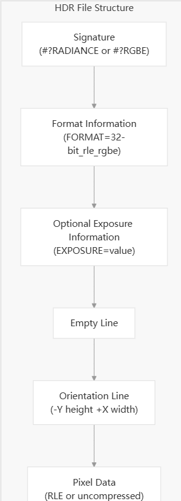
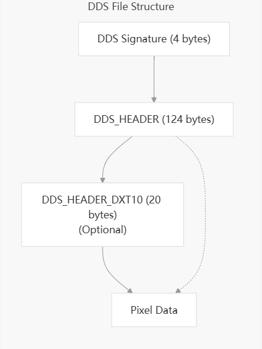
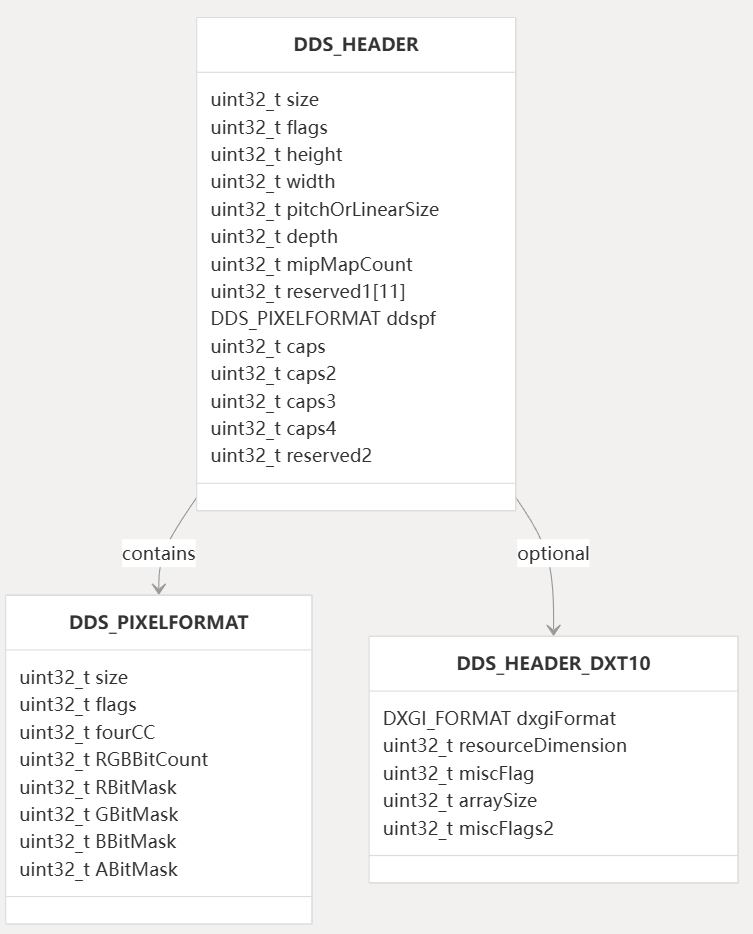
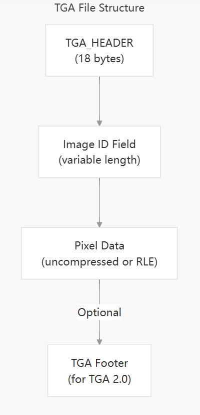
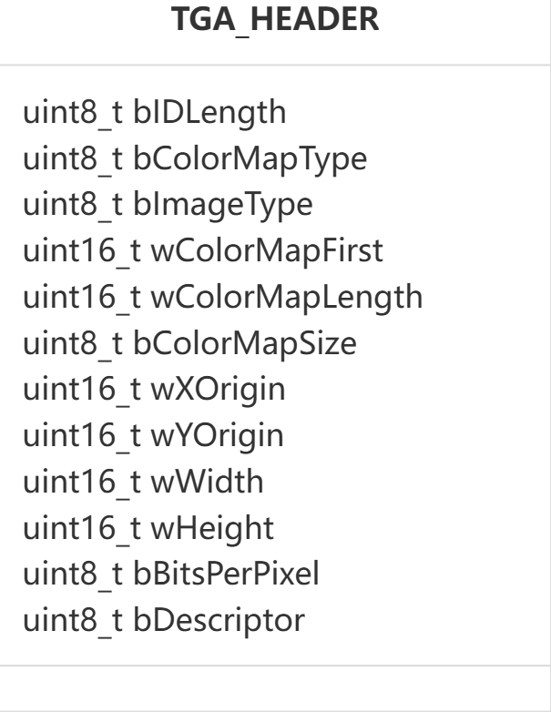

# 相关概念
## 纹理 纹理映射 uv展开 纹理数据来源 类型 纹理io
好的，这是一个非常核心的图形学主题。我们来系统地梳理一下你提到的这些概念，从基础到进阶，形成一个清晰的知识框架。

核心概念总览

这些术语描述了将2D图像（纹理）包裹到3D模型表面的整个过程和技术。

•   目标： 让3D模型表面拥有丰富的细节（颜色、凹凸、反光等），而无需增加模型本身的几何复杂度。

•   核心方法： 通过一套被称为 UV映射 的坐标系统，建立2D图像像素与3D模型顶点之间的对应关系。

•   流程： UV展开 -> 纹理绘制/生成 -> 纹理映射（在着色器中通过UV坐标采样）。

1. 基本概念详解

1.1 纹理

在图形学中，纹理 远不止是一张图片。它是一个广义概念，指任何可以“贴”到模型表面上来提供信息的数据数组。
•   最初的理解： 漫反射贴图，即模型的基础颜色。

•   现代的理解： 可以是表示颜色、凹凸、光泽度、法线方向、高度等任何表面属性的数据。

1.2 UV 坐标

这是连接3D空间和2D纹理空间的桥梁。
•   是什么： 一对二维坐标 (u, v)。

    ◦   U 代表水平方向，相当于X轴。

    ◦   V 代表垂直方向，相当于Y轴。

•   范围： 通常取值范围是 [0, 1]，即纹理图像的左下角是 (0,0)，右上角是 (1,1)。这个坐标系被称为纹理空间。

•   归属： 每个模型的顶点都会拥有一个UV坐标。这个坐标定义了“这个顶点应该去纹理图片的哪个位置取颜色（或数据）”。

1.3 纹理映射

纹理映射 就是指利用UV坐标，将纹理图像“贴”到模型表面的整个过程。
•   在渲染时（如片元着色器中）： 对于3D模型上的每个像素（更准确说是片元），系统会根据其所在三角形的三个顶点的UV坐标进行插值，得到一个属于该像素的UV坐标。

•   纹理采样： 然后，使用这个插值后的UV坐标去查询（采样）纹理图像，获取对应的颜色值，并将该颜色值用于计算该像素的最终颜色。

1.4 UV展开

这是整个流程的预处理步骤，也是最具技巧性的步骤之一，通常在3D建模软件（如Blender, Maya, 3ds Max）中完成。
•   是什么： 将3D模型的表面“切开”并“摊平”到2D的UV空间的过程。

•   比喻： 就像为一个橙子制作包装纸，你需要把橙子皮剥下来并小心地压平。UV展开就是创建这张“包装纸”的版型。

•   结果： 生成一个2D的“UV网格图”，这个图上的每个点都对应3D模型上的一个顶点。艺术家可以在这个展开的UV网格上绘制纹理。

•   挑战： 尽量减少拉伸和扭曲，并充分利用纹理空间（避免浪费）。

2. 纹理数据来源与类型

纹理的数据来源和类型极其丰富，远远超出了“一张jpg图片”的范畴。

2.1 数据来源

1.  手绘： 艺术家直接在展开的UV图上进行绘制（使用Photoshop, Substance Painter等）。
2.  程序化生成： 通过算法实时或预计算生成。例如，噪声函数、木材、大理石等材质。
3.  照片扫描： 通过专业设备拍摄真实物体表面，处理成无缝平铺的纹理。这是PBR流程的主流来源。
4.  物理模拟/烘焙： 将复杂光照信息（如环境光遮蔽、烘焙光照贴图）或几何信息（如法线贴图）从高模“烘焙”到低模的UV上。

2.2 纹理类型（按用途分类）

现代渲染（尤其是PBR流程）使用多张不同类型的纹理共同描述一个材质。

•   漫反射贴图 / 基础色贴图： 定义表面的基础颜色（Albedo）。不包含光照信息。

•   法线贴图： 通过改变表面法线方向，模拟出凹凸不平的细节，而无需增加几何多边形。

•   高光贴图 / 粗糙度贴图： 控制表面反射的强度和清晰度。

    ◦   高光： 值越高，反射越强（用于非金属）。

    ◦   粗糙度： 值越高，反射越模糊（PBR常用）。

•   金属度贴图： 定义表面是金属（白色）还是非金属（黑色）。

•   环境光遮蔽贴图： 模拟物体缝隙间的阴影，增加立体感。通常会被烘焙到其他贴图中。

•   高度贴图 / 置换贴图： 真正地通过顶点位移或曲面细分来改变模型的几何形状，比法线贴图更耗性能但效果更真实。

•   自发光贴图： 定义表面哪些区域会自己发光。

3. 纹理I/O

纹理I/O指的是纹理数据的输入和输出，涉及文件格式、通道、压缩和API操作。

3.1 文件格式

•   无损格式（适合存储/编辑）：

    ◦   PNG： 支持透明度，无损压缩。适合UI图标、细节纹理。

    ◦   TGA： 古老的格式，支持多种通道，在游戏开发中历史久远。

    ◦   EXR： 高动态范围格式，用于存储超出[0,1]范围的光照信息（如HDR环境贴图）。

•   有损格式（适合运行时）：

    ◦   JPG/JPEG： 有损压缩，文件小，但不支持透明度，有画质损失。

•   硬件优化格式（游戏/实时渲染专用）：

    ◦   DDS, KTX, ASTC等： 这些格式通常预先生成了适合GPU快速解码的压缩数据（如S3TC/DXT, ETC, ASTC），能极大提升加载速度和减少内存占用。它们通常支持Mipmaps。

3.2 输入

•   从磁盘加载： 应用程序（游戏引擎）从硬盘读取图片文件，解压为RGB(A)像素数据。

•   上传至GPU： 通过图形API（如OpenGL, Vulkan, DirectX）将像素数据从CPU内存上传到GPU的显存中，创建一个纹理对象。这个对象包含了纹理数据、滤波设置、寻址模式等信息。

3.3 输出

•   渲染到纹理： 将渲染结果不输出到屏幕，而是输出到一个纹理对象上。用于后期处理、阴影映射、环境反射等高级效果。

•   保存到磁盘： 将GPU中的纹理数据读回CPU内存，并保存为图片文件（如截图、烘焙光照贴图）。

总结

这些概念构成了一个完整的生产流水线：

1.  建模与展开： 艺术家创建3D模型，并进行UV展开，得到UV坐标。
2.  纹理制作： 根据UV布局，通过手绘、程序化或扫描等方式创建各种纹理（漫反射、法线等）。
3.  引擎集成： 在游戏引擎或渲染器中，将模型和纹理导入。引擎通过纹理映射技术，在着色器中使用UV坐标来采样对应的纹理。
4.  优化与I/O： 将纹理转换为合适的格式（DDS等）并进行压缩，以优化纹理I/O性能和内存占用。

理解这个流程是掌握现代实时图形渲染和3D内容创作的基础。

## UV Unwrap， UV/纹理 打包, UV/Texture Mapping 纹理技术三步骤
好的，这些术语非常相关，但描述了纹理工作流程中不同且连续的阶段。它们常常被混淆。我们来清晰地梳理一下。

这是一个从准备到最终应用的完整流程：

1. UV Unwrap (UV展开) -> 2. 纹理打包 (Texture Packing) -> 3. UV Mapping (纹理映射)

而 UV Wrap 是 UV Mapping 的核心思想。

核心关系图

为了更好地理解，我们可以将这个过程与一个比喻相结合：

比喻：给一个复杂形状的礼物盒子（3D模型）包上包装纸（纹理）。

步骤 3D图形学术语 礼物盒比喻 描述

第1步：制作包装纸版型 UV Unwrapping 把礼物盒的纸箱拆开，压平，得到一堆纸板片。 将3D模型表面“切开”并“摊平”到2D空间的过程。结果是UV布局。

第2步：优化排版 Texture Packing / UV Packing 把这些纸板片高效地排列在一张大的包装纸上，减少浪费。 将展开的多个UV块（charts）合理安排在一个纹理图片的空间里。

第3步：给版型上图案 Texturing / Painting 在排版好的包装纸上印刷或绘制图案。 艺术家根据UV布局来绘制颜色、凹凸等细节，生成纹理贴图。

第4步：包上盒子 UV Mapping / UV Wrapping 按照版型把印好图案的包装纸包回礼物盒上。 在渲染时，通过UV坐标将纹理贴图“包裹”到3D模型表面。

详细解释每个术语

1. UV Unwrap (UV展开)

•   是什么： 这是预处理阶段。这是一个动词，指艺术家或算法在3D软件（如Blender, Maya）中执行的操作。

•   目的： 为3D模型的每个顶点分配一个2D坐标 (U, V)，从而建立3D表面与2D纹理图像之间的对应关系。

•   过程： 需要手动或自动地在模型上创建“接缝”，然后将模型表面沿着接缝剪开，并摊平。这个过程会产生一个2D的“UV网格”图。

•   关键： 尽量减少摊平过程中的拉伸和扭曲。

2. Texture Packing / UV Packing (纹理/UV打包)

•   是什么： 这是UV展开后、纹理绘制前的一个优化步骤。

•   目的： 将模型所有展开的UV块（称为“UV islands”或“charts”）尽可能地紧密排列在0到1的纹理坐标范围内。

•   为什么重要：

    ◦   提高纹理分辨率利用率： 减少空白区域，意味着模型的每个部分都能使用更多的纹理像素，细节更清晰。

    ◦   合并绘制： 可以将多个模型的UV打包到一张纹理图上，通过“纹理图集”来减少绘制调用，提升实时渲染性能。

•   工具： 3D软件都内置了打包功能，也有很多专门的算法（如前面提到的Iso-charts算法就包含了打包步骤）。

3. UV Mapping (纹理映射)

•   是什么： 这是概念总称和最终结果。它描述了“通过UV坐标将纹理贴到模型上”的整个技术、过程和状态。

•   常用表达：

    ◦   “这个模型的UV Mapping做得很好。”（指整个UV工作流程的结果很好）

    ◦   “UV Mapping是计算机图形学的基石技术之一。”（指这个技术概念）

•   它涵盖了UV Unwrapping和后续的映射应用。

4. UV Wrap (UV包裹)

•   是什么： 这是一个非常形象化的术语，用于描述UV Mapping的核心思想。

•   用法： 它不像其他术语那样作为一个标准操作名称。你更可能听到：

    ◦   “纹理被包裹在模型上。”

    ◦   “这种映射方式就像把地图包裹在地球仪上一样。”（这正是在描述圆柱投影或球面投影）

•   核心意象： 强调的是一张2D图片如何像一个包装纸或皮肤一样紧密地贴合在3D物体表面。

总结与关系

术语 中文 阶段 核心问题 比喻

UV Unwrapping UV展开 准备 “如何把模型表面剪开并摊平？” 制作包装纸的版型。

Texture Packing 纹理打包 优化 “如何把摊平的版型高效地排在一张纸上？” 优化排版，节省纸张。

UV Mapping 纹理映射 概念/结果 “如何把图片贴到模型上？” 整个“包装礼物”的过程和技术。

UV Wrap UV包裹 概念 “图片是如何包裹模型的？” 描述“包上”这个动作和效果。

简单来说：
你先进行 UV展开 来创建一张地图（UV布局），然后对这张地图进行打包优化。接着，你根据这张地图来画纹理（Texturing）。最后，在渲染时，引擎使用纹理映射技术，按照地图的指引将纹理包裹到模型上。

希望这个解释能彻底厘清这些术语之间的关系！

## UV展开(unwrap)概念 原理 算法 工具
纹理展开是3D建模和游戏开发中的一个重要步骤，它涉及到将3D模型的表面展开成一个2D平面，以便于纹理贴图。纹理展开的主要目的是为了简化模型的纹理贴图过程，提高渲染效率，并减少纹理的存储空间。

好的，我们来系统性地深入探讨UV展开，这是3D计算机图形学中一个基础且关键的环节。

一、UV展开的核心概念

1. 是什么？
UV展开是将3D模型表面的顶点映射到2D纹理空间的过程。这个过程的输出是一个UV布局，它定义了3D模型上的每个点对应2D纹理图像上的哪个位置。

•   UV坐标： 一对二维坐标 (U, V)，范围通常是 [0, 1]。纹理图像的左下角是 (0,0)，右上角是 (1,1)。

•   UV岛： 在UV布局中，一个连续的、展开的网格片段称为一个“UV岛”。

•   接缝： 为了将封闭的3D模型摊平，必须在模型上“切割”出接缝。接缝在UV布局中表现为UV岛的边界。

2. 为什么需要？
3D模型本身没有“表面图像”的概念。为了给模型赋予丰富的颜色、细节和材质信息（这些信息存储在2D纹理图中），就必须建立一个从3D到2D的桥梁。UV坐标就是这个桥梁。

3. 最终目标：
生成一个失真度最小的UV布局。失真主要有两种：
•   拉伸： UV岛上的网格与3D模型上的网格面积比例不一致。

•   扭曲： UV岛上的网格形状（如角度）与3D模型上的原始形状不一致。

理想情况下，展开后的UV网格应尽可能保持原始3D网格的形状和面积。

二、UV展开的基本原理

UV展开在数学上属于网格参数化的问题，即寻找一个从3D曲面（或其近似网格）到2D平面的双射映射。

1. 核心思想：保角映射
大多数现代UV展开算法都力求实现保角映射。
•   目标： 尽可能保留3D空间中的局部角度。这意味着，在3D模型上垂直的两条边，展开到UV空间后应该仍然保持垂直。

•   优点： 保角映射能有效避免纹理的扭曲，视觉效果最好。它允许纹理图案在模型表面连续地“流动”，而不会发生奇怪的变形。

2. 简单原理：平面投影
这是最直观的理解方式，也是3D软件中最基础的展开工具。它通过一个投影器（如平行光）将3D模型投射到一个平面上。
•   方式： 平面、圆柱体、球体、立方体投影。

•   缺点： 只对形状与投影器相似的模型有效。对于复杂模型，会产生严重的重叠和拉伸。因此，它通常作为自动展开算法的初始步骤，或用于简单物体。

三、UV展开的算法分类与演进

UV展开算法的发展，核心是如何更好地最小化映射失真。

1. 传统方法：基于剪裁的松弛法

这是早期主流且至今仍在使用的方法，更依赖艺术家的干预。
•   流程：

    1.  手动切割接缝： 艺术家根据模型结构，手动在模型上标记出接缝（如沿着角色身体的中线、衣物缝合线）。
    2.  初始投影： 对切割后的各个部分进行简单的平面投影，得到一个初始的、拉伸严重的UV布局。
    3.  松弛/优化： 算法将UV网格视为一个弹簧系统。每个边都是一根弹簧。算法通过迭代计算，调整UV顶点的位置，使这些“弹簧”恢复到原始3D空间中的自然长度，从而减少拉伸和扭曲。
•   代表： 在Blender、Maya等软件中的“松弛工具”或“展开”功能。

2. 自动展开算法

这类算法旨在最小化人工干预，自动寻找最优的接缝和映射。

a. 基于信号处理的方法：
将网格表面视为一个信号场，通过分析其“频率”或“特征”来指导分割。
•   核心： Iso-charts 算法

    ◦   原理： 将3D曲面视为一个光滑的标量场（如通过计算测地距离生成）。然后，像画等高线一样，追踪等值线来分割网格。这些被分割出的块（charts）其内部参数化失真很小。

    ◦   优点： 全自动，产生的UV岛大而连续，接缝数量少，失真度低。

    ◦   地位： 是自动展开领域的里程碑算法。微软DirectX SDK中的 UVAtlas 工具是其经典实现。

b. 基于几何分割的方法：
根据模型的几何特征（如曲率、锐边）来自动放置接缝。
•   原理： 算法会识别模型上曲率大的区域（如鼻子边缘、手臂与身体连接处），因为这些地方是天然的“接缝”位置。然后将模型沿着这些特征线切开。

•   流程： 特征检测 -> 自动切割 -> 分块参数化 -> 打包。

为了更直观地理解不同算法的策略，下图展示了自动展开算法的核心思想：
flowchart TD
    A[3D模型] --> B{选择自动展开策略}

    B --> C[基于信号处理 （如Iso-charts）]
    B --> D[基于几何分割 （如基于曲率）]

    subgraph C [流程]
        C1[生成标量场 （如测地距离）] --> C2[追踪等值线 进行分割] --> C3[对每个块进行 保角参数化]
    end

    subgraph D [流程]
        D1[检测网格特征 （曲率/锐边）] --> D2[沿特征线 自动切割] --> D3[分块参数化 与优化]
    end

    C3 --> E[UV布局优化 （松弛/最小化失真）]
    D3 --> E

    E --> F[UV岛打包]
    F --> G[最终UV布局]

3. 最新进展：基于深度学习的方法

这是目前的前沿研究方向。
•   原理： 使用大型已标注的UV数据集（如已经由专业艺术家展开好的模型）来训练神经网络。

•   过程： 网络学习模型的几何特征与最优接缝位置、UV布局之间的复杂关系。

•   输入： 3D网格。

•   输出： 预测的接缝或直接的UV坐标。

•   潜力： 有望实现接近艺术家水平的、且速度极快的自动展开。

四、总结

算法类型 原理 优点 缺点 适用场景

投影法 简单几何投影 速度快，极其简单 失真大，只适用于简单形状 简单几何体、作为初始解

剪裁松弛法 手动剪裁+物理松弛 控制力强，结果精确 耗时，依赖艺术家经验 角色、道具等高质量资产

自动展开 （如Iso-charts） 信号处理/几何分割 全自动，速度快，效果均衡 接缝位置不可控，可能不直观 程序化生成模型、LOD模型、快速原型

深度学习方法 数据驱动的预测 潜力巨大，速度快 依赖训练数据，处于研究阶段 未来可能成为主流

结论：
UV展开是一个在艺术控制和自动化之间寻找平衡的技术。对于追求最高质量的影视、游戏主角模型，手动或半自动的剪裁松弛法仍然是金标准。而对于游戏中的环境资产、大量道具或需要快速迭代的场景，自动展开算法（如Iso-charts）是不可或缺的强大工具。理解其原理有助于你在不同场景下选择最合适的工具和工作流。

自动化UV展开和纹理打包

### Iso-charts: Stretch-driven Mesh Parameterization using Spectral Analysis
好的，我们来深入探讨一下 Iso-charts（等值线图或等参线图，在UV展开的语境下）。这是一个非常经典且重要的自动UV展开算法。

1. 核心思想：是什么？

Iso-charts 是一种自动的、基于网格分割的UV展开算法。它的核心目标是将一个复杂的3D模型自动分割成若干个“块”（即 charts），然后将这些块尽可能地无扭曲、无拉伸地展开到2D的UV平面上。

它得名于一个关键概念：将3D曲面视为一个光滑的标量场，然后通过追踪等值线 来划分区域，就像在地形图上画等高线一样。

2. 为什么要用 Iso-charts？解决的问题

在它出现之前，UV展开主要依赖艺术家手动在3D软件中切割接缝。这存在几个问题：
•   耗时费力： 对于复杂模型（如角色、怪物），手动切割是极其繁琐的工作。

•   结果依赖经验： 切割的好坏直接影响纹理映射的质量，对艺术家技能要求高。

•   难以优化： 手动难以保证拉伸和扭曲的全局最优。

Iso-charts 算法的目标就是自动化这个过程，并力求在数学上达到最优的展开质量，具体是优化以下两点：
1.  最小化面积失真： 展开后的UV块面积应与3D表面的面积比例保持一致。
2.  最小化形状失真： 展开后的形状应尽量保持与3D表面相似的形状，避免拉伸。

3. 算法原理简述（通俗版）

你可以把算法过程想象成给一个不规则的地球仪制作世界地图，但要保证每个大洲的形状和面积都尽可能准确。

1.  第一步：生成标量场
    ◦   算法首先要在3D模型表面定义一个“高度”或“距离”场。最常用的方法是计算测地距离——即模型表面上的最短路径距离。

    ◦   通常，它会选择模型表面上距离最远的两个点作为“极点”，然后计算表面上每个点到这两个极点的距离差或比值，形成一个标量场。这个场就像地形的高度场。

2.  第二步：追踪等值线并进行分割
    ◦   有了标量场，算法就可以像画等高线一样，画出许多条等值线。这些线连接了表面上标量值相等的点。

    ◦   算法会根据这些等值线，将连续的3D网格分割成若干个带状区域。这些区域就是初步的 “charts” 的雏形。

3.  第三步：参数化
    ◦   现在，需要将每个3D的 chart 展开到2D平面。Iso-charts 采用了一种叫做松驰的方法。

    ◦   它假设 chart 是一个由弹簧连接的网格。在3D空间中，这些弹簧处于自然状态。展开到2D时，目标就是让这些2D空间中的“弹簧”长度和角度尽可能与3D原始状态一致，从而最小化扭曲。

    ◦   由于每个 chart 都是基于等值线分割的，其形状相对规则，因此参数化过程能取得很好的效果（拉伸很小）。

4.  第四步：Pack（打包）
    ◦   将所有展开的2D charts 像拼图一样摆放进一个统一的UV空间（通常是 [0,1] 的正方形内）。这一步会尽量提高纹理空间的利用率，减少空白区域。

4. 优点

•   全自动化： 无需人工干预，一键生成UV。

•   高质量： 在数学上优化了失真度，通常能产生拉伸很小的UV布局。

•   连续性： 生成的 charts 通常很大块，接缝数量相对较少且合理，有利于纹理绘制的连续性。

•   特别适用于： 程序化生成的模型、需要快速为大量模型生成UV的场景（如LOD生成）、以及作为手动展开的优质起点。

5. 缺点与局限性

•   接缝位置不可控： 算法决定的接缝可能不在艺术家期望的位置。例如，它可能会把角色的脸部从中间切开，而艺术家通常希望脸部是完整的一块。

•   对特定拓扑不友好： 对于具有复杂分支或孔洞的模型，自动分割的结果可能不直观。

•   计算量相对较大： 相比一些简单的平面投影法，计算测地距离和优化参数化需要更多的计算时间。

6. 实际应用与实现

•   微软研究院： 该算法最早由微软研究院的 Zhou 等人在 2004 年的 SIGGRAPH 论文《Iso-charts: Stretch-driven Mesh Parameterization using Spectral Analysis》中提出。

•   软件集成：

    ◦   Microsoft DirectX SDK： 早期版本中包含了一个名为 UVAtlas 的命令行工具，它就是 Iso-charts 算法的一个经典实现，用于为网格生成均匀的、低失真的UV。

    ◦   游戏引擎： 许多引擎的自动化UV展开工具都借鉴或采用了类似的思想。

    ◦   3D建模软件： 如 Blender、Maya 等软件中的“自动展开”或“智能UV投影”功能，其底层原理与 Iso-charts 非常相似，都是力求在减少扭曲的同时自动分割模型。

总结

Iso-charts 是UV展开领域的一个里程碑式的算法。它将一个复杂的几何问题（最小化扭曲参数化）与一个图形学问题（分割）巧妙地结合起来，通过谱方法 或测地距离场 来指导分割，从而实现了高质量的全自动UV展开。

虽然它不能完全替代艺术家对于重要资产（如主角角色）的手动精细展开，但它是处理大量资产、快速原型设计以及为手动展开提供优秀起点的强大工具。理解了 Iso-charts，你就掌握了现代自动UV展开技术的核心思想。

# UVAtlas 
是对uv展开中的基于信号处理的自动化展开算法的一个经典实现
open3d 也有一个实现compute_uvatlas
https://learn.microsoft.com/pl-pl/windows/win32/direct3d9/using-uvatlas
https://deepwiki.com/microsoft/UVAtlas 算法具体代码实现及架构说明

UVAtlas会自动创建最优的UVAtlas，api输入参数允许用户控制:
1. Minimize texture stretch, distortion, and undersampling.
2. Maximize texture-space packing density for efficient use of memory.
3. Provide an even sampling across the mesh, minimizing discontinuities in sampling frequency.

UVAtlas的工作流程包括：
1. partitioning a surface into charts，D3DXUVAtlasPartition 或者D3DXUVAtlasCreate
2. packing charts into a texture atlas,  D3DXUVAtlasPack或者D3DXUVAtlasCreate

1. Partitioning and Parameterizing a Mesh
2. Using Integrated Metric Tensors to Control Parameterization
3. Using Adjacency Data for User Specified Creases
4. Packing Charts Into an Atlas

裁剪 接缝 数据焊接weld

## uvatlas命令行工具的使用
uvatlas [options] <input_file> [<output_file>]
uvatlas input.obj output.obj: 默认参数，生成一个2048x2048的纹理图
uvatlas -s 1024 -n 10 input.fbx output.obj
uvatlas -st 0.2 input.obj output.obj
uvatlas -g uv_layout.png input.obj output.obj
uvatlas -s 2048 -n 15 -st 0.05 -g mymodel_uv.png -l mymodel_log.txt mymodel.obj mymodel_withNewUV.obj

输出参数：
-c,--color-mesh:输出mesh不同isocharts颜色不同
-t,--uv-texture:没看出来啥用
-m,--output-remap:生成一个_map.txt文件，记录输出mesh中每个顶点的newIndex对应的输入mesh中的oldIndex

mipmapping

# 数学中的映射概念
单射
满射
双射
一一映射
逆映射

### 1. 单射（Injective）
单射也称为"一对一映射"，是指不同元素映射到不同像的映射。
- 定义：对于映射 f: A → B，若任意 x₁, x₂ ∈ A，当 x₁ ≠ x₂ 时，有 f(x₁) ≠ f(x₂)，则 f 是单射。
- 特点：A 中不同元素在 B 中有不同的像
- 举例：f: R → R，f(x) = 2x + 1 是单射，因为不同的 x 值对应不同的函数值

### 2. 满射（Surjective）
满射是指值域等于陪域的映射。
- 定义：对于映射 f: A → B，若对于任意 y ∈ B，都存在 x ∈ A 使得 f(x) = y，则 f 是满射。
- 特点：B 中每个元素都有原像
- 举例：f: R → R⁺，f(x) = x² 不是满射，因为负数没有原像

### 3. 双射（Bijective）
双射既是单射又是满射的映射。
- 定义：若映射 f: A → B 既是单射又是满射，则 f 是双射。
- 特点：A 和 B 的元素一一对应
- 举例：f: R → R，f(x) = 2x + 1 是双射

### 4. 一一映射
一一映射就是双射的另一种说法，表示两个集合之间的元素是一一对应的。

### 5. 逆映射（Inverse Mapping）
- 定义：若 f: A → B 是双射，则存在唯一的映射 f⁻¹: B → A，使得对于任意 x ∈ A，有 f⁻¹(f(x)) = x；对于任意 y ∈ B，有 f(f⁻¹(y)) = y。这个映射 f⁻¹ 称为 f 的逆映射。
- 特点：只有双射才有逆映射
- 举例：若 f(x) = 2x + 1，则 f⁻¹(x) = (x - 1)/2

这些概念在数学的许多领域都有重要应用，特别是在集合论、抽象代数和函数论中。理解这些概念对于深入理解数学结构和函数关系非常重要。

# 纹理数据IO
## 文件格式
纹理文件格式是指用于存储纹理数据的文件格式。这些格式定义了纹理数据的组织方式、压缩方式以及元数据等信息。常见的纹理文件格式包括：

1. PNG (Portable Network Graphics)
2. JPEG (Joint Photographic Experts Group)
3. BMP (Bitmap)
4. TIFF (Tagged Image File Format)
5. GIF (Graphics Interchange Format)
6. HDR (High Dynamic Range)  RGBE 是一种用于存储高动态范围(HDR)图像的格式，也称为 Radiance RGBE 格式
   数据结构:
	每个像素由 4 个字节组成：R、G、B 和 E
	R、G、B 各占 8 位，E (Exponent) 也占 8 位
	E 是共享指数，用于表示三个颜色通道的公共指数
   
   存储方式:
	使用浮点数的科学记数法表示
	实际颜色值 = (R, G, B) × 2^(E-128)
	这种表示方法可以用较少的位数存储大范围的亮度值
7. DDS (DirectDraw Surface) begin with a 4-byte signature "DDS " followed by a DDS_HEADER structure, with an optional DX10 extended header for newer formats  
8. KTX (Khronos Texture)
9. TGA (Truevision Targa)   一般用于cg领域影视动画的序列帧输出
10. PPM (Portable Pixmap)
11. EXR 工业光魔设计的一种半精度浮点的HDR文件格式 支持piz zip rle 等压缩方式 EXR（或OpenEXR）、工业光魔（ILM）和ASWF（Academy Software Foundation）三者之间，其实是一段关于​​电影工业中开源技术如何从解决特定问题走向行业标准，并通过基金会协作推动整个生态繁荣的精彩故事​​。ILM开发了exr并开源了OpenEXR，交给了ASWF基金管理

## 纹理压缩算法及格式
ASTC
DXTC1234567

## DirectXTex 纹理处理库
DirectXTex 是微软开发的一套用于处理纹理的库，它提供了丰富的功能来加载、处理和保存纹理。DirectXTex 可以与 DirectX 11 和 DirectX 12 一起使用，并且支持多种纹理格式。

Windows Image Components (WIC) 是一个用于处理图像的 Windows API，它提供了一种统一的接口来加载、处理和保存各种图像格式。WIC 支持的图像格式包括 BMP、JPEG、PNG、GIF、TIFF 等。

DirectXTex 的主要功能包括：
1. 加载和保存多种纹理格式，如 PNG、JPEG、DDS、KTX 等。
2. 支持纹理压缩，如 DXT、BCn、ETC 等。
3. 提供高效的纹理处理功能，如纹理过滤、纹理转换、纹理压缩等。
4. 支持多线程处理，以提高纹理处理的性能。

DirectXTex 的使用非常简单，只需要包含相应的头文件并链接相应的库文件即可。它提供了丰富的 API，可以满足各种纹理处理的需求。

GenerateMipMaps
Compress:Block Compression BC1/2/3/4/5/6/7

# 3d 贴图制作工具
图形学领域的贴图制作工具非常丰富，它们能帮助你将简单的模型变成栩栩如生的数字资产。下面这个表格汇总了主流工具的核心特点，方便你快速了解。

| 工具名称 | 核心功能 | 主要适用场景 | 关键特点 |
| :--- | :--- | :--- | :--- |
| **Substance Painter** | **实时3D贴图绘制** | 游戏开发、实时视觉特效 | 强大的PBR（基于物理的渲染）工作流、智能材质、粒子笔刷 |
| **Substance Designer** | **程序化纹理生成** | 创建可重复使用和动态调整的智能材质 | 节点式编辑、非破坏性工作流、高度可控 |
| **Mari** | **处理超高细节贴图** | 影视级高精度模型纹理 | 被誉为“贴图之王”，擅长处理复杂模型和大量纹理层 |
| **3DCoat** | 3D雕刻与纹理绘制 | 游戏模型开发 | 集雕刻与绘制于一体，支持中文 |
| **Adobe Photoshop** | 2D图像处理与绘制 | 基础贴图制作、处理与合成 | 行业标准，插件生态丰富，与3D工具联动良好 |
| **Blender** | 内置纹理绘制模块 | 开源3D创作全流程 | 完全免费，与建模、雕刻、渲染流程深度集成 |
| **ZBrush** | 数字雕刻与Spotlight绘制 | 角色、生物高模雕刻与贴图 | 强大的雕刻功能，配合Spotlight进行贴图投射 |
| **Mudbox** | 3D雕刻与纹理绘画 | 直观的3D绘制 | 操作易上手，与Maya等Autodesk软件工作流顺畅 |
| **ShaderMap Pro** | 专业贴图生成与转换 | 从单张图像生成法线/置换等贴图 | 专注贴图生成与转换，支持实时预览和PBR材质打包 |

### 💡 根据需求选择工具组合

实际项目中，通常需要组合使用多种工具：

-   **影视级角色/场景制作**：通常会使用 **Mari** 来处理面部皮肤、复杂织物等需要极高精度的纹理细节。同时，可能会用 **Substance Designer** 来程序化生成一些基础材质（如石材、金属），以提高效率和一致性。
-   **次世代游戏资产开发**：**Substance Painter** 是当前行业的标准选择。它的智能材质和蒙版功能能快速生成逼真的磨损、灰尘效果。模型的高模通常先在 **ZBrush** 或 **Mudbox** 中雕刻完成，然后烘焙出法线贴图等资源，再导入Painter进行绘制。
-   **独立开发者/个人学习**：**Blender** 是最佳起点。它内置的纹理绘制工具集足够完成从UV展开到基础绘制的全流程，并且完全免费。可以搭配 **GIMP**（一款开源的图像编辑软件）或 **Photoshop** 进行额外的图像处理。
-   **快速生成法线/置换贴图**：如果你有一张普通的彩色图片，想快速转换为法线贴图或其他PBR贴图，**ShaderMap Pro** 或 **PixPlant** 这类工具非常高效。它们能直接从一张图片计算出表面凹凸信息。

### 🎨 理解贴图的工作流程

现代贴图制作，尤其是游戏和实时渲染领域，广泛采用 **PBR（基于物理的渲染）** 流程。这意味着你需要制作一套相互关联的贴图，而不仅仅是一张颜色图。常见的PBR贴图包括：
-   **基础色贴图**：定义物体表面的颜色。
-   **法线贴图**：在不增加模型多边形的情况下，模拟表面微小的凹凸细节。
-   **粗糙度/高光贴图**：控制表面反射的模糊程度或强度。
-   **金属度贴图**：定义哪些部分是金属，哪些部分是非金属。

### 🔧 选择工具的其他考量

-   **预算与平台**：**Substance** 系列和 **Mari** 等是商业软件，需要付费订阅或购买。**Blender**、**GIMP** 则是完全免费开源的。
-   **学习曲线**：**Substance Designer** 和 **Mari** 的节点式工作流或复杂图层系统学习曲线相对陡峭。**Substance Painter** 和 **Mudbox** 的界面则相对直观，更容易上手。
-   **工作流集成**：考虑工具与你主要使用的3D软件（如Maya、3ds Max、Blender、Unity、Unreal Engine）的兼容性。例如，Substance工具与Unreal Engine和Unity的集成非常紧密。

希望这份工具指南能帮助你找到最适合你项目的利器！如果你能分享一下你主要从事的领域（比如是游戏角色制作、场景环境艺术，还是产品可视化），或许我可以给出更具体的流程建议。