Unreal Engine 5.x Documentation

# Basics 基础

## Foundation

### Terminology 术语

https://dev.epicgames.com/documentation/en-us/unreal-engine/unreal-engine-4-terminology?application_version=4.27
1. object->actor可以放置在场景world中的object  actor->pawn可以进行控制的actor(non-player characters)  pawn->character人形pawn
2. content browser里的东西应该都是project的asset，包含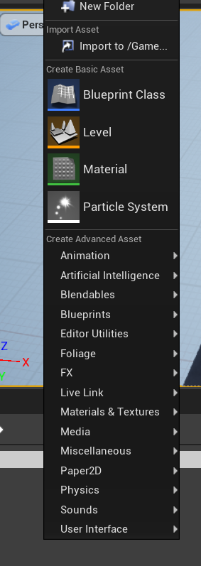
   1. 基本资产material ，paticle-system， level 以及 blueprint class
   2. 高级资产，如特效 动画 物理 声音 ai等
   3. blueprint class是一种特殊的资产，提供了直观 基于node的编程脚本，用来生成不同的actor以及level event 
   4. level是一组actors(mesh light volume)的组合，进行game所在的虚拟scene称为level,多个level可以组成streaming experience,
3. Component是分为actor或者场景的组件 
4. game default map:初始加载的地图，否则是黑屏
5. editor start map
6. game mode
7. 
   1. tools 完成某项工作，如将actor放置在world中
   2. editor是一组tools的集合
   3. system是更复杂的功能，如blueprint system
8. 从内容浏览器选择ASSET，右键，asset actions进行批量编辑或者detail面板里的matrix property
9. Project， ue工程文件.uproject,包含了硬盘上的一系列文件夹,如Blueprints, Materials等
10. Blueprint 蓝图，完整的游戏脚本系统，通过编辑器基于node 的接口实现游戏逻辑,用来定义OO类或对象
11. Object
12. Class
13. Actor Technically speaking, an Actor is a programming class used within the Unreal Engine to define an object that has 3D position, rotation, and scale data. Think of an Actor as any object that can be placed in your levels.
    Actor Type: 
    1. static mesh
    2. brush
    3. skeletal mesh
    4. camera 
    5. playerstart
    6. triggers
    7. pointlight
    8. spotlight
    9. directionallight
    10. particleemitter
14. xx

### Tools and Editors

Tool:
Editor: a collection of tools to achieve some more complex things
System:a large collection of features that work together to produce some aspect of the game or application,如蓝图系统

1. level editor 关卡编辑器
   gameplay level
   有5种模式，默认是select actor模式，地形编辑 植被编辑 画刷 mesh-painter
2. static mesh editor 
   You can use the Static Mesh Editor to preview the look, collision, and UV mapping, as well as set and manipulate the properties of Static Meshes
3. material editor
   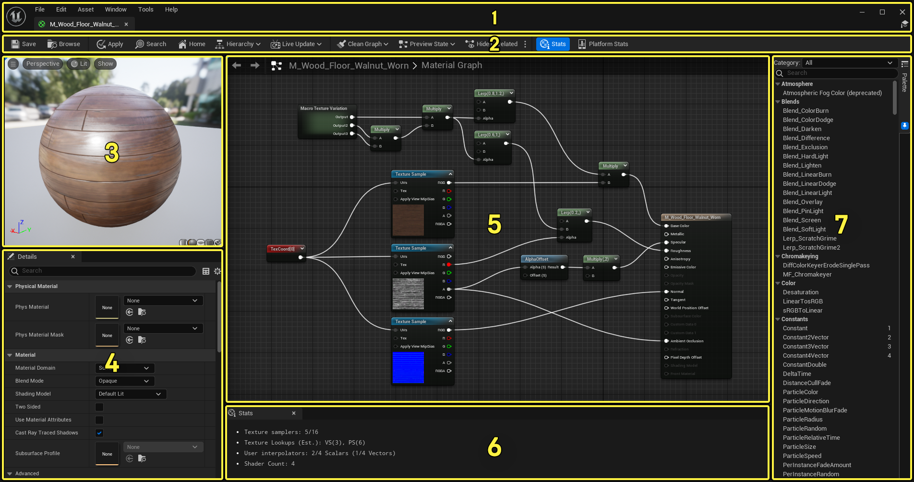
	1 菜单栏
	2 工具栏
	3 视口面板
	4 细节面板
	5 材质图面板
	6 统计信息面板
	7 控制板面板 以分类的形式显示所有材质节点
	材质表达式（Material Expressions） 和 材质函数（Material Functions） 是在虚幻引擎中创建功能齐全材质的基本单位。每个表达式或函数都是材质图表中完全独立的节点。 这些节点对其输入运行HLSL代码的小片段，并输出结果。
4. blueprint编辑器
	修改 编辑blueprint的地方，blueprint是一种可以创建游戏元素(如控制actor或创建event script等)、修改材质、实现其他feature而不需要编写c++代码的特殊资产
5.  physics asset editor
	创建Skeletal Meshes的物理属性
6.  Behavior Tree Editor
	行为树编辑器 通过可视化节点为关卡中的Actor编写脚本的地方，可以为敌人 npc 载具等创建各种行为
7. font editor
8. UMG UI
	
9.  sequence editor 通过tracks轨道实现动画
   1.  Tracks can consist of things like Animations (for animating a character), Transformations (moving things around in the scene), Audio (for including music or sound effects), and so on
   2.  过场动画及动态事件编辑
10. Animation editor
11. Control Rig Editor
12. Sound Cue Editor
13. Media Editor
14. nDisplay 3D Config Editor多屏显示编辑器
15. DMX Library Editor

## content browser
对package file的管理，asset的操作
collection：自定义的asset引用的集合，

## 定制化引擎

## 项目与模板
## 项目设置
## 关卡
每一个关卡都是一个独立的.umap文件，所以有时关卡也称为地图
## 资产与内容包
## actor与geometry
## 游戏与模拟

# work with content
## Alembic File 导入
## Artist Quick Start
## FBX 内容管线
## 毛发渲染与模拟
## Interchange Framework
## Skeleton Meshes 骨骼mesh
## Static Meshes 静态网格
## Mutable Skeletal Mesh Generation 可变骨骼网格生成
## Datasmith
## glTF
## Universal Scene Description
## LiDAR 点云插件
## Modeling and Geometry Scripting
## Work with Scene Variants
## SpeedTree
## Localization本地化

# build virtual world
# Design Visuals, Rendering, and Graphics

## Materials
  
1	Menu Bar  
2	Toolbar  
3	Viewport Panel  
4	Details Panel  
5	Material Graph Panel  
6	Stats Panel  
7	Palette Panel  

### Essential Material Concepts
shader graph   
material graph  
material expression:每个node貌似都是一个  
material function  
main material node  

材质编辑器中的 材质图面板里，材质图是那个图，里面的节点有材质表达式和材质函数，材质表达式（Material Expressions） 和 材质函数（Material Functions） 是在虚幻引擎中创建功能齐全材质的基本单位。每个表达式或函数都是材质图表中完全独立的节点。 这些节点对其输入运行HLSL代码的小片段，并输出结果。  

The main difference between Material Expressions and Functions is that Material Expressions are created directly in the source code of the engine, while Material Functions exist as editable assets in the Content Browser.材质表达式是引擎内嵌的，只能通过改源码改动；材质函数可以通过编辑器进行编辑

可以对材质的数据进行append合并或者componentmask拆解，以方便输出不同的通道

### Physically Based Materials

<!-- #### PBR Material Attributes -->
#### base color
  
Measured BaseColor values for nonmetals (intensity only):
Material	BaseColor Intensity
Charcoal	0.02
Fresh asphalt	0.02
Worn asphalt	0.08
Bare soil	0.13
Green grass	0.21
Desert sand	0.36
Fresh concrete	0.51
Ocean Ice	0.56
Fresh snow	0.81

Measured BaseColors for metals:
Material	BaseColor (R, G, B)
Iron	(0.560, 0.570, 0.580)
Silver	(0.972, 0.960, 0.915)
Aluminum	(0.913, 0.921, 0.925)
Gold	(1.000, 0.766, 0.336)
Copper	(0.955, 0.637, 0.538)
Chromium	(0.550, 0.556, 0.554)
Nickel	(0.660, 0.609, 0.526)
Titanium	(0.542, 0.497, 0.449)
Cobalt	(0.662, 0.655, 0.634)
Platinum	(0.672, 0.637, 0.585)

#### roughness
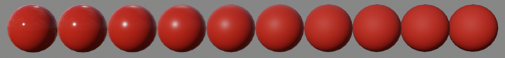  
 
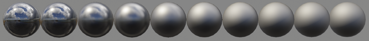

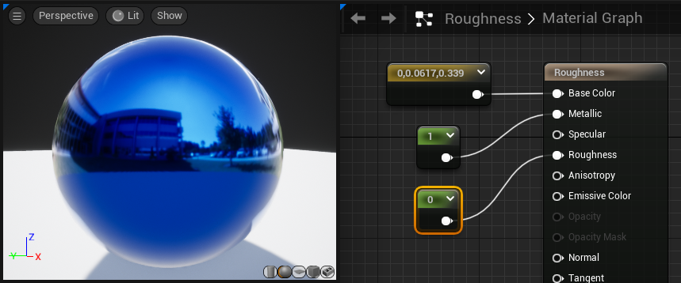   
  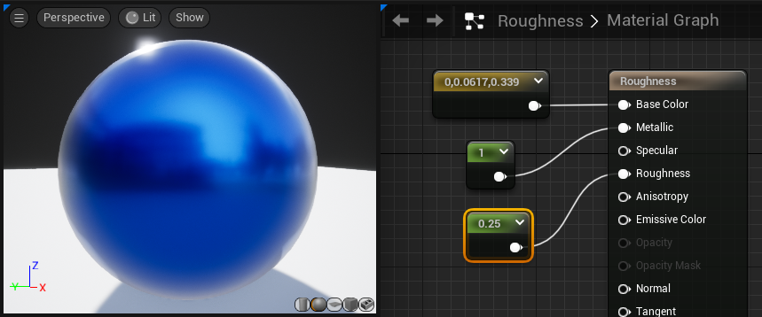
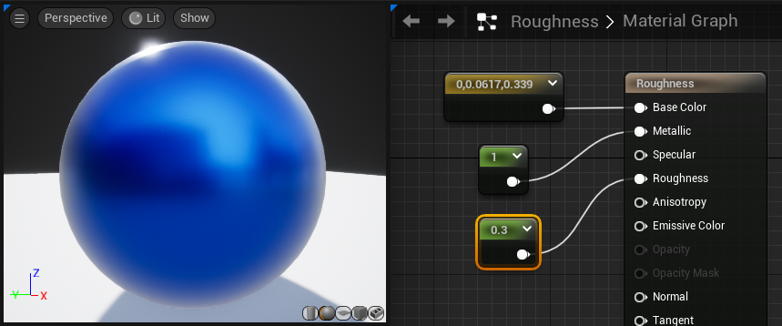 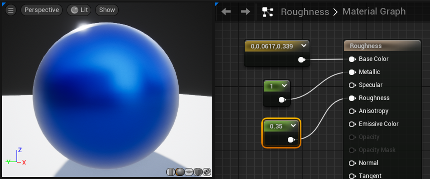 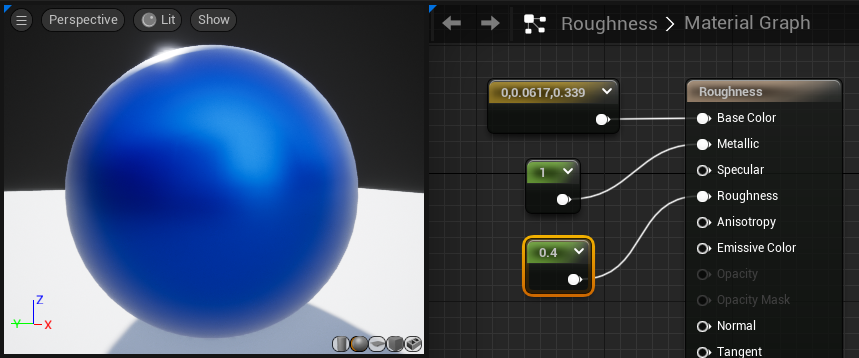
 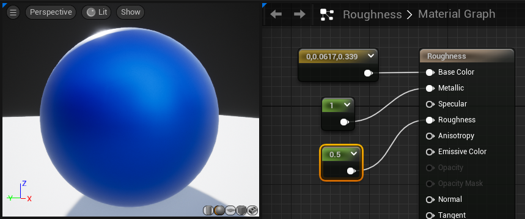 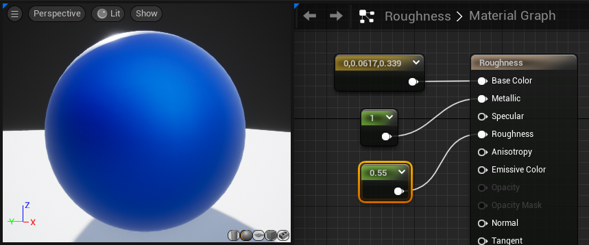 
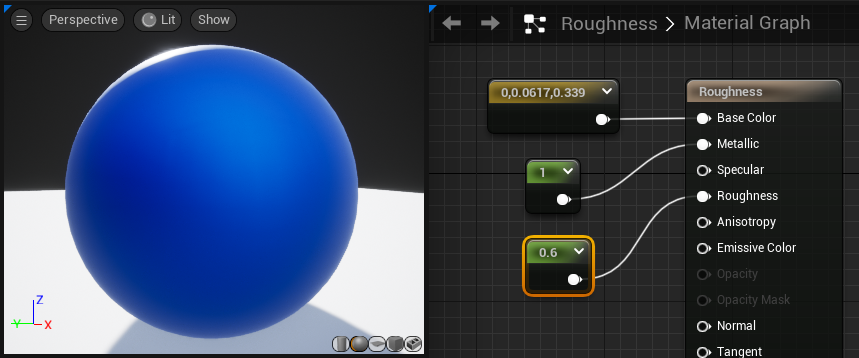  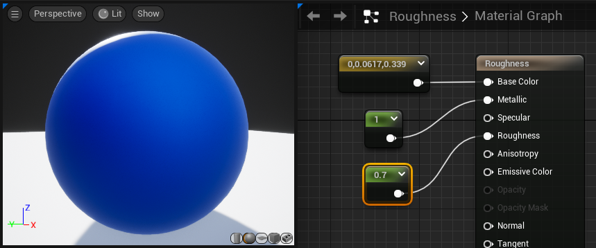
 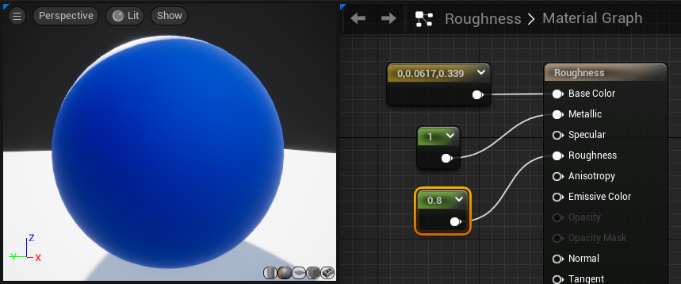 
 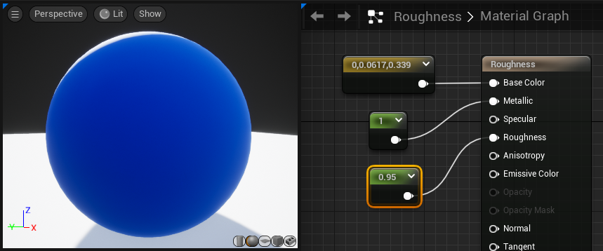 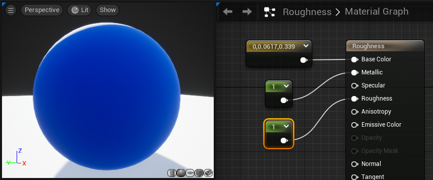

#### metallic
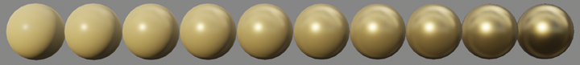
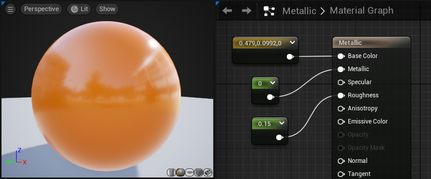
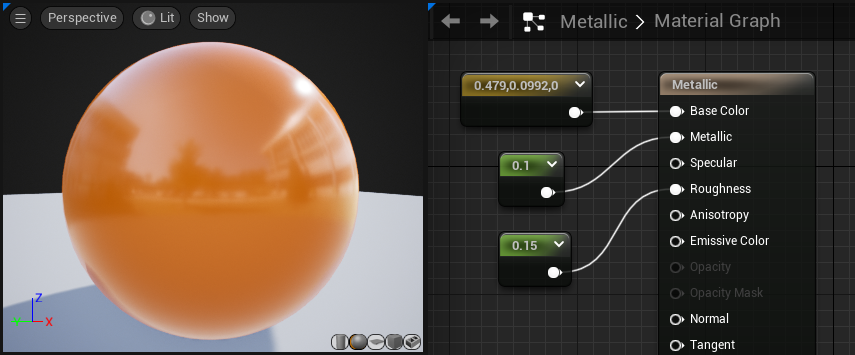
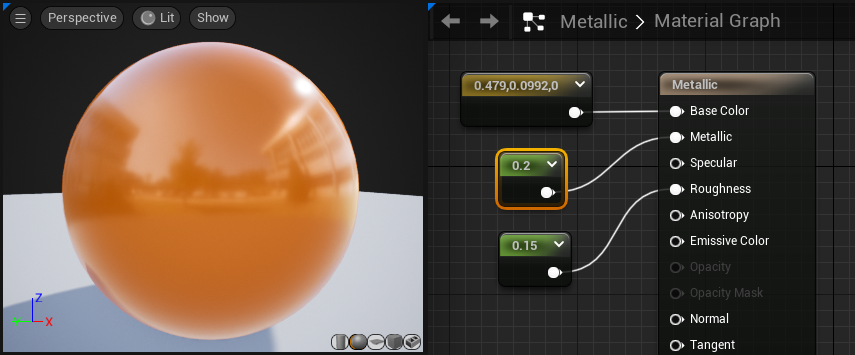
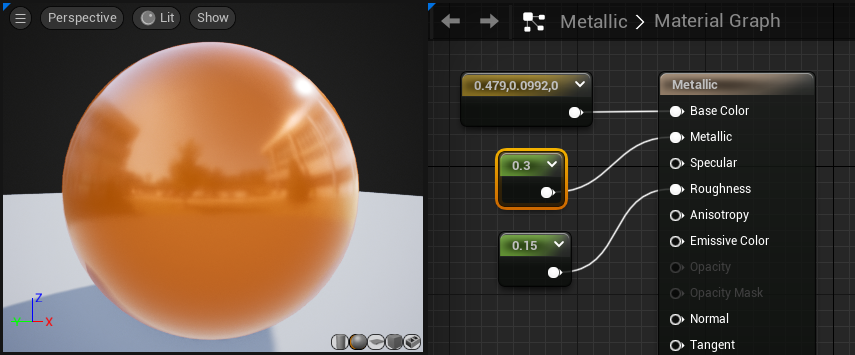

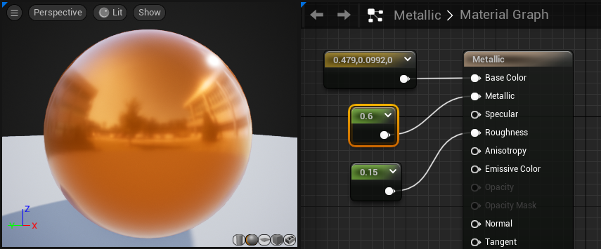

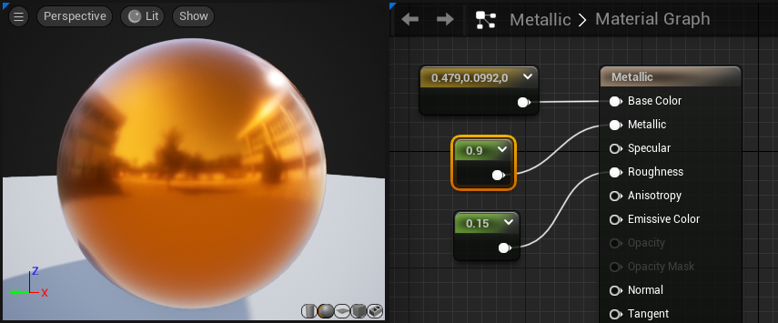
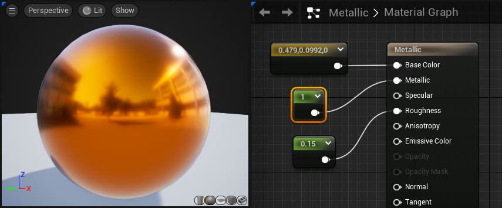

#### mapping metalic
with a coat of paint covering some or all of the metal金属上漆(车身)
一个二值的mask，金属部分为1，非金属部分为0，金属度乘以这个mask，就可以得到金属度在金属部分为1，非金属部分为0的效果

#### specular
The Specular input takes a value between 0 and 1, and controls how much specular light the surface reflects.

A Specular value of 0 is fully non-reflective.
A Specular value of 1 is fully reflective.

#### Cavity Maps
One reason to modify Specular is to add micro occlusion or small scale shadowing, say from cracks represented in the normal map. These are sometimes referred to as cavities. Small scale geometry, especially details only present in the high poly and baked into the normal map, will not be picked up by the renderer's real-time shadows.

To capture this shadowing, you can generate a cavity map, which is typically an AO map with very short trace distance. This is multiplied by the final BaseColor before output and multiplied with 0.5 (Specular default) as the Specular output.

To be clear this is BaseColor = CavityOldBaseColor, Specular = Cavity0.5.

For advanced use, this can be used to control the index of refraction (IOR). We have not found this to be necessary for 99% of Materials. Below are Specular values based off of measured IOR.

### Material Propeties
https://dev.epicgames.com/documentation/unreal-engine/unreal-engine-material-properties 列出了有哪些材质 已经这些的含义

### Material Inputs
### Material Editor Guide
### Material Instances
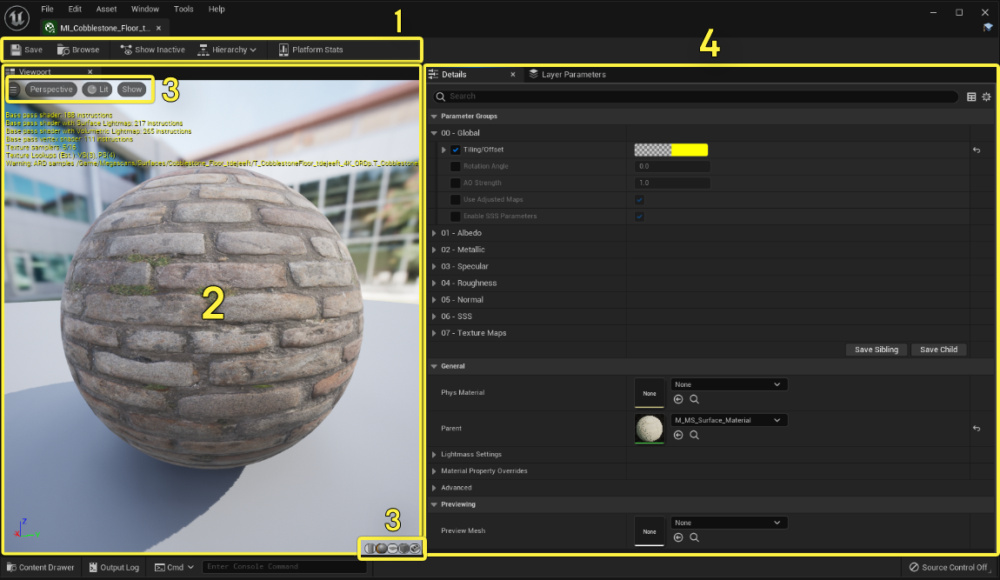  
1 Toolbar - Save your asset, locate it in the Content Browser, show hidden parameters, display inheritance hierarchy and platform stats.
2 Viewport - A realtime viewport showing a preview of the Material instance.
3 Viewport display options - Allows you to edit the camera and display settings in the viewport, and change the mesh used for the Material preview.
4 Details Panel - All exposed Material parameters and properties are found here  
### Material Functions
可以把材质图的一部分打包成可复用的资产
### Decals
### Layered Materials
### Material Expression Reference

## XR
# Create Visual Effects
# Gameplay Tutorials
# Blueprint Visual Scripts
# Programming With C++ 
# Gameplay System 游戏系统
# Mobile Development
# Animating Actors and Objects
# Motion Design 运动设计
# Creating User Interfaces
# Work with Audio
# Work with Media
# Setup Your Production Pipeline
# Test and Optimization
# API

# 快捷键
alt切换窗口一类的操作，如alt1-9分别是不同的光照 线框 shader复杂度 光照复杂度的显示
alt p/s进行游戏/上帝视角观察游戏
alt+L：地形显隐
alt+F：雾显隐
alt+c：碰撞开闭

ctrl是控制actor之类的操作以及复制粘贴啥的
ctrl+g：打组 shift+G取消打组
G上帝视角吧？