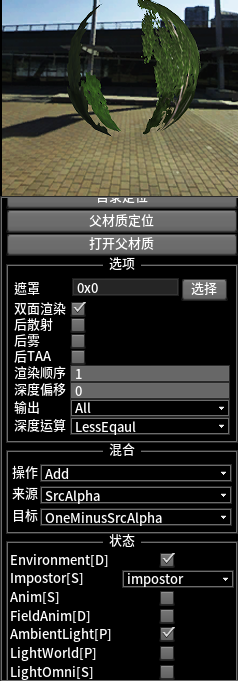

https://www.zhihu.com/column/c_1401501167713771522 unigine引擎的介绍

培训视频内容
~~202404070943视频主要讲了团队组成 引擎功能效果 案例分享~~

~~佐罗引擎-地形数据库生成~~

2024年9月培训
~~佐罗引擎培训-20240905pm-引擎程序及同步框架~~

# bin目录
各个dll 小工具 Editor.exe

# config目录
看起来主要是网络相关的配置
引擎应该是可以支持渲染农场类似的功能

# data目录
存放了各种资源文件
在编辑器里添加一些预制体 世界等时，会保存相关文件到当前目录，需要注意

## art
## assets
可能是用户自定义的资产文件夹 用于存放材质 纹理 动画 模型等

## core
引擎核心文件夹
### config
### editor
### gui
ui资源
### materials
各种材质
default默认的
generate自动生成的应该是对外的接口 里面的block.cfg需要修改
mtl不知道干啥
### mesh
### osm
### prefab
引擎预先定义的预制体,主要包含*.prefab及对应的材质和纹理
### shaders
引擎使用的shader 包含.h 和.c
### textures
引擎预生成的各种类型的纹理


## earth
存放地球索引数据库 可以索引到dem dom mask lightmap等文件

# 引擎SDK
分文件夹记录 按照文件夹排序

IGApplication

## ig 主目录

### action 这个干啥的?
```c++
class Action
{
	//action结束时会调用
	Signal<Action*> signalTrigger;
	virtual bool start() { return true; }
	virtual bool step(float dt){ return true; }
	virtual bool isDone() { return true; }
	virtual bool forceDone(){ return true; }
	virtual void trigger(){ signalTrigger(this);}
	virtual void release(){}
}
```
FiniteTimeAction ForeverAction

```c++
class ActionInterval: public FiniteTimeAction
{

}
```
ActionSequence

ActionManager

### control
ControlApp:负责鼠标键盘的输入

### file 
#### mjl.h
```c++

/**
 * Item实际存储的数据，看起来可以是字符串、数字、布尔值
 * 内部实现上，猜测是存储一个jString，然后通过getter函数得到不同类型的值
 */
class Value
{
	jString val;
	bool getBool();
	int getInt();
	float getFloat();
	double getDouble();
}

/**
 * 不同于c++结构体中的字段，item是一个list，可以包含多个不同类型的值，通过Value包一层实现
 */
class Item
{
	jString id;
	int _id;
	jVector<Value*> values;
}

/**
 * 配置文件对应的数据结构,应该一个大括号(struct)表示一个Package
 * 一个字段是一个Item,类似结构体中的字段
 * 可嵌套多层Package,类似结构体中的嵌套
 */
class Package
{
	jString id;
	int _id;
	Package* parent;
	jList<Item*> items;
	jList<Package*> packages;
};


class mjl//读写自定义格式的配置文件
{
private:
	Token* m_cur_token;
	Package* m_cur_pkg;
	Item* m_cur_item;
public:
	bool open(const jString& path, bool decode = false);
	bool open(const jString& path, _out Package* doc, bool decode = false);
	bool save(const jString& path, bool encode = false);
	bool save(const jString& path, _in Package* doc, bool encode = false);
	bool openBuffer(char* data, int length, _out Package* doc, bool decode = false);
	//如果buf为NULL，则仅计算需要的字节数
	int saveBuffer(_out char* buf, _in Package* doc,  bool encode = false);
	Package* getRoot();
}
```
### gui
猜测是编辑器界面相关的类
```c++

class Widget : public IApp//引擎的窗口
{

}

class RenderWidget : public Widget//编辑器很可能就是派生自这个类
{

}

class PlatformKit;//平台相关接口

```
RenderWidget派生出以下类:这些好像是编辑器打开文件 弹出消息等的控件
1. IGMainWindow
2. DialogColor
3. DialogFile
4. Drag
5. MenuBox
6. MsgBox
7. ProgressBar

### interface
应该是引擎对外的接口

```c++
class IApp
{
	virtual Splash* getSplash()const = 0;
	virtual UIRoot* getUIRoot()const = 0;
	virtual ControlApp* getCtrl()const = 0;
	void update();
	void render();
	void swap();
	void onFocus();
	void onPaint();

	//window相关方法
	//事件相关方法
}
```
```c++
class GameSystem //游戏系统的运行流程
{
public:
	/**
	 * 引擎运行流程
	 */
	//主窗口显示前，会调用此接口
	virtual bool initBegin() { return true; }
	//主窗口显示后，会调用此接口
	virtual bool initEnd() { return true; }
	//引擎初更新前、键盘鼠标事件后，会调用此接口
	virtual bool updateBegin(float dt) { return true; }
	//引擎初更新后，会调用此接口
	virtual bool updateEnd() { return true; }
	//引擎初渲染前，会调用此接口
	virtual bool renderBegin() { return true; }
	//引擎初渲染后，会调用此接口
	virtual bool renderEnd() { return true; }
	//引擎初提交前，会调用此接口
	virtual bool swapBegin() { return true; }
	//引擎初提交后，会调用此接口
	virtual bool swapEnd() { return true; }
	//引擎初释放前，会调用此接口
	virtual void releaseBegin() {}
	//引擎初释放后，会调用此接口
	virtual void releaseEnd() {}
	//自身释放
	virtual void release(){}

	/**
	 * 引擎事件响应
	 */
	virtual void onMouseDown(const GUIEventMouse& arg, IApp* wid) {}
	virtual void onMouseUp(const GUIEventMouse& arg, IApp* wid) {};
	virtual void onMouseMove(const GUIEventMouse& arg, IApp* wid) {};
	virtual void onMouseWheel(const GUIEventWheel& arg, IApp* wid) {};
	virtual void onKeyPress(const GUIEventKey& arg, IApp* wid) {};
	virtual void onKeyRelease(const GUIEventKey& arg, IApp* wid) {};
}
```

```c++
class GameWorld//游戏中世界的运行流程
{
	//引擎运行流程相关api
}
```

```c++
class GameScene
{
	//引擎事件响应相关api
}
```

IGGameSystem
IGGameWorld


### kit
```c++ CRTP实现节点等
template <typename Type>
class Instance
{
private:
	int m_id;
	Type *instance;
private:
	static bool _s_initialized;
	static unsigned long long _s_seed;
	static int _s_id;
	static jMap<int, Type*> _s_instances_id;
	static jSet<Type*> _s_instances;
	static volatile int s_lock;
}
```

Singnal Slot 变参模板函数

### light
光源，派生自Node
```c++
class Light : public Node
{
	vec4 m_color;
	float m_attenuation;
	float m_shadow_distance;
	float m_shadow_scale;
}
```

LightWorld:太阳光
LightPoint
LightProj
LightOmni:泛光等，约等于点光源，但是支持阴影

### material

### math
- Geometry.h 几何相关 正交基 三角形(area normal plane) 点与三角形/多边形的位置关系、距离，碰撞检测 earclipping
- jMath.h 
  - jMath:经纬度 wgs cgcs2000 初等函数(三角函数 log pow sqrt)
	```c++
	static dvec3 lonLatAltToMercator(dvec3 lonLatAlt);
	//墨卡托转经纬度,单位°
	static dvec3 mercatorToLonLatAlt(dvec3 xyz);
	//日角（单位"度"）
	//GMT为格林威治时间，北京为GMT=8.0，传入的时间要与GMT匹配
	static double sunAngle(int year, int month, int day, int hour, int minute, int second, double GMT = 8.0);
	/*
	输入参数：
	Longitude - 经度（单位"度"）
	Latitude  - 纬度（单位"度"）
	Year      - 年
	Month     - 月
	Day       - 日
	Hour      - 时
	Minute    - 分
	Second    - 秒
	输出参数：
	x   - 太阳高度角   （单位"度"）
	y	- 太阳方位角   （单位"度"）
	太阳高度角是指太阳光的入射方向和地平面之间的夹角
	太阳方位角是指太阳光线在地平面上的投影与当地经线的夹角
	GMT为格林威治时间，北京为GMT=8.0，传入的时间要与GMT匹配
	*/
	static dvec2 sunPositionNR(double Longitude, double Latitude, int year, int month, int day, int hour, int minute, int second, double GMT = 8.0);
	//月球位置计算:黄经,黄纬，距离（单位"度",米）
	static dvec3 moonPosition(int year, int month, int day, int hour, int minute, int second);
	static double normalizeAngle(double v);
	```
  - EllipsoidModel:椭球模型，
	```c++
	enum WGS_MODE
	{
		WGS_MODE_NONE = -1,
		WGS_MODE_84 = 0,
		WGS_MODE_CGCS2000,
		WGS_MODE_MOON,
		WGS_MODE_MAX
	};
	class EllipsoidModel
	{
		//扁率F=(A-B)/A
		//偏心率平方EE = 2 * F - F * F
		//偏心率E = sqrt(EE) = C/A
		double a;			//长半轴
		double b;			//短半轴
		double c;			//快速计算因子
		double e;			//偏心率
		double ee;			//e^2
		double inv_a;		//1/wgs_a 
		double inv_b;		//1/wgs_b
		double aa;			//a*a
		double bb;			//b*b
		double cc;			//c*c
		double one_minus_ee;//1-ee
		double aa_div_c;	//aa/c
		double bb_div_cc;	//bb/cc
		double dash;		//(wgs_aa - wgs_bb) / (wgs_b)
		double eea;			//wgs_ee*wgs_a
		dvec3 wgs;
		dvec3 inv_wgs;
		//姿态计算当星球位置不在原点时有意义，比如计算月亮上的某点位置
		bool is_transform_valid;
		dmat4 transform;		//椭球姿态
		dmat4 inv_transform;	//椭球姿态的逆变换
		//
		void setMode(WGS_MODE m);
		void setTransform(const dmat4& mat);
		//如果use_transform为false，则按照椭球坐标系位于0点计算，否则按照椭球真实位置计算
		dvec3 toWorld(const dvec3& lon_lat_alt, bool use_transform = true)const;
		dvec3 toWorld(double lon, double lat, double alt, bool use_transform = true)const;
		dvec3 toWGS(const dvec3& xyz, bool use_transform = true)const;
		dvec3 getWGSNormal(double lon, double lat, dvec3* ret_pos = 0, bool use_transform = true)const;
		void getWGSTransform(const dvec3& xyz, dmat4& ret, bool use_transform = true)const;
		dmat4 getWGSTransform(const dvec3& xyz, bool use_transform = true)const;
		void getWGSTransform(double lon, double lat, const dvec3& pos, dmat4& ret, bool use_transform = true) const;
	}
	
	```
	根据椭球的数学模型以及输入的椭球坐标(经纬高)就可以计算得到物体的世界坐标  
	世界坐标系的origin在wgs坐标系下的(0,90,-6356752):地心,z轴指向北极,xy平面为赤道平面,高度是相对于椭球面的高度所以地心是负的极半径，这个世界坐标系应该就是地心地固直角坐标系
	可以在编辑器里测出世界坐标系的朝向:xyz与椭球面坐标系重合，z轴指向北极，xy平面为赤道平面  
	```c++
		dvec3 world_ori_in_wgs =	e->toWGS(dvec3(0,0,0));//世界坐标系原点(地心)的经纬高(0,90,-6356752)应该等价于(0,0.-6378137)
		dvec3 wgsv_xaxis_in_world =	e->toWorld(dvec3(0,0,0));//东经0°北纬0°的地球表面点(wgs坐标系的x轴,赤道平面上一点)的世界坐标系(6378137.0000000000,0,0)
		dvec3 wgsv_yaxis_in_world =	e->toWorld(dvec3(90,0,0));//东经90°北纬0°的地球表面点(wgs坐标系的y轴,赤道平面上一点)的世界坐标系(0,6378137,0)
		dvec3 wgsv_zaxis_in_world =	e->toWorld(dvec3(0,90,0));//东经0°北纬90°的地球北极点(wgs坐标系的z轴,北极点)的世界坐标系(0,0,6356752.3142451795)
		dvec3 wgsv_south_pole_in_world = e->toWorld(dvec3(0,-90,0));//东经0°南纬90°的南极点(wgs坐标系的-z轴,南极点)的世界坐标系(0,0,-6356752.3142451795)
	```
- SimdLib.h 可能是封装的开源的SimdLib https://ermig1979.github.io/Simd/

### mesh

### node

```c++
class Node : public Instance<Node>//主要是父子关系 坐标变换
{
	jString m_name;
	jString m_tag;
	Node* m_parent;
	World* m_world;
	BoundBox m_bound_box;
	BoundSphere m_bound_sphere;
	jVector<Node*> m_children;

	dmat4 m_transform;
	dmat4 m_world_transform;
	dmat4 m_iworld_transform;
	dmat4 m_old_world_transform;
	dmat4 m_wgs_transform;
	BSPNode* m_bsp_node;
}
```

### object

Object继承Node，用于渲染，可设置材质

```c++
class Object : public Node
{
public:
	struct SurfaceLod
	{
		double shadow_visible_distance;
		double min_visible_distance;
		double max_visible_distance;
		double min_fade_distance;
		double max_fade_distance;
		short max_shadow_split;
	};
	struct Surface
	{
		bool cast_shadow;
		bool recv_shadow;
		Material* material;
	};

protected:
	jVector<Surface> m_surfaces;//一个Object可以有多个surface，对应多个材质
	bool m_pass[RENDER_NUM_PASSES];
public:
	bool setSurfaceMaterialByID(int surface, const jString& matName);

	void setBody(Body* body, bool update = true);
	BodyRigid* getBodyRigid() const;
}
```

派生出各种类型的可渲染对象:
ObjectBillboard
ObjectCloud
ObjectMesh
ObjectPrefab
ObjectSky
ObjectVolume
ObjectWall
ObjectWaterBase
ObjectWaterMesh

### physics
Body
BodyRigid


### render
1. RHIViewport 渲染的接口
	```c++
	//派生类有D3D11Viewport，GLViewport, 是图形api上下文的抽象 HDC HGLRC
	class RHIViewport
	{
		IApp* m_widget;//哪个窗口创建的上下文
	public:
		virtual void begin() = 0;
		virtual void end() = 0;
		virtual void beginPass(bool bind_pass = true) = 0;
		virtual void endPass() = 0;
		virtual void present() = 0;
		virtual void release() = 0;
	public:
		virtual void resize(int w, int h) = 0;
		virtual void fullscreen(bool v = true) = 0;
	}
	```

2. RenderManager
	```c++
	//各种渲染资源的创建
	class RenderManager
	{
		virtual RHIViewport* createViewport(IApp* wnd, const char* file, int line, const char* func) const;
		Render *createRender(const char* file, int line, const char* func) const;
		Shader *createShader(const char* file, int line, const char* func) const;
		RenderTarget* createRenderTarget(int w, int h, int flags, const char* file, int line, const char* func) const;
		Sampler* createSampler(int flags, int unit, const char* file, int line, const char* func) const;
		Texture* createTexture(const char* file, int line, const char* func) const;
		Texture *createTexture(jImage *image, int flags, const char* file, int line, const char* func) const;
		Texture* createTexture2D(const jString& path, int flags, const char* file, int line, const char* func);
		Texture *createTexture2D(const char* file, int line, const char* func) const;
		Texture* createTexture2D(int width, int height, TEXTURE_FORMAT format, int flags, const char* file, int line, const char* func) const;
		Texture* createTexture2D(int width, int height, TEXTURE_FORMAT format, int flags, bool cache, const char* file, int line, const char* func) const;
		Texture* createTexture3D(int w, int h, int depth, TEXTURE_FORMAT format, int flags, bool bUsedForRender, const char* file, int line, const char* func);
		Texture *createTexture3D(int width, int height, int depth, TEXTURE_FORMAT format, int flags, const char* file, int line, const char* func) const;
		Texture *createTextureCube(int width, int height, TEXTURE_FORMAT format, int flags, const char* file, int line, const char* func) const;
		Texture *createTexture2DArray(int width, int height, int num_layers, TEXTURE_FORMAT format, int flags, const char* file, int line, const char* func) const;
		TextureImage *createTextureImage(const jImage &image, int flags, const char* file, int line, const char* func) const;
		TextureRender *createTextureRender2D(int width, int height, int flags, const char* file, int line, const char* func) const;
		TextureRender *createTextureRender3D(int width, int height, int depth, int flags, const char* file, int line, const char* func) const;
		TextureRender *createTextureRenderCube(int width, int height, int flags, const char* file, int line, const char* func) const;
		TextureRender *createTextureRender2DArray(int width, int height, int num_layers, int flags, const char* file, int line, const char* func) const;
		Mesh *createMesh(const char* file, int line, const char* func) const;
		MeshDynamic* createMeshDynamic(bool dynamic, const char* file, int line, const char* func);
		MeshSkin* createMeshSkin(const char* file, int line, const char* func);
		Billboards *createBillboards(const char* file, int line, const char* func) const;
		Particles *createParticles(const char* file, int line, const char* func) const;
		UIPainter* createUI(const jString& name, const char* file, int line, const char* func) const;
		Query* createQuery(const char* file, int line, const char* func);
		StructuredBuffer* createStructuredBuffer(const char* file, int line, const char* func)const;
		void clear(){}
		virtual void release(){}
	}
	```

3. RenderSurface
4. RExec 真正渲染流程
	```c++
	class RExec
	{
		virtual void beginFrame();
		virtual void endFrame();
		virtual void renderViewport(World* world, Render::RenderCaller* caller, bool run_game = true, const vec4& scissor_rect = vec4(0, 0, 1, 1));
	}
	```
5. RLights
6. RPost
7. RScene
8. RState
9. Visualizer


RenderSurface

### script

### texture

1. Texture 对显卡纹理对象的封装,派生出GL DX版本
	```c++
	class Texture
	{
		jString m_name;
		Sampler* m_sampler;
		TEXTURE_TYPE m_type;				// type
		TEXTURE_FORMAT m_format;				// format
		int m_flags;				// flags
		int m_offset;				// offset

		int m_width;				// size
		int m_height;
		int m_depth;

		int m_num_mipmaps;		// number of mipmaps
		int m_num_layers;			// number of layers

		uint64 m_memory_usage;	// memory usage
		J_PROPERTY_REF(jString, m_tag, Tag);

		// create texture
		virtual bool create(jImage* image, int flags = TEXTURE_DEFAULT_FLAGS, TEXTURE_LOAD_MODE mode = TEXTURE_LOAD_NORMAL, int flush_speed = 256, bool pooled = false) = 0;
		//cache用于提前分配显存，目前针对gl
		virtual bool create2D(int width, int height, TEXTURE_FORMAT format, int flags = TEXTURE_DEFAULT_FLAGS, bool cache = false) = 0;
		virtual bool create3D(int width, int height, int depth, TEXTURE_FORMAT format, int flags = TEXTURE_DEFAULT_FLAGS) = 0;
		virtual bool createCube(int width, int height, TEXTURE_FORMAT format, int flags = TEXTURE_DEFAULT_FLAGS) = 0;
		virtual bool create2DArray(int width, int height, int num_layers, TEXTURE_FORMAT format, int flags = TEXTURE_DEFAULT_FLAGS) = 0;
		//通过GPU生成mipmap，仅需level 0有数据，其他部分GPU自己处理
		virtual bool createMipmaps() = 0;
		// load texture
		virtual bool load(const jString& name, int flags = TEXTURE_DEFAULT_FLAGS) = 0;
		// image texture
		virtual bool setImage(jImage *image) = 0;
		virtual bool getImage(jImage *image) = 0;
		virtual void clear(bool pooled = false) = 0;
		virtual void release() = 0;

		// texture format
		TEXTURE_FORMAT getFormat() const;
		virtual const char *getFormatName() const;
		virtual bool isColorFormat() const;
		virtual bool isDepthFormat() const;
		virtual bool isDepthStencilFormat() const;

		// texture size
		int getWidth() const;
		int getHeight() const;
		int getDepth() const;
		int getNumMipmaps() const;
		int getNumLayers() const;

	};
	```
2. TextureImage Texture和Image的绑定,用于从Image创建Texture，UI用的多
	```c++
	class TextureImage
	{
		Texture* m_texture;
		jImage* m_image;
	}
	```
3. TextureObject 看起来是TextureImage的另一种封装方式，或者再封装，主要还是Texture和Image 数据的绑定 glTexImagexD glTexSubImage glCopyTexImage2D glTextureStoragexD
4. TextureManger 管理需要更新的纹理列表
   ```c++
   class TextureManager
   {
	private:
		jMap<jString, FlagDatas> m_data;
		J_PROPERTY(float, m_create_time_limit, CreateTimeLimit);
		float m_elapse_time;
		bool m_can_create;
		jSet<Texture*> m_textures_to_update;

	public:
		void addUpdateTexture(Texture* p) { m_textures_to_update.append(p); }
		bool removeUpdateTexture(Texture* p) { return m_textures_to_update.remove(p); }
		const jSet<Texture*>& getUpdateTexture()const { return m_textures_to_update; }
   }
   ```
5. TextureRender 渲染纹理，用于封装glFramebufferTexture glFramebufferRenderbuffer
	```c++
	class TextureRender
	{
	protected:
		Texture* m_default_color_texture;
		Texture* m_default_depth_texture;
		RenderTarget* m_rendertarget;
	public:
		void unbindColorTexture(int slot = INVALID_INDEX);
		void unbindDepthTexture();
		void unbindAll();
	public:
		// color texture
		virtual void setColorTexture(int slot, Texture *texture, int layer = INVALID_INDEX, bool dummy = false);
		virtual Texture *getColorTexture(int slot) const;

		// depth texture
		virtual void setDepthTexture(Texture *texture, int layer = INVALID_INDEX);
		virtual Texture *getDepthTexture() const;
		virtual void setLayer(int layer);

		// render texture status
		virtual int isEnabled() const;
		// set render texture
		virtual void useDepth();
		virtual void clearBuffer(int buffer, const float* color = 0, float depth = Z_FAR, int stencil = 0);
		virtual void enable(bool bind_pass = true);
		virtual void disable();
		//Resolve to textures
		virtual void resolve();
		virtual uint64 getMemoryUsage() const;
	}
	```
6. RenderTarget 渲染目标，用于渲染到纹理 实现应该是调用了TextureRender
   ```c++
   class RenderTarget
   {
		virtual void setColorTexture(int slot, Texture* texture, int layer = -1, bool dummy = false) = 0;
		virtual Texture* getColorTexture(int slot) const = 0;

		virtual void setDepthTexture(Texture* texture, int layer = -1) = 0;
		virtual Texture* getDepthTexture() const = 0;
		virtual void setLayer(int layer) = 0;
		virtual void useDepth() = 0;
		virtual void clearBuffer(int buffer, const float* color = 0, float depth = Z_FAR, int stencil = 0) = 0;
		virtual void enable(bool bind_pass = true) = 0;
		virtual void disable() = 0;
		virtual void resolve() = 0;
		virtual void release() = 0;
	}
   ```


### track

Track应该是动画的容器?

1. Track
2. TrackReg 定义不同数据的Track注册
3. TrackParameter

### ui
```c++
class UIRoot//UI的管理器
{
	m_widget:IApp*;
	jSet<UIElement*> m_widgets;//子控件
	jVector<UIElement*> m_widgets_to_del;
	void addChild(UIElement* widget, UI_EXPAND_TYPE tp = UI_EXPAND_NONE, int render_order = -1) const;
	void removeChild(UIElement* widget) const;
	void destroyChild(UIElement* widget);
	bool isChild(const UIElement* widget) const;
	int getNumChilds() const;
	UIElement* getChild(int id) const;
	UIElement* getChildByTag(int tag) const;
	int getMinWidth()const;
	int getMinHeight()const;
}
```

```c++
class UIElement
{
	UIRoot* m_root;
	UIElement* m_parent;

	void render_triangle();
	void render_quad();
	void render_cube();
	void render_sphere();
	void render_border();

	void stencil_enable();
}

```

以及派生的各种UI组件 UIButton UICanvas UIDialog UIEditLine UILabel UIImage UIHLayout UIVLayout UIListBox UISlider UIWindow

```c++
//应该是用来放在整个场景中进行渲染的吧?
class UINode:public Node
{
public:
	virtual bool loadWorld(Package* doc)override;
	virtual bool saveWorld(Package* doc)const override;
	INLINE virtual bool hasBSP()const override { return false; }
	INLINE virtual bool hasScale()const override { return false; }
protected:
	UINode* copy(UINode* dst);
	MeshDynamic* create_mesh();
	void render_mesh(MeshDynamic* mesh, Material* mat, int albedo_id, Texture* albedo);
}
```

### world

```c++
class World //Node的管理，包括更新 裁剪 加载 保存等
{
protected:
	jVector<Node*> m_nodes;	
	jVector<jString> m_mats;
	
	WorldDynamicLoader* m_loader;
	SoundThread* m_sound_thread;
	volatile int m_sound_lock;				// sound lock
	J_PROPERTY_BOOL(m_enable_render, EnableRender);
	J_PROPERTY_READONLY(RScene*, m_main_scene, MainScene);
	J_PROPERTY_READONLY(RScene*, m_auxiliary_scene, AuxiliaryScene);
	J_PROPERTY_READONLY(RLights*, m_lights, Lights);
	J_PROPERTY_READONLY(Physics*, m_phy, Physics);
	J_PROPERTY_READONLY(SoundWorld*, m_sound, Sound);
	//释放时，会在所有node销毁前置false
	J_PROPERTY_READONLY_BOOL(m_loaded, Loaded);
	J_PROPERTY_BOOL(m_sun_moon_wgs_fade, SunMoonWGSFade);
	J_PROPERTY_READONLY_REF(jSet<WorldTrigger*>, m_triggers, Triggers);
	ScriptInfo* m_script;
private:
	BSPWorld *m_bsp;		
	float m_active_distance;
	J_PROPERTY_READONLY_REF(jString, m_path, Path);
public:
	//用于加载一个nodes节点，此操作不会会将创建的node放入world中。
	static Node* LoadNodes(const jString& path);
	//用于加载一个node节点及其子节点，此操作不会会将创建的node放入world中。
	static Node* LoadNode(const jString& path);
	//加载doc中的节点及子节点
	static Node* LoadNode(Package* doc, Node* parent = 0, int num_items = 0, int* num = 0, Signal<int, int, bool, Node*>* cb = 0);
	//加载doc中的节点，不加载子节点
	static Node* LoadNodeSingle(Package* doc, Node* parent = 0, int num_items = 0, int* num = 0, Signal<int, int, bool, Node*>* cb = 0);
	static bool SaveNode(Node* p, Package* doc, bool save_child = true);
	static bool SavePrefab(Node* node, jString path);
	static bool SavePrefab(Node* node, Package* doc);
public:
	World();
	virtual ~World();
public:
	virtual bool load(const jString& path);
	virtual bool load(Package* doc);

	virtual bool save(const jString& path);
	virtual bool save(Package* doc);

	//在Game::update尾部调用
	virtual bool update(float dt);
	//用于物理系统多线程更新，在Game::render尾部调用
	virtual bool render();
	virtual bool swap();
	virtual void release();
	//如果destroy_all为true，那么NODE_FLAG_IMMORTAL的物体也会被删除，否则NODE_FLAG_IMMORTAL物体会保留在world中
	virtual void clear(bool destroy_all = false);
	//添加单个节点，不包含子节点
	virtual bool addNode(Node *n);
	//添加节点及其所有子节点
	virtual bool addNodeHierachy(Node *n);
	//销毁单个节点，不包含子节点
	virtual bool releaseNode(Node* n);
	//销毁节点及其所有子节点
	virtual bool releaseNodeHierachy(Node* n);
	//移除节点，不释放
	virtual bool removeNode(Node* p);
	//移除节点及其所有子节点，不释放
	virtual bool removeNodeHierachy(Node* p);
	virtual int getRootNodeIndex(const Node* n) const;
	virtual bool swapRootNodeByIndex(int src_index, int dst_index);
	//是否开启物体基于WGS坐标系下的光照检测，如果不是地球的场景，不要开启，会导致世界光根据与地平线的管线被裁剪掉。默认开启
	virtual void setWGSLightWorldForObjects(bool v);
	virtual void setEnvironmentBuffers(EnvironmentBuffers* buffers);
	virtual EnvironmentBuffers* getEnvironmentBuffers();
	//尾部必须有'/'
	virtual bool setDynamicLoadResourceDirectory(const jString& dir);
	virtual WorldDynamicLoader* getDynamicLoader() { return m_loader; }
	virtual const WorldDynamicLoader* getDynamicLoader()const { return m_loader; }
public:
	bool setScriptPath(const jString& path, bool reset = false);
	const jString& getScriptPath() const;
	ScriptInfo* getScriptInfo() { return m_script; }
	void releaseScript();
public:
	void runSound();
	void stopSound();
	void lockSound();
	void unlockSound();
public:
	virtual bool registerWorldTrigger(WorldTrigger* p);
	virtual bool unregisterWorldTrigger(WorldTrigger* p);
	virtual bool isWorldTriggerRegistered(WorldTrigger* p);
	BSPNode* getWorldRoot()const;
public:
	//int total_num_to_load, int num_loaded, int load_over
	Signal<int, int, bool, Node*> signalLoad;
public:
	bool loadMaterials(Package* pkg);
	INLINE void setDistance(float d){m_active_distance = J_MAX(d, 0.0f);}
	INLINE float getDistance() const{return m_active_distance;}
	INLINE BSPWorld* getBSPWorld() { return m_bsp; }
	Node* getNodeByName(const jString& name) const;
	Node * getNodeByTag(const jString& tag) const;
	Node* getNodeByID(int id) const;
	jVector<Node*>& getAllNodes() { return m_nodes; }
public:
	//仅用于物理引擎
	int getCollision(const dvec3& p0, const dvec3& p1, jVector<Object*>& objects, bool bodyOnly = true);
	int getCollision(const WorldBoundSphere& bs, jVector<Object*>& objects, bool bodyOnly = true);
	int getCollision(const WorldBoundBox& bb, jVector<Object*>& objects, bool bodyOnly = true);
public:
	bool getIntersection(const WorldBoundBox &bb, jVector<Node*> &nodes);
	bool getIntersection(const WorldBoundBox &bb, NODE_TYPE type, jVector<Node*> &nodes);
	bool getIntersection(const WorldBoundSphere &bs, jVector<Node*> &nodes, int bsp_flag = BSP_ALL);
	bool getIntersection(const WorldBoundSphere &bs, jVector<Light*> &lights);
	bool getIntersection(const WorldBoundSphere &bs, jVector<LightWorld*> &lights);
	bool getIntersection(const WorldBoundSphere &bs, NODE_TYPE type, jVector<Node*> &nodes);
	bool getIntersection(const WorldBoundFrustum &bf, jVector<Object*> &objects);
	bool getIntersection(const WorldBoundFrustum &bf, NODE_TYPE type, jVector<Node*> &nodes);
	bool getIntersection(const WorldBoundFrustum &bf, const WorldBoundBox &bb, NODE_TYPE type, jVector<Node*> &nodes);
	bool getIntersection(const WorldBoundFrustum &bf, const WorldBoundSphere &bs, NODE_TYPE type, jVector<Node*> &nodes);
	bool getIntersection(const BoundFrustum &bf, const dmat4 &modelview, jVector<Node*> &nodes);
	bool getIntersection(const WorldBoundFrustum& bf, const dvec3& camera, float distance, jVector<Node*>& nodes);
	// 
	bool getIntersection(const dvec3& p0, const dvec3& p1, jVector<Node*>& nodes);
	bool getIntersection(const WorldBoundSphere& bs, jVector<PNode*>& physicals);
private:
	//加载doc中的子package
	bool load_nodes(Package* doc, int num_items, int& num);
	void update_spatial(float dt);
	static void get_nodes_num(Package* pkg_nodes, int& num);
	bool remove_node(Node* n);
}
```


### Engine.h
应该是把所有的都串起来了:
1. GameWorld GameSystem IApp
2. Camera World MaterialManager ImageManager TextureManager SoundManager MeshManager MeshSkinManager MeshDynamicManager ScriptManager Globals
3. PackageManager FileSystem EngineThreads Visualizer
```c++
class Engine
{
private:
	J_PROPERTY_READONLY(GameWorld*, m_game_world, GameWorld);
	J_PROPERTY_READONLY(GameSystem*, m_game_system, GameSystem);
private:
	J_PROPERTY_REF(jString, m_app_path, AppPath);
	J_PROPERTY_REF(jString, m_app_name, AppName);
	J_PROPERTY_REF(jString, m_app_dir, AppDir);
	J_PROPERTY_REF(jString, m_cur_dir, CurDir);
	J_PROPERTY_REF(jString, m_data_dir, DataDir);
	J_PROPERTY_REF(jString, m_proj_dir, ProjDir);
	J_PROPERTY_REF(jString, m_home_dir, HomeDir);
	J_PROPERTY_REF(jString, m_save_dir, SaveDir);
	J_PROPERTY_REF(jString, m_cache_dir, CacheDir);
private: 
	J_PROPERTY_READONLY_BOOL(m_is_init, Init);
	J_PROPERTY(RHI_TYPE, m_rhi_type, RHIType);
	J_PROPERTY(IApp*, m_app, App);
	J_PROPERTY_READONLY(UIPainter*, m_ui, UIPainter);
	J_PROPERTY(double, m_total_run_time, TotalRunTime);
	J_PROPERTY(int, m_frame_count, FrameCount);
	J_PROPERTY_READONLY(Camera*, m_default_cam, DefulatCamera);
	J_PROPERTY_READONLY(Camera*, m_cam, Camera);
	J_PROPERTY_READONLY(FileSystem*, m_filesystem, FileSystem);
	J_PROPERTY_READONLY(EngineThreads*, m_threads, Threads);
	J_PROPERTY_READONLY(World*, m_world, World);
	J_PROPERTY_BOOL(m_world_auto_destroy, WorldAutoDestory);
	J_PROPERTY_READONLY(MaterialManager*, m_mat_mngr, MatManager);
	J_PROPERTY_READONLY(RenderManager*, m_render_mngr, RenderManager);
	J_PROPERTY_READONLY(Render*, m_render, Render);
	J_PROPERTY_READONLY(ImageManager*, m_img_mngr, ImageManager);
	J_PROPERTY_READONLY(TextureManager*, m_tex_mngr, TextureManager);
	J_PROPERTY_READONLY(SoundManager*, m_sound_mngr, SoundManager);
	J_PROPERTY_READONLY(MeshManager*, m_mesh_mngr, MeshManager);
	J_PROPERTY_READONLY(MeshSkinManager*, m_mesh_skin_mngr, MeshSkinManager);
	J_PROPERTY_READONLY(MeshDynamicManager*, m_mesh_dynamic_mngr, MeshDynamicManager);
	J_PROPERTY_READONLY(ScriptManager*, m_script_mngr, ScriptManager);
	J_PROPERTY_READONLY(Globals*, m_globals, Globals);
	J_PROPERTY(float, m_interval, Interval);
	J_PROPERTY_READONLY(Visualizer*, m_visualizer, Visualizer);
	jVector<ControlJoystick*> m_control_joystick;
	J_PROPERTY_READONLY(ExpressionManager*, m_expr_mngr, ExpressionManager);
	J_PROPERTY_READONLY(ProfileGraph*, m_profile_graph, ProfileGraph);
	J_PROPERTY_READONLY(PackageManager*, m_package_mngr, PackageManager);
	J_PROPERTY_READONLY(AtlasManager*, m_atlas_mngr, AtlasManager);
	J_PROPERTY_READONLY(ProfileCollector*, m_profile_collector, ProfileCollector);
	J_PROPERTY_BOOL(m_use_approximate_interval, UseApproximateInterval);
	J_PROPERTY_BOOL(m_render_world, RenderWorld);
	J_PROPERTY_BOOL(m_update_world, UpdateWorld);
	J_PROPERTY_REF(D3DAdapterLuid, m_d3d_luid, D3DAdapterLuid);
	J_PROPERTY(int, m_gpu_index, GPUIndex);
	J_PROPERTY(int, m_debug_flag, DebugFlag);
private:
	jVector<jString> m_args;
private:
	volatile int m_lock;
	Random m_rand;
	Noise m_noise;			// perlin m_noise generator
private:
	float m_fps;
	float m_ifps;
	float m_dt;
private:
	//true:fps以1/dt的形式每帧更新；false:每秒统计的渲染帧数
	J_PROPERTY_BOOL(m_use_fps_real_time, UseFpsRealTime);
	J_PROPERTY_BOOL(m_first_frame, FirstFrame);
	J_PROPERTY_BOOL(m_is_init_env, InitEnv);
public:
	Engine();
	bool initEnv(int version, int argc, char ** argv, const jString& password = jString::null());
	bool initGraphic(IApp* app, int version, int argc, char** argv, const char* project = 0, const char* password = 0);
	bool initGraphic(IApp* app, GameWorld* game, GameSystem* system, int version, int argc, char **argv, const char *project = 0, const char *password = 0);
	void release();
public:
	void doUpdate();
	void doRender();
	void doSwap();
public:
	void setWorld(World* w, bool auto_destroy = true);
	void setCamera(Camera* p);
	INLINE float getIFps() { return m_ifps; }
	INLINE float getFps() { return m_fps; }
	INLINE float getDeltaTime() { return m_dt; }
public:
	ControlJoystick* createControlJoystick(int device_id);
	bool destoryControlJoystick(int device_id);
	ControlJoystick* getControlsJoystickByID(int device_id);
public:
	void setLic(const char* buffer, int buffer_size, const jString& company = jString::null());
	bool isLicValid()const;
	bool isCommand(const jString& cmd)const;
	jString getCommandValue(const jString& cmd)const;
	int getArgc()const;
	const jString& getArgv(int i)const;
public:
	UIPainter* getUIPainter();
public:
	int getRandom()const;
	int getRandomInt(int from, int to)const;
	float getRandomFloat(float from, float to)const;
	double getRandomDouble(double from, double to)const;
	float getNoise1(float pos, float size, int frequency) const;
	float getNoise2(const vec2 &pos, const vec2 &size, int frequency) const;
	float getNoise3(const vec3 &pos, const vec3 &size, int frequency) const;
public:
	ControlApp* getControlApp();
private:
	void init_param();
	bool load_default();
	void process_cmds(int argc, char ** argv);
private:
	void do_update();
	void do_render();
	void do_swap();
private:
	void update_info();
	void register_node();
	static Node* create_node(int tp, const char* file, int line, const char* func);
};
```

### IGBase.h
1. 宏:
	J_PROPERTY 
	LINE_INFO
	J_IMPL_INS
2. enum
	WGS_MODE 84 cgcs2000
3. 鼠标 键盘事件 UI相关全局属性
4. TEXTURE_FORMAT(只支持dxtc 1 3 5) UI_BLEND_FUNCTION_TYPE 纹理加载mode
5. IG_VISION_MODE: IR LLNV(Low Light Night Vision) RADAR_WEATHER
6. UIEvent及其派生类 UIPainter
7. renderpass
8. depth func


### IGKit.h
一些宏
JOK JFAIL

## 插件目录

### plugin-environment
Environment封装了环境，日月雨雪雾等大气环境及其动画
这个应该对应.world里的environment
```c++
class Environment
{
	//各种动画效果
	Track m_anim_tod;
	Track m_anim_rain;
	Track m_anim_snow;
	Track m_anim_snow_add;
	Track m_anim_hail;
	Track m_anim_hail_add;
	Track m_anim_fog;
	Track m_anim_cloud;
	Track m_anim_lightning;
	Track m_anim_wind;
	Track m_anim_weather;

	//动画文件路径
	jString m_anim_tod_path;
	jString m_anim_rain_path;
	jString m_anim_snow_path;
	jString m_anim_hail_path;
	jString m_anim_fog_path;
	jString m_anim_cloud_path;
	jString m_anim_lightning_path;
	jString m_anim_wind_path;
}
```

### plugin-ocean

### plugin-osm
街道河流道路等等矢量数据 .shp文件吧

### plugin-terrain
```c++
/**
 * 地形数据结构
 * dem高程数据
 * dom数字正射纹理数据
 * lightmap光照贴图
 * mask遮罩图(用于区分地表、水面、植被等)
 */
class ObjectTerrain
{
	int m_num_triangles;
	int m_num_dips;
	Terrain* m_terrain;
	TerrainNode* m_root[CUBE_FACE_MAX];
	J_PROPERTY(int, m_min_render_lod, MinRenderLod);
	J_PROPERTY(int, m_max_render_lod, MaxRenderLod);
	const EllipsoidModel* m_ellipsoid;
	double m_lod_distances[TERRAIN_MAX_LOD];
	jVector<BoundFrustum> m_extern_cull_bfs;
	TerrainLoader* m_tile_loader_dem;
	TerrainLoader* m_tile_loader_dom;
	TerrainLoader* m_tile_loader_lightmap;
	TerrainLoader* m_tile_loader_mask;

	bool setDataPath(const jString& cfg);//earth.cfg 地形数据库文件
}


class TerrainLoader
{
	//地形数据
	Tvolatile int m_lock;
	ObjectTerrain* m_object;
}

派生出四个子类，对应dem dom lightmap mask的加载
TerrainLoaderDem
TerrainLoaderDom
TerrainLoaderLightmap
TerrainLoaderMask

TerrainLod
TerrainTexture
TerrainNode
```

派生出ObjectEarth ObjectMoon

# 各种配置文件

主要的文件格式应该都是类似c++的struct形式，就是Package类

1. .world文件 主要包含
   1. editor设置(相机参数等) 应该主要是编辑器配置
   ```c++
	editor
	{
		camera
		{
			fov_v = 50;
			aspect = 1.759477124183007;
			z_near = 1;
			z_far = 1000000000;
			velocity = 10000;
			focus_length = 12726498;
			transform = -0.956998610738956,-0.290092500840228,-0.000000000000606,0,0.182183530898922,-0.601013075020105,0.778198204009815,0,-0.225749463150941,0.744734600116817,0.628018753920546,0,-2873000.34943645214662,9477863.875084385275841,7992479.660338629037142,1;
		}
	}
   ```
   2. environment(环境及动画),对应Environment类
   ```c++
	environment
	{
		time_control = 1;
		dynamic_ibl = 0;
		cloud = 0.53,"data/art/anim/cloud.anim";
		rain = 0,"data/art/anim/rain.anim";
		snow = 0,"data/art/anim/snow.anim";
		fog = 0,"data/art/anim/fog.anim";
		lightning = 0,"data/art/anim/lightning.anim";
		hail = 0,"data/art/anim/hail.anim";
		wind = 0,"data/art/anim/wind.anim";
		tod = 11.04,"data/art/anim/tod.anim";
		GMT = 8;
		date = 2022,5,15;
		i0 = "data/core/textures/environment/night.dds",0;
		i1 = "data/core/textures/environment/morning.dds",6;
		i2 = "data/core/textures/environment/day.dds",12;
		i3 = "data/core/textures/environment/evening.dds",18;
		i4 = "data/core/textures/environment/night.dds",24;
	}
   ```
   3. world(文件的主体内容,场景树)，对应World类，主要包含
      1. 全局设置globals
			```c++
			globals
			{
				wgs = 0;
				preload_shader = 0;
			}
			```	
      2. 渲染参数render 
         ```c++
		 render
		 {
			ambient_color=0,0,0,0;
			background_color=0,0,0,0;
			radar_weather_lut=0;
			ssao_quality = 3;
			enable_fxaa = 1;
			...
		 }
		 ``` 
      3. 场景节点nodes列表，应该就是Node的各种派生类,node这个Package里有节点的各种属性,不同节点属性不同，这些属性会显示在编辑器的右边栏,包括对应的数据类型
   		一般包含
		```c++
		node
		{
			name = "terrain";//在节点列表里显示的名称
			tag = "";
			type = "ObjectTerrain";
			id = 143031657;
			enabled = 1;
			collider = 0;
			bound_box = -0.000000999999997,-0.000000999999997,-0.000000999999997,0.000000999999997,0.000000999999997,0.000000999999997;
			transform = 0,-1,0,0,0,0,-1,0,1,0,0,0,6378137,0,0,1;
			wgs_lightworld = 1;
			light_mask = 1;
			cfg = "data/earth/earth.cfg";//ObjectTerrain类型的node数据的地形配置文件(地形数据库索引文件)
			reference = "data/core/prefab/star/stars.prefab";//ObjectPrefab类型的节点数据,应该是个预制体
			mesh="data/core/mesh/sphere.m";//ObjectMesh类型的网格数据路径
			surface//应该是可渲染节点(Object)的表面数据,一个Object可以有多个surface
			{
				name = "lambert1";//编辑器的属性tab中显示材质的名称
				enabled = 1;
				cast_shadow = 1;
				receive_shadow = 1;
				cast_world_shadow = 1;
				receive_world_shadow = 1;
				intersection = 1;
				collision = 1;
				min_visible_distance = -1000000000;
				max_visible_distance = 1000000000;
				min_fade_distance = 0;
				max_fade_distance = 0;
				max_shadow_split = 4;
				viewport_mask = 1;
				material = "data/art/material/moon/moon.mat";//当前surface对应的材质文件
			}
			node//可以嵌套节点,形成树状层次
			{

			}
		}
		```
2. earth文件夹怎么来的 data文件夹下的地球数据库，eartch.cfg实际是一个数据库索引文件,通过一条条记录指向某个目录下的terrain.cfg，而terrain.cfg是个Package，记录了具体的dem dom lightmap数据
3. editor.cfg定义了地形lod尺寸
4. 菜单栏新建功能，会创建一个默认的世界场景，包含地球 月球 太阳，其中地球是ObjectTerrain类型，通过earth.cfg指定数据路径，里面再通过terrain.cfg指定具体的dem dom lightmap数据
5. .mtl 跟.mat啥区别? .mtl是材质与shader的关联?
6. .mat材质文件是材质文件,有两种一种是模板(父材质) 一种是实例(实例在编辑器里的图标加了锁链,意思是锁定无法修改了,标题栏也会显示INTANCE) .world文件中会在surface里指定对应的.mat文件
   1. 实例材质的.mat文件主要包含父材质的目录及其他属性
		```c++
		materials//一个.mat文件应该可以有多个material
		{
			material//指定的各种属性会在材质编辑器的左侧属性列表中显示,应该没有全部显示,只显示了一部分
			{
				parent = "data/core/materials/default/DefaultGrass.mat";//指定父材质
				parent_path = "data/core/materials/default/DefaultGrass.mat";
				parameter//可以指定多个parameter
				{
					text = 0.1;
					name = "const_value2119873691";
					type = "slider";
				}
				
				texture//可以指定多个texture
				{
					text = "data/core/textures/grass/impostor.png";
					name = "texture1630948199";
					tag = "albedo";
				}

				state//可以指定多个state
				{
					name = "Impostor";
					text = 1;
				}
				
				options//可以指定多个options
				{
					render_order = 1;
				}
			}
		}
		``` 
	

   2. 模板材质的.mat文件除了包含与实例材质相同的materials字段外,最重要的是还包含blueprint字段,指定了材质蓝图节点结构
		```c++
		blueprint//整个蓝图的节点结构
		{
			version = 1;
			node//蓝图中的节点,包含id type name pos_x pos_y等属性
			{
				id = 28;
				type = "PS.Output.Grass";//材质蓝图节点的类型,由block.cfg文件定义
				name = "PS.Output.Grass";
				pos_x = 60665;//在材质编辑器平面上的xy坐标
				pos_y = 60326;
			}
			node
			{
				id = 1918194810;
				type = "PS.Input.Grass";
				name = "PS.Input.Grass";
				pos_x = 57423;
				pos_y = 60421;
			}

			joint//节点之间的连线
			{
				node_0 = 1918194810;//起始节点id
				node_1 = 1199575332;//终止节点id
				anchor_0 = "xyz";//起始节点连接点名称
				anchor_1 = "value";//终止节点连接点名称
			}
		}
		```
   3. 材质跟材质实例的关系，
		逻辑关系上，类似类和对象实例的关系，材质是个模板，实例是根据这个模板生成的对象(可以修改材质中的参数)  
		实现关系上，代码实现上应该是一个派生关系  
		物理存储引擎具体文件上，都是.mat文件，材质文件包含editor、blueprint(里面含有node(节点id name type 位置)，joint(起始节点 指向节点 起始节点引脚 指向节点引脚))、materials(包含state(应该部分显示在了UI上的状态)、shader)，材质实例文件包含materials指向材质文件<br/>
		.mat文件里材质的参数与UI界面上参数对应，但是名称不一样了

7. block.cfg中定义了blocks,block定义了.mat材质文件中blueprint下的node代表的shader的数据结构，data\core\materials\generate\block.cfg
   本质应该就是定义了一段shader代码,形式上是通过定义一种数据结构,这种数据结构包含input_path output_path定义输入输出参数及执行的function
	```c++
	block
	{
		type = "Math.ir";//用于在.mat的blueprint.node中标识节点类型,从而执行这种类型对应的shader代码
		input_path//定义输入参数
		{
			text = "AtmScale";//用于在.mat的blueprint.joint中标识起始节点连接点名称 anchor_0 anchor_1
			type = "float4";
			name = "_atmScale";//变量名,在output_path.function中通过@_atmScale引用
			default = "float4_one";//默认值
		}
		
		output_path//定义输出参数
		{
			type = "float4";
			name = "output_value";
			function = "ir(@_atmScale,@_atmOffset,@_atmClamp,@_SensorSelect,@_SensorScaleOffset,@_convert888Enable,@_Specular1,@_Specular2,@_Shininess1,@_Shininess2,@_Emission1,@_Emission2,@vert,@_uv,@N,@T,@B,@n,@_albedo,@_Emat1Tex,@_Emat1_s,@_Emat2Tex,@_Emat2_s,@_Emat3Tex,@_Emat3_s,@_IrradianceTex,@_Irradiance_s,@_FogTex,@_Fog_s);";//执行函数,其中@_atmScale等是input_path中定义的变量名,ir是函数名, ir函数定义在shader文件中 如何与ir.h关联的不知道
		}

		variable
		{
			text = "tex";
			type = "texture2D";
			name = "texture";
			edit = 0;
			
			sub
			{
				type = "string";
				name = "type";
				edit = 0;
				default = "reflection_2d";
			}
		}
	}
	```
   145版本中201个shader数据结构，其中
   Global.12个
   VS 10个
   PS 44个
   Post 2个
   Constant 6个
   Texture 7个
   Math 125个

8. **材质编辑器的属性列表**显示的属性是.mat文件中materials字段里material的属性,而**材质编辑器的查找列表**是block.cfg中定义的blocks,每个block包含type 及多个output_path
9.  .prefab预制体配置文件可以看做是一个小的.world文件，里面包含多个节点，可以嵌套，可以包含多个surface，可以包含多个node


# 使用&开发
## IR.h扩展 
data\core\shaders\common\ir.h
data\core\shaders下可以修改shader代码
修改block后，可以在材质蓝图里添加这段代码 从而修改材质
支持2d 3d cube 2darray纹理,1d认为是w*1的2d纹理
TEXTURE返回的值是float4

材质里纹理使用名称索引，shader里使用id，id咋设置?


1.5.0.3作为红外开发的基础版本，保留  
1.5.1-win 作为浮点mask导入的基础版本  新建world模板有问题，需要修改
1.5.1-win-2 是浮点纹理导出版本

修改的地方:
1. data\core\materials\generate\block.cfg修改蓝图材质节点类型,添加了math.ir2
2. data\core\shaders\common\ir.h 修改红外测试代码 主要两个测试方法 一是T-L表,二是温度直接归一化
3. frustum j20 sanya_test是mesh的红外材质等
4. 自动化生成的obj是blender翻转之后的模型
5. 圆台 飞机 地形是三个mesh 父材质是DefaultMeshIR4Test2.mat 实例在对应的materials\xxx.mat
6. 模板使用DefaultMeshIR4Test2.mat 地形使用DefaultTerrainIR.mat
7. base_world是为了展示地球+飞机的红外
8. 1.5.1添加了浮点纹理导入功能 需要先导入一个mask_32f的配置 然后添加纹理 纹理似乎处理了，不知道影不影响精度，~~纹理导入不确定成功了没有 uv32的纹理坐标好像也没只作用在指定区域~~
9. 1.5.1导入浮点mask成功了，显示单通道的红色，必须用引擎的材质模板，使用uvmask32f uvmask32fparent成对使用
10. 1.5.1 1.5.1-win-2新建地形的模板有问题，貌似还是没搞定
11. 地形不能使用模型那种uv输入给ir的形式，因为地形的uv是变化的?需要直接使用输出的xyzw颜色值给到ircolor，所以需要用ir的功能替换math.lerp
12. 四通道result.dds 4096可以读入，需要修改ir.h的y通道

## 使用
添加地球节点时，必须有earth文件夹及下面的文件

可以新建世界(编辑器里菜单栏新建)，然后添加地球节点

可以建一个dummy节点，指定经纬度，这样可以快速回到特定位置

鼠标加键盘进行导航，比单独鼠标要靠谱

地球无法直接绑定mesh的材质

project项目作为demo不断添加新的演示功能 AppWindow.cpp本身就乱码了


# TODO
1. ~~node world等场景组织 然后是场景数据~~
2. 引擎渲染流程 gamesystem gamescene gamewrold调用关系 world node renderwidget
3. app接口
4. debug一下appwin64的ui代码，看是不是跟renderwidget有关
5. action是干啥的 应该是动画，demo里有CameraMoveTo派生类,生成关键帧的吧
6. engine是干啥的 把所有的搞一起，就是editor?应该引擎是引擎 编辑器是编辑器
7. RenderManager
8. RHIViewport
9. block.cfg中的block如何与.h .cpp关联的?

Node
World

BSP

Mesh
MeshDynamic
MeshSkin

Camera
Light
Material

Texture

AppQt里会有ControlApp Splash UIRoot


GameTerrain::update_input轮询或者本身提供的事件响应函数被动响应

引擎运行应用程序的两种方式
1. run(GameScene) GameScene框架
2. 使用UI机制 UI框架

getEllipsoidModel 获取地球模型

引擎视频1h40min ig飞控


- [] Engine
- [] Render
- [x] Texture
  - [x] Sampler
  - [x] TextureImage
  - [x] TextureRender
  - [x] RenderTexture
  - [x] RenderTarget
  - [x] TextureManager
  - [x] TextureObject
- [] Track