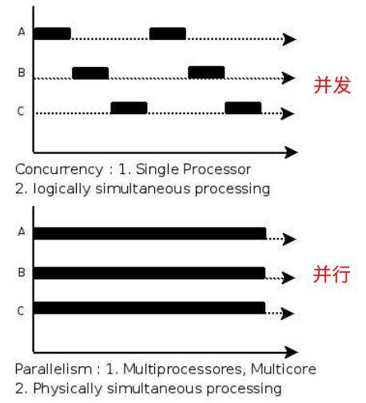
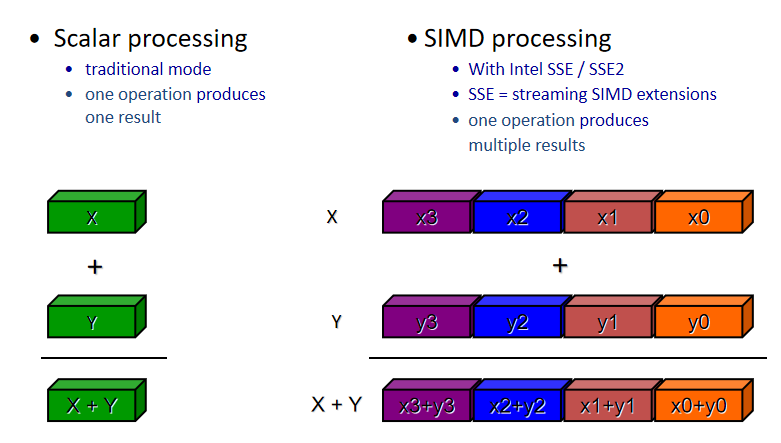

当前计算加速技术栈，非高性能计算领域:
1. 寄存器级 宽/向量寄存器 arm/intel都有自己的向量化指令集
2. SIMD指令级
3. 多线程 openmp/opencl/openacc/cuda
4. 设备级

# 并行-并发-多线程-多进程-simd-openmp-simt-gpu
现代计算加速技术通过不同层次的并行化手段提升系统性能，涵盖了从指令级到设备级的多种并行范式。以下是各类技术的系统综述：  
  


## 一、基础概念辨析

| 概念 | 定义 | 关键特征 | 硬件要求 |
|------|------|----------|----------|
| **进程** | 资源分配的基本单位，拥有独立内存空间 | 隔离性强、创建开销大、通信成本高 | 单核/多核均可 |
| **线程** | CPU调度的基本单位，共享进程资源 | 轻量级、通信便捷、同步复杂 | 单核/多核均可 |
| **并发** | 宏观上同时执行，微观上交替执行 | 逻辑并行、时间片轮转 | 单核即可实现 |
| **并行** | 真正的同时执行 | 物理并行、同时处理 | 需要多核/多CPU |

**核心区别**：并发是任务在单处理器上通过快速切换实现的"伪同时"，而并行是多处理器上真正的物理同时执行。多进程更适合计算密集型任务，因其天然隔离；多线程更适合IO密集型任务，因共享内存通信高效。

## 二、SIMD指令级并行

### 原理与实现
SIMD（单指令多数据）通过一条指令同时处理多个数据元素，是CPU层面的数据并行技术：
- **硬件基础**：x86架构的SSE（128位）、AVX（256位）、AVX-512（512位）指令集
- **并行粒度**：SSE支持4个float32同时计算，AVX支持8个，AVX-512支持16个
- **编程接口**：编译器intrinsics函数、自动向量化、OpenMP SIMD指令

### 技术特点
- **适用场景**：规则数据循环、图像处理、科学计算中的向量运算
- **性能优势**：消除循环开销、提高内存带宽利用率、硬件直接支持
- **局限性**：数据需对齐、分支处理复杂、编程难度较高

## 三、OpenMP共享内存并行

### 编程模型
OpenMP是基于编译指导语句的共享内存并行编程标准：
- **并行区域**：`#pragma omp parallel`创建线程组
- **工作共享**：`#pragma omp for`自动划分循环迭代
- **同步机制**：critical、atomic、barrier等指令
- **SIMD扩展**：OpenMP 4.0+支持SIMD指令指导向量化

### 技术演进
- **CPU多核并行**：传统OpenMP主要针对多核CPU
- **异构计算**：OpenMP 5.0+支持`target`指令将计算卸载到GPU
- **AI扩展**：OpenMP 5.3增强AI算子支持，如矩阵乘法优化

## 四、GPU异构计算加速

### 架构原理
GPU采用大规模并行架构，专为数据并行任务设计：
- **SIMT模型**：单指令多线程，比SIMD更灵活，允许线程有条件分支
- **层次化线程**：Grid → Block → Thread三级组织（CUDA）或NDRange → Work-Group → Work-Item（OpenCL）
- **内存层次**：寄存器 → 共享内存 → L1/L2缓存 → 全局内存 → 主机内存

### 主要编程框架对比

| 框架 | 硬件支持 | 编程语言 | 并行模型 | 优势 | 劣势 |
|------|----------|----------|----------|------|------|
| **CUDA** | NVIDIA GPU | C/C++/Python/Fortran | SIMT（线程网格） | 性能最优、生态完善、工具链齐全 | 仅限NVIDIA硬件 |
| **OpenCL** | CPU/GPU/FPGA/DSP | C/C++ | 任务+数据并行 | 跨平台、开放标准、硬件无关 | 优化困难、生态较弱 |
| **OpenACC** | CPU/GPU | C/C++/Fortran | 指令集加速 | 移植简单、学习曲线平缓 | 性能依赖编译器优化 |

### GPU性能优势来源
1. **高计算并发**：GPU将更多芯片面积分配给流处理器而非控制逻辑
2. **延迟隐藏**：通过大量线程切换掩盖内存访问延迟
3. **高带宽内存**：GDDR6/HBM显存带宽可达DDR5内存的30倍以上
4. **专用计算单元**：Tensor Core等针对特定计算模式优化

## 五、技术选型指南

### 选择依据矩阵

| 技术 | 适用场景 | 并行粒度 | 编程复杂度 | 性能潜力 |
|------|----------|----------|------------|----------|
| **多进程** | 计算密集型、任务隔离需求高 | 进程级 | 中等 | 高（多核充分利用） |
| **多线程** | IO密集型、数据共享频繁 | 线程级 | 中等 | 中等 |
| **SIMD** | 规则数据向量运算 | 指令级 | 高 | 高（4-16倍加速） |
| **OpenMP** | 共享内存多核CPU | 线程级 | 低 | 高（线性扩展） |
| **CUDA** | NVIDIA GPU大规模数据并行 | 线程级 | 高 | 极高（10-100倍） |
| **OpenCL** | 跨平台异构计算 | 线程级 | 高 | 高（依赖优化） |

### 实际应用建议

1. **层次化并行策略**：
   - 顶层：多进程处理独立任务
   - 中层：多线程处理共享数据
   - 底层：SIMD/GPU加速计算密集型内核

2. **开发流程优化**：
   - 先使用OpenMP实现CPU多核并行
   - 热点函数使用SIMD指令优化
   - 数据并行密集部分移植到GPU
   - 使用性能分析工具定位瓶颈

3. **混合编程模式**：
   ```cpp
   // 示例：OpenMP + CUDA混合编程
   #pragma omp parallel for
   for (int i = 0; i < num_blocks; i++) {
       cuda_kernel<<<blocks, threads>>>(data + i * block_size);
   }
   ```

## 六、未来发展趋势

1. **统一编程模型**：OpenMP、SYCL等标准致力于提供CPU/GPU统一编程接口
2. **AI硬件集成**：GPU集成Tensor Core等专用AI加速单元
3. **内存层次优化**：统一内存架构简化CPU-GPU数据交换
4. **自动化工具**：编译器自动向量化、自动并行化能力持续增强

现代计算加速已形成多层次技术栈：从指令级SIMD到线程级OpenMP，再到设备级GPU加速。实际应用中应根据任务特性、硬件平台和开发资源，选择合适的技术组合，实现最优的性能加速比。

# SSE/AVX

sse/avx向量化的硬件基础就是64bit的cpu将memory的数据一次性加载到向量寄存器进行计算

编程接口也是通过定义基本的指针类型来实现内存的整块拷贝及计算，所以内存对齐很重要
```c++
/*
 * Intel(R) AVX compiler intrinsic functions.
 */
typedef union __declspec(intrin_type) __declspec(align(32)) __m256 {
    float m256_f32[8];
} __m256;

typedef struct __declspec(intrin_type) __declspec(align(32)) __m256d {
    double m256d_f64[4];
} __m256d;

typedef union  __declspec(intrin_type) __declspec(align(32)) __m256i {
    __int8              m256i_i8[32];
    __int16             m256i_i16[16];
    __int32             m256i_i32[8];
    __int64             m256i_i64[4];
    unsigned __int8     m256i_u8[32];
    unsigned __int16    m256i_u16[16];
    unsigned __int32    m256i_u32[8];
    unsigned __int64    m256i_u64[4];
} __m256i;
```

SSE和AVX是x86架构上的SIMD（单指令多数据）指令集扩展，通过硬件并行性大幅提升数据密集型计算性能。以下是其接口、汇编、机器指令和原理的详细解析：

## 一、SIMD基本原理

SIMD的核心思想是**一条指令同时处理多个数据元素**。传统标量指令一次处理一个数据，而SIMD指令可将多个数据打包到宽寄存器中并行计算。

**硬件实现**：现代CPU包含专门的向量ALU（算术逻辑单元），如AVX2的256位向量ALU包含8个32位执行单元并行工作。当执行`_mm256_add_ps`指令时，8个float32元素同时相加，理论上可获得8倍加速。

## 二、指令集演进

| 指令集 | 寄存器宽度 | 典型并行度(float32) | 推出时间 |
|--------|------------|---------------------|----------|
| SSE    | 128位      | 4个                | 1999     |
| AVX    | 256位      | 8个                | 2011     |
| AVX2   | 256位      | 8个                | 2013     |
| AVX-512| 512位      | 16个               | 2015     |

AVX是SSE的直接继承者，将SIMD寄存器从128位扩展至256位。最新的AVX10.2指令集旨在统一128/256/512位执行模型，解决异构处理器指令支持差异问题。

## 三、编程接口
SIMD虽然是寄存器级别的并行，但不是非得通过汇编来编程
### 1. Intrinsics函数（推荐方式）
编译器提供的"汇编级函数"，直接映射到特定SIMD指令：
```c
#include <immintrin.h>  // AVX头文件
#include <xmmintrin.h>  // SSE头文件

// SSE示例：4个float相加
__m128 a = _mm_loadu_ps(float_array);
__m128 b = _mm_loadu_ps(another_array);
__m128 result = _mm_add_ps(a, b);
_mm_storeu_ps(output, result);

// AVX示例：8个float相加
__m256 a256 = _mm256_loadu_ps(float_array);
__m256 b256 = _mm256_loadu_ps(another_array);
__m256 result256 = _mm256_add_ps(a256, b256);
_mm256_storeu_ps(output, result256);
```
Intrinsics函数避免了函数调用开销，由编译器直接插入对应机器指令。

### 2. 内联汇编（不推荐）
```c
// GCC风格SSE内联汇编示例
__asm__ __volatile__(
    "movups %1, %%xmm0\n\t"
    "movups %2, %%xmm1\n\t"
    "mulps  %%xmm1, %%xmm0\n\t"
    "movups %%xmm0, %0\n\t"
    :"=m"(res)          // 输出
    :"m"(left), "m"(right) // 输入
);
```
内联汇编可移植性差，不同编译器语法不同。

### 3. 编译器自动优化
对于简单的for循环等，编译器可自动识别并插入SIMD指令：
gcc -O3 -march=native -ftree-vectorize -fopt-info-vec-missed demo.c -o demo

### 4. OpenMP导语
OpenMP提供了SIMD指令集的自动向量化支持：
```c
#pragma omp simd
for (int i = 0; i < n; i++) {
    a[i] = a[i] + b[i];
}
```

## 四、汇编指令

### SSE汇编指令示例
```assembly
; 加载4个float到XMM0寄存器
movups xmm0, [mem_address]  ; 未对齐加载
movaps xmm0, [mem_address]  ; 对齐加载（要求16字节对齐）

; 4个float同时相加
addps xmm0, xmm1            ; xmm0 = xmm0 + xmm1（打包单精度浮点）

; 存储结果
movups [mem_address], xmm0
```

### AVX汇编指令示例
```assembly
; 加载8个float到YMM0寄存器（256位）
vmovups ymm0, [mem_address]  ; v前缀表示VEX编码

; 8个float同时相加
vaddps ymm0, ymm0, ymm1      ; ymm0 = ymm0 + ymm1

; 存储结果
vmovups [mem_address], ymm0
```

## 五、机器指令编码原理

### 1. VEX编码（AVX）
AVX引入全新的VEX（Vector Extension）编码方案，压缩传统x86指令前缀信息：
- **2字节或3字节VEX前缀**：替代传统的REX前缀和操作码映射
- **支持3操作数语法**：`vaddps ymm0, ymm1, ymm2`（目标寄存器独立）
- **消除部分数据移动**：传统SSE指令如`addps xmm0, xmm1`会破坏源操作数，AVX的三操作数形式避免了额外数据移动

### 2. EVEX编码（AVX-512）
AVX-512使用EVEX（Extended Vector Extension）前缀：
- **4字节前缀**：支持512位向量长度及更多选项
- **掩码寄存器支持**：`{k1}`掩码实现条件执行
- **广播功能**：可将标量广播到所有向量通道

### 3. 指令格式示例
```
传统SSE指令：        F3 0F 58 C1    addss xmm0, xmm1
AVX VEX编码指令：    C5 F8 58 C1    vaddss xmm0, xmm1, xmm1
AVX三操作数：        C5 EC 58 D2    vaddps ymm2, ymm1, ymm2
```

## 六、性能优势与注意事项

### 性能优势
1. **硬件并行**：AVX2的256位向量ALU包含8个32位执行单元同时工作
2. **减少指令数**：8次标量加法需24条指令，而AVX2只需3条指令
3. **提高内存带宽利用率**：256位加载一次读取32字节，带宽利用率提升8倍
4. **消除循环开销**：无循环计数器、跳转指令等开销

### 注意事项
1. **数据对齐**：对齐加载（`movaps`/`vmovaps`）要求内存地址对齐到16/32字节边界，否则导致异常
2. **数据依赖**：编译器需保守分析数组重叠（aliasing）问题，可能无法自动向量化
3. **AVX频率偏移**：调用AVX-512指令时，CPU可能降低时钟频率以控制功耗
4. **编译器支持**：需指定编译选项（如`-mavx2`、`-march=native`）
5. **CPU检测**：运行时需检测CPU支持的指令集，提供多版本代码路径

## 七、实际应用建议

1. **适用场景**：图像处理、科学计算、音频处理、机器学习推理等数据并行任务
2. **开发工具**：
   - Intel® Intrinsics Guide：查询intrinsics函数
   - 编译器文档：GCC/Clang/MSVC的SIMD支持
   - 性能分析工具：perf、VTune、AMD uProf

3. **最佳实践**：
   - 优先使用intrinsics而非内联汇编
   - 确保数据内存对齐（`alignas(32)`）
   - 处理剩余元素（非向量宽度倍数）
   - 避免在热循环中混合不同SIMD指令集

SIMD技术通过硬件并行性将CPU算力充分发挥，在数据并行任务中可实现5-10倍的性能提升。随着AVX10.2的推出，SIMD编程将更加统一和高效。
